# **chapter 02** 

 ## 💡 `React` 

--- 

#### [ES6 문법]
- package.json 
```javascript
"scripts": {
    "build": "babel src -d build"
  },
```
◾ 02-01 : Hello John!! <br>
◾ 02-02 : let 키워드 <br>
◾ 02-03 : const 키워드 - 속성 변경 허용 <br>
◾ 02-04 : const 키워드 - 재할당 허용하지 않는다. (메모리 주소의 변경 불가) <br><br>
◾ 02-05 : 기본 파라미터(default parameter) <br>
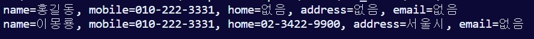 <br><br>
◾ 02-06 : 가변 파라미터(rest parameter) <br>
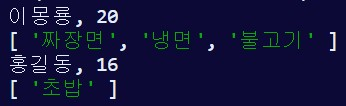 <br><br>
◾ 02-07 : 구조 분해 할당(destructuring assignment) <br>
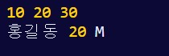 <br><br>
◾ 02-08 : 구조 분해 할당(destructuring assignment) - 함수 파라미터 <br>
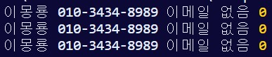 <br><br>
◾ 02-09 : 화살표 함수(arrow function) <br>
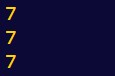 <br><br>

###### ▶ 02-10 ~ 02-15는 브라우저 개발자 도구의 콘솔 창에 작성하여 확인
◾ 02-10 : this 객체 <br>


◾ 02-11 : this 객체2 <br>
- 자바스크립트의 함수와 메서드는 어떤 객체의 메서드 형태로 호출되느냐에 따라 this가 달라진다. <br>

◾ 02-12 : bind(), apply(), call() 메서드 활용 <br>
- bind() : 지정한 객체를 this로 미리 연결한(binding) 새로운 함수를 린턴함 <br>
- apply(), call() : 지정한 객체를 this로 연결한 후 함수를 직접 호출함 <br>

◾ 02-13 : 중첩 함수에서의 this <br>
◾ 02-14 : 중첩 함수에서의 this (bind(), apply(), call() 이용) <br>
- bind() 사용
    - 내부 함수와 외부 함수의 this가 동일해졌다. <br>

◾ 02-15 : 화살표 함수의 this <br>
- 화살표 함수를 사용하여 내부 함수 및 외부 함수의 this가 동일하다. <br>

◾ 02-16 : 객체 리터럴 <br>
- 객체의 속성을 작성할 때 속성과 변수명이 동일하다면 변수명을 생략할 수 있다.

◾ 02-17 : 새로운 메서드 표기법 <br>
◾ 02-18 : 탬플릿 리터럴(template literal) [역따옴표 == backquoto: `] <br>
◾ 02-19 : 모듈(modules) - export <br>
- export default 구문 <br>


◾ 02-20 : 모듈(modules) 사용 - import <br>
- import할 때 export된 요소 중 필요한 것만 참조해서 사용할 수 있다. <br>
- export default된 것은 import할 때 중괄호 없이 참조할 수 있다. <br>
- default로 export와 import할 수 있는 요소는 단 하나라는 점에 주의! <br>
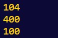 <br><br>

◾ 02-21 : 프로미스(promise) <br>
- resolve() 함수 ▶ than(result) 함수 실행 <br>
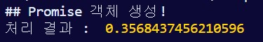 <br><br>
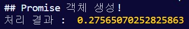 <br><br>
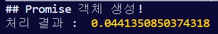 <br><br>
- reject() 함수 ▶ catch(error) 함수 실행 <br>
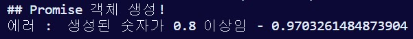 <br><br>

◾ 02-22 : 프로미스(promise) 체인 <br>
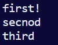 <br><br>
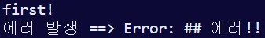 <br><br>

◾ 02-23 : 얕은 복사(Shallow Copy)와 전개 연산자(spread operator) <br>
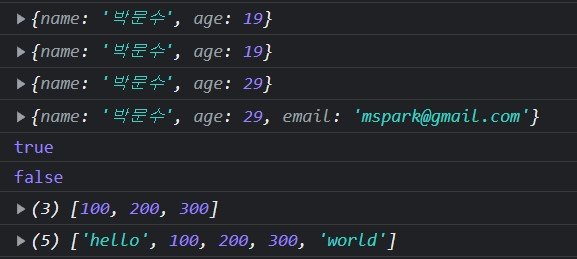 <br><br>

◾ 02-24 : 클래스(class) <br>
- extends 키워드로 상속 구현 <br>
- constructor 키워드로 생성자 생성 <br>
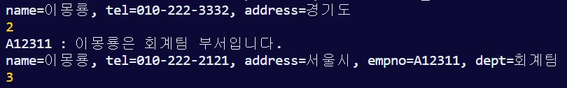 <br><br>
