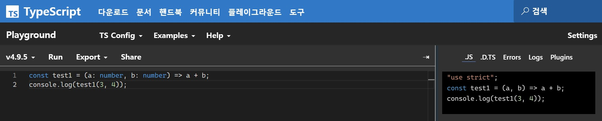
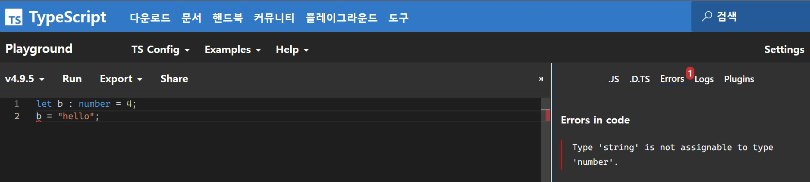
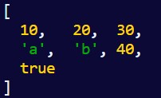

# **chapter 02** 

 ## 💡 `React` 

--- 

#### [타입스크립트]
```
▶ tsconfig.json 설정 관련 

https://www.typescriptlang.org/tsconfig
https://typescript-kr.github.io/pages/compiler-options.html
```

◾ sample : test <br>
```
npx tsc

node build/sample.js
```

```
[Typescript Playground]

https://www.typescriptlang.org/ko/play
```
 <br>
- Type Error <br>
 <br>

- type alias
```
type TestType {
  id: number,
  age: number,
  name: {
    first: string,
    last: string
  }
}

let obj : TestType = {
  id : 1001,
  age : 20,
  name : {
    first : "Larry",
    last : "King"
  }
}
```

<br>
◾ 02-27 : any[] 타입 [배열] <br>
 <br><br>
◾ 02-28 : 제네릭 타입 <br><br>
◾ 02-29 : 타입 별칭(type alias) <br>
- 타입 1개 또는 복잡한 타입에 대한 별칭 부여 <br>
- 선택적 속성 : ? <br>
- 읽기 전용 속성 : readonly <br>
- 튜플 타입 <br>

```
// string 타입에 대한 별칭 부여
type MyType = string;
let a: MyType = "Hello";

// 복잡한 타입에 대한 별칭 부여
type MyType2 = { name: string, age: number; }
let b: MyType2 = { name: "홍길동", age: 20 };

// 선택적 속성과 읽기 전용 속성
type MyType3 = {
    name: string;
    age?:number;
    readonly email: string;
};

let c: MyType3 = { name: "홍길동", email: "gdhong@test.com" };
// 읽기 전용이므로 에러 발생
// c.email = "gdhong@test.com";

// 튜플 타입
type TupleType = [string, number];
let d: TupleType = ["hello", 100];
// let e: TupleType = ["hello", 100, "world"]; // 에러
```

◾ 02-30 : 타입 별칭 안 타입 별칭 <br>
◾ 02-31 : 유니온(union type) 타입 ( | ) - 단일 <br>
◾ 02-32 : 유니온(union type) 타입 ( | ) - 복수 <br>
◾ 02-33 : 인터섹션(intersection type) 타입 ( & ) <br>
◾ 02-34 : 열거형(enum) <br>
◾ 02-35 : 인터페이스(interface) <br>
◾ 02-36 : 인터페이스(interface) 중복 정의 => 병합된 하나의 인터페이스 <br>