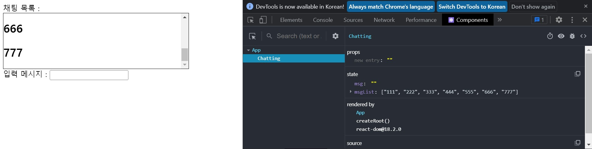
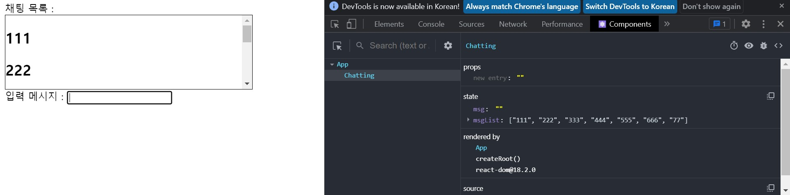
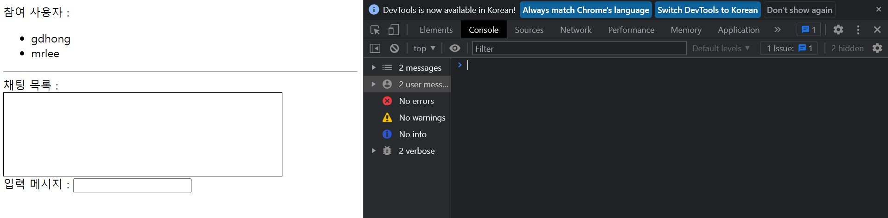
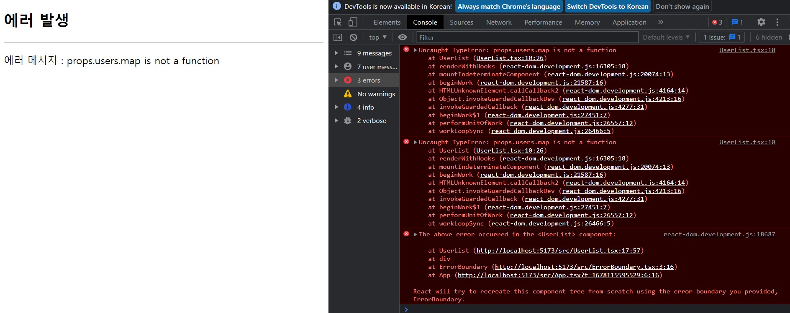
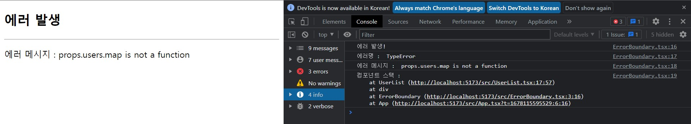
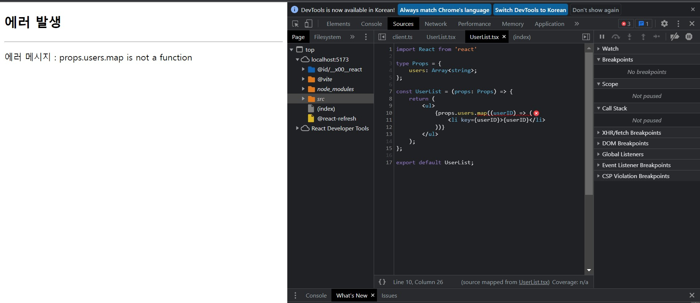

# **chapter 05**  

## 💡 `React` 

--- 
#### [리액트 클래스 컴포넌트]

<br> ♧ 새로운 프로젝트 생성 <br>
```
cd ..
npm init vite chatting-app -- --template react-ts
cd chatting-app
npm install
```

<br>

♣ 생명주기 메서드 예제 2 <br>

◾ 05-07 : src/Chatting.tsx → 컴포넌트 추가 <br>
```javascript
import React, { ChangeEvent, Component, KeyboardEvent } from 'react'

type State = {
    msg: string;
    msgList: Array<string>;
};

export default class Chatting extends Component<{}, State> {
    chatRef = React.createRef<HTMLDivElement>();
    state: State = { msgList: [], msg: "" };

    getSnapshotBeforeUpdate(prevProps: {}, prevState: State): number {
        const chat = this.chatRef.current;
        if (prevState.msgList !== this.state.msgList && chat !== null) {
            return chat.offsetHeight;
        }
        return 0;
    }

    componentDidUpdate(prevProps: {}, prevState: State, snapshot: number) {
        const chat = this.chatRef.current;
        if (snapshot > 0 && chat !== null) {
            chat.scrollTop = chat.scrollHeight - snapshot;
        }
    }

    setMsg = (e: ChangeEvent<HTMLInputElement>) => {
        this.setState({ ...this.state, msg: e.target.value });
    };

    msgKeyup = (e: KeyboardEvent<HTMLInputElement>) => {
        if (e.key === "Enter") {
            this.setState({ msg: "", msgList: [...this.state.msgList, this.state.msg] });
        }
    };

    render() {
        return (
            <div>
                채팅 목록 : <br />
                <div ref={this.chatRef}
                    style={{ width: 400, height: 120, overflow: "auto", border: "solid 1px black" }}>
                    {this.state.msgList.map((item, index) => {
                       return <h2 key={index}>{item}</h2>; 
                    })}
                </div>
                입력 메시지 : <input type="text" value={this.state.msg} 
                                    onChange={this.setMsg} onKeyUp={this.msgKeyup} />
            </div>
        );
    }
}
```

◾ 05-08 : src/App.tsx → Chatting 컴포넌트 임포트하여 렌더링 <br>
```javascript
import { Component } from 'react'
import Chatting from './Chatting'

export default class App extends Component<{}, {}> {
  state = {};

  render() {
    return (
      <div>
        <Chatting />
      </div>
    );
  }
}
```

 <br>
(채팅 메시지를 전송하는 상황을 가정 - 채팅 메시지를 작성하거나 상대방이 메시지를 전송하면 사용자가 최신의 메시지를 볼 수 있도록 &lt;div&gt; 박스는 항상 마지막으로 스크롤되어 있어야 한다.) <br>

cf) getSnapshotBeforeUpdate, componentDidUpdate 메서드를 사용하지 않을 때 <br>
```javascript
import React, { ChangeEvent, Component, KeyboardEvent } from 'react'

type State = {
    msg: string;
    msgList: Array<string>;
};

export default class Chatting extends Component<{}, State> {
    chatRef = React.createRef<HTMLDivElement>();
    state: State = { msgList: [], msg: "" };

    // getSnapshotBeforeUpdate(prevProps: {}, prevState: State): number {
    //     const chat = this.chatRef.current;
    //     if (prevState.msgList !== this.state.msgList && chat !== null) {
    //         return chat.offsetHeight;
    //     }
    //     return 0;
    // }

    // componentDidUpdate(prevProps: {}, prevState: State, snapshot: number) {
    //     const chat = this.chatRef.current;
    //     if (snapshot > 0 && chat !== null) {
    //         chat.scrollTop = chat.scrollHeight - snapshot;
    //     }
    // }

    setMsg = (e: ChangeEvent<HTMLInputElement>) => {
        this.setState({ ...this.state, msg: e.target.value });
    };

    msgKeyup = (e: KeyboardEvent<HTMLInputElement>) => {
        if (e.key === "Enter") {
            this.setState({ msg: "", msgList: [...this.state.msgList, this.state.msg] });
        }
    };

    render() {
        return (
            <div>
                채팅 목록 : <br />
                <div ref={this.chatRef}
                    style={{ width: 400, height: 120, overflow: "auto", border: "solid 1px black" }}>
                    {this.state.msgList.map((item, index) => {
                       return <h2 key={index}>{item}</h2>; 
                    })}
                </div>
                입력 메시지 : <input type="text" value={this.state.msg} 
                                    onChange={this.setMsg} onKeyUp={this.msgKeyup} />
            </div>
        );
    }
}
```

 <br>
(getSnapshotBeforeUpdate( )와 componentDidUpdate( )메서드를 사용하지 않으면서 채팅 메시지가 추가되더라도 &lt;div&gt;박스의 마지막으로 자동 스크롤되지 않으므로 가장 최근의 채팅 메시지가 보이지 않는다. (직접 스크롤 해줘야 한다.)) <br>
→ getSnapshotBeforeUpdate 생명주기 메서드에서는 이전 상태의 msgList와 현재 상태의 msgList가 다르면 채팅 메시지를 보여주는 &lt;div&gt; 요소를 useRef( )훅으로 참조해 &lt;div&gt; 요소의 높이, 즉 offsetHeight를 리턴한다. <br>
→ 리턴된 값은 componentDidUpdate 메서드의 세 번째 인자인 snapshot으로 전달 <br>
→ componentDidUpdate 메서드에서는 콘텐츠의 높이인 scrollHeight에서 요소의 높이만큼을 뺀 값을 scrollTop으로 지정하여 콘텐츠의 마지막으로 스크콜이 되도록 해준다. <br>

<br>

♣ 생명주기 메서드 예제 3 <br>

＊ componentDidCatch, getDerivedStateFromError 생명주기 메서드는 평상시에는 실행되지 않고, 컴포넌트 자신이 포함하고 있는 하위 컴포넌트 트리에서 자바스크립트 에러가 발생했을 때 에러 화면 대신 fallback UI(에러가 발생했음을 알리는 UI)를 보여주고 에러 메시지를 잡아낼 수 있도록 하는 기능을 제공 <br>

＊ 에러 경계 컴포넌트라고 하더라도 모든 에러를 처리하지는 않고, 에러 경계 컴포넌트 자신에서 발생하는 에러나 비동기 처리 코드, 서버 사이드 렌더링을 수행하는 코드에서 발생하는 에러는 포착하지 않는다. <br>

cf) 서버 사이드 렌더링: 서버 사이드 렌더링은 클라이언트(브라우저)가 서버에 매번 데이터를 요청하여 서버에서 처리하는 방식. 클라이언트에서 요청이 들어올 때마다 매번 서버에서 새로운 화면(View)을 만들어 제공하는 것. 즉, 서버가 화면(View)을 그리는 주체가 된다. <br>
```
[클라이언트 사이드 렌더링(Client Side Rendering)과 서버 사이드 렌더링(Server Side Rendering)]
https://www.startupcode.kr/company/blog/archives/12 참조
```

＊ 이벤트 핸들러 함수에서 발생하는 에러도 처리하지 않으므로 이벤트 핸들러 함수 내부에서 try~catch문을 이용해 예외 객체를 던지도록(throw exceptions) 작성해야 한다. <br>

◾ 05-09 : src/ErrorBoundary.tsx → 에러 처리 <br>
```javascript
import { Component, ErrorInfo } from 'react'

type State = { hasError: boolean; errorMessage: string };
type Props = { children: JSX.Element };

export default class ErrorBoundary extends Component<Props, State> {
    state = { hasError: false, errorMessage: ""};

    static getDerivedStateFromError(error: Error): State {
        // 에러가 발생했을 때 hasError 상태를 true로 변경
        return { hasError: true, errorMessage: error.message };
    }

    componentDidCatch(error: Error, errorInfo: ErrorInfo): void {
        // 여기서는 에러 로깅, 서버로의 전송 등 작업을 수행
        console.log("에러 발생! ");
        console.log("에러명 : ", error.name);
        console.log("에러 메시지 : ", error.message);
        console.log("컴포넌트 스택 : ", errorInfo.componentStack);
    }

    render() {
        // 에러가 발생했다면 fallback UI를 렌더링
        if (this.state.hasError) {
            return (
                <div>
                    <h2>에러 발생</h2>
                    <hr />
                    <p>에러 메시지 : {this.state.errorMessage} </p>
                </div>
            );
        }
        // 에러가 없다면 children을 렌더링
        return this.props.children;
    }
}
```

- ErrorBoundary 컴포넌트 내부에 자식 컴포넌트를 끌어안도록 작성 <br>
- 자식 컴포넌트 트리에서 에러가 발생하면 ErrorBoundary 컴포넌트의 getDerivedStateFromError 메서드가 실행되고, 이 메서드에서 리턴된 값이 ErrorBoundary 컴포넌트의 새로운 상태가 된다. <br>
    - 에러가 발생 했을 때는 hasError 상태를 true로 바꾸고 에러 메시지를 상태로 저장 <br>
    - componentDidCatch 메서드에서 로깅을 하거나 서버로 에러 정보를 전송 <br>
        - render 메서드에서는 hasError 상태가 true일 때 fallback UI를 렌더링하고, 에러가 발생하지 않았을 때는 자식 컴포넌트 트리가 렌더링되도록 this.props.children을 렌더링 한다. <br>
```javascript
<ErrorBoundary>
    <Component1 />
    <Component2 />
    ···
</ErrorBoundary>

```
→ 내부에 작성한 컴포넌트들이 children <br>

◾ 05-10 : src/UserList.tsx → users라는 속성으로 전달 받아 목록으로 출력(users 속성이 배열이 아닌 값이 전달되면 props.users.map에서 에러 발생) <br>
```javascript
import React from 'react'

type Props = {
    users: Array<string>;
};

const UserList = (props: Props) => {
    return (
        <ul>
            {props.users.map((userID) => (
                <li key={userID}>{userID}</li>
            ))}
        </ul>
    );
};

export default UserList;
```

◾ 05-11 : src/App.tsx → ErrorBoundary 컴포넌트와 UserList 컴포넌트를 사용하도록 App 컴포넌트에 추가 <br>
```javascript
import { Component } from 'react'
import Chatting from './Chatting'
import ErrorBoundary from "./ErrorBoundary";
import UserList from "./UserList";

export default class App extends Component<{}, {}> {
  render() {
    return (
      <ErrorBoundary>
        <div>
          참여 사용자 :
          <UserList users={["gdhong", "mrlee"]} />
          <hr />
          <Chatting />
        </div>
      </ErrorBoundary>
    );
  }
}
```
 <br>
(에러 없이 정상 실행) <br>

<br>

⊙ 의도적으로 렌더링 에러 발생(배열이 아닌 잘못된 속성값을 전달) <br>

```javascript
import { Component } from 'react'
import Chatting from './Chatting'
import ErrorBoundary from "./ErrorBoundary";
import UserList from "./UserList";

export default class App extends Component<{}, {}> {
  render() {
    return (
      <ErrorBoundary>
        <div>
          참여 사용자 :
          {/* <UserList users={["gdhong", "mrlee"]} /> */}
          <UserList users={"gdhong"} />
          <hr />
          <Chatting />
        </div>
      </ErrorBoundary>
    );
  }
}
```
 <br>
 <br>
 <br>

▷ ErrorBoundary 컴포넌트에 작성했던 `fallback UI`가 나타난다. <br>