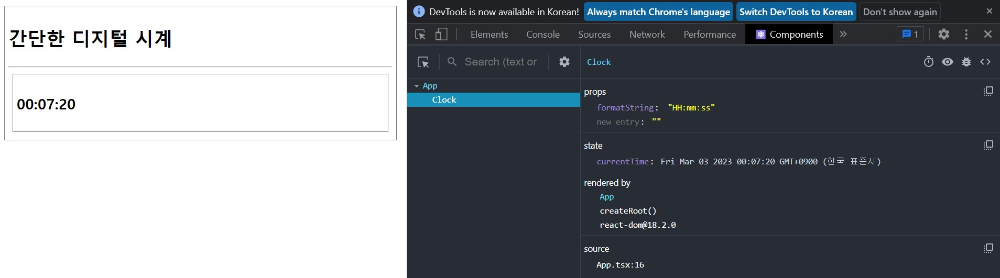
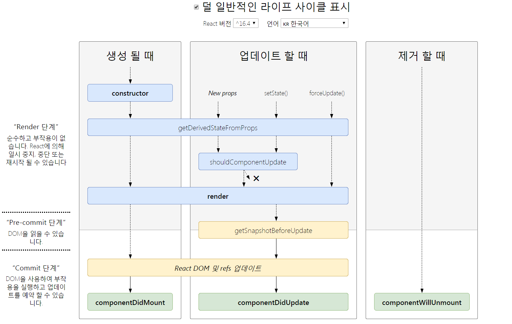
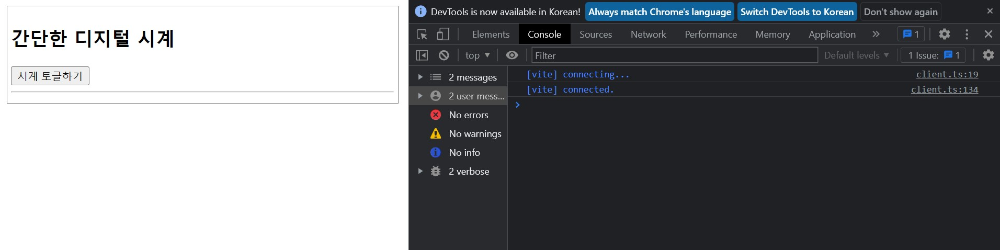
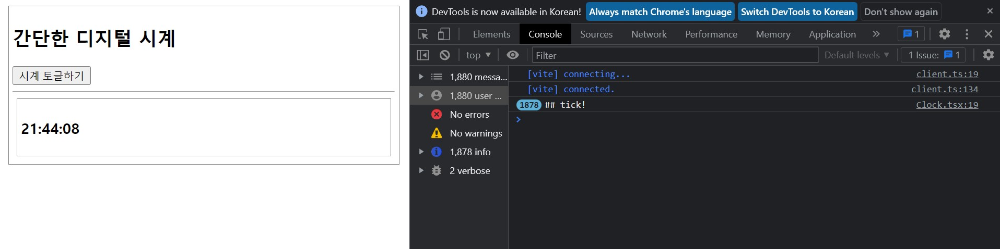
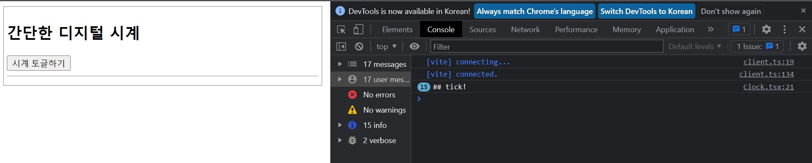
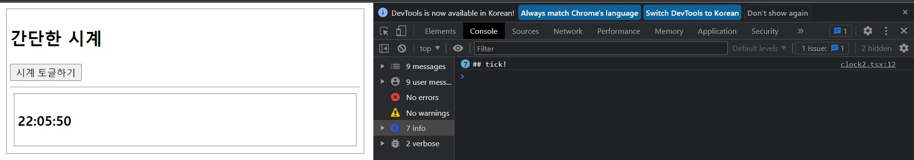

# **chapter 05**  

## 💡 `React` 

--- 
#### [리액트 클래스 컴포넌트]
- 클래스 컴포넌트는 함수 컴포넌트에서는 지원하지 않는 다양한 `생명주기 이벤트 훅`들을 제공 <br>
- **리액트**는 한 프로젝트에서 `클래스 컴포넌트`와 `함수 컴포넌트`를 혼용하기도 한다. <br>
- 리액트 클래스 컴포넌트는 React.Component<PropsType, StateType>을 상속받도록 작성 <br>
    - 만일 속성이나 상태를 사용하지 않는다면 제네릭 문법 부분을 생략하거나 { }와 같이 비어있는 객체로 지정할 수 있다. <br>

```javascript
// [ React 클래스 컴포넌트의 기본적인 형태 ]
import React, { Component } from 'react'

// 속성의 타입
type Props = {}

// 상태의 타입
type State = {}

export default class Test extends Component<Props, State> {
    state = {}
    render() {
        return (
            <div>Test</div>
        )
    }
}

// [ 속성만 사용하는 React 클래스 컴포넌트 형태 예 ]
import React, { Component } from 'react'

type TestProps = {
    name: string;
    age: number;
}

export default class Test extends Component<TestProps> {
    render() {
        return <div>{this.props.name}님의 나이는 {this.props.age}입니다.</div>;
    }
}
```

<br>

- 전달받은 '속성'은 this.props.name과 같이 `this` 식별자를 이용해 컴포넌트 인스턴스의 props 속성을 이용 <br>
- '상태'는 this.state.name의 형식으로 접근 가능 <br>

```javascript
// [ 상태만 사용하는 React 클래스 컴포넌트 형태 예 ]
import React, { Component } from 'react'

type TestState = {
    name: string;
};

export default class Test extends Component<{ }, TestState> {
    state: TestState = {
        name: "홍길동",
    };

    render() {
        return <div>이름은 {this.state.name}입니다.</div>;
    }
}
```

<br>

- 속성으로 함수와 메서드를 전달할 때는 함수 컴포넌트의 속성을 정의할 때와 마찬가지로 (format: string) => void와 같은 형태를 사용 <br>
    - 만일 <u>인자 형식</u>과 <u>리턴값의 형식</u>을 알 수 없다면 `Function`을 지정 <br>

```javascript
// [ 속성으로 함수, 메서드를 전달하는 경우 ]
import React, { Component } from 'react'

type Props = {
    formatString: string;
    changeFormat: (format: string) => void;
    // changeFormat: Function;
};

export default class Test extends Component<Props> {
    render() {
        return (
            <div>
                <button onClick={(e) => this.props.changeFormat("HH:mm:ss")}>적용</button>
            </div>
        );
    }
}
```

```
VSCode의 확장팩 [ES7+React/Redux/React-Native snippets] 활용

◈ tsrafc, tsrafce: Typescript(ts) 기반의 React Arrow Function Component(rafc) 코드 조각을 생성
   (끝에 e가 붙은 것은 export 구문까지 생성)

◈ tsrcc, tsrce: Typescript(ts) 기반의 React Class Component(rcc) 코드 조각을 생성
   (끝에 e가 붙은 것은 export 구문까지 생성)

◈ tsrfc, tsrfce: Typescript(ts) 기반의 React Function Component(rfc) 코드 조각을 생성
   (끝에 e가 붙은 것은 export 구문까지 생성)


[참고]
https://github.com/dsznajder/vscode-react-javascript-snippets/blob/HEAD/docs/Snippets.md
```

<br>

♧ 새 프로젝트 생성 <br>
``` javascript
cd ..
npm init vite clock-app -- --template react-ts
cd clock-app
npm install
npm install date-and-time // 시간을 HH:mm:ss 형식으로 출력하기 위한 라이브러리
```

☆ App 컴포넌트 <br>
- 상태: formatString(시간을 보여주는 형식 문자열) <br>

<br>

☆ Clock 컴포넌트
- 상태: currentTime(현재 시각을 나타내는 정보) <br>
- 속성: formatString(App 컴포넌트의 상태를 속성으로 전달 받음) <br>
- 기능: 1초마다 시간을 갱신하도록 componentDidMount 생명주기 이벤트를 사용 <br>

<br>

◾ 05-01 : src/Clock.tsx → 새로운 컴포넌트 작성 <br>
- date-and-time 라이브러리 사용(HH:mm:ss 형식으로 시간 정보 출력) <br>
- componentDidMount 생명주기 메서드에서 컴포넌트가 마운트된 후에 1초 간격으로 시간 상태를 변경하도록 setInterval 함수를 호출, 인자로 전달하는 함수 내에서 this.setState()메서드를 사용해 상태를 변경 <br>

```javascript
import React, { Component } from 'react'
import DateAndTime from 'date-and-time'

type Props = {
    formatString: string;
};

type State = {
    currentTime: Date;
};

export default class Clock extends Component<Props, State> {
    state = {
        currentTime: new Date(),
    };

    componentDidMount = () => {
        setInterval(() => {
            this.setState({ currentTime: new Date() });
        }, 1000);
    };

    render() {
        return (
            <div className="boxStyle">
                <h3>{DateAndTime.format(this.state.currentTime, this.props.formatString)}</h3>
            </div>
        );
    }
}
```

◾ 05-02 : src/App.tsx → Clock 컴포넌트에 formatString 속성을 전달 <br>
```javascript
import { Component } from 'react'
import Clock from './Clock'

type State = {
  formatString: string;
};

export default class App extends Component<{}, State> {
  state = {
    // HH:mm:ss
    // H시 m분 s초
    formatString: "HH:mm:ss",
  };

  render() {
    return (
      <div className="boxStyle">
        <h2>간단한 디지털 시계</h2>
        <hr />
        <Clock formatString={this.state.formatString} />
      </div>
    );
  }
}
```

◾ 05-03 : src/index.css → 스타일 지정 <br> 
```css
.boxStyle {
  border: solid 1px gray;
  padding: 5px;
  margin: 5px;
}
```

 <br>

<br>

- 생명주기 메서드 <br>
    - 생명주기 메서드(life cycle method)는 리액트 클래스 컴포넌트에서만 사용. <br>
    ▷ 함수 컴포넌트에서 useEffect()라는 리액트 훅을 이용해 이와 유사한 기능을 구현. <br>

        - 컴포넌트 마운트(mounting)될 때 <br>
            > 리액트 컴포넌트가 애플리케이션의 컴포넌트 트리에 추가되어 브라우저 화면에 나타날 때의 단계별 생명주기 메서드 <br>
        - 컴포넌트가 업데이트(updating)될 때 <br>
            > 리액트 컴포넌트의 상태, 속성이 변경되어 브라우저 화면이 갱신될 때의 단계별 생명주기 메서드 <br>
        - 컴포넌트가 언마운트(unmounting)될 때 <br>
            > 리액트 컴포넌트가 애플리케이션의 컴포넌트 트리에서 제거되어 브라우저 화면에 사라질 때의 생명주기 메서드 <br>

 <br>
(생명주기 다이어그램) <br>

<br>

1. 컴포넌트가 마운트될 때 <br>

- constructor(생성자) <br>
    - 컴포넌트가 생성될 때 호출되는 생명주기 메서드 <br>
    - 생성자에서는 반드시 super(props)를 호출해야 하며, 그렇지 않으면 컴포넌트에서 속성(props)을 사용할 수 없으므로 에러가 발생한다. <br>
    - 생성자는 this.state에 객체를 할당하여 컴포넌트의 상태(state)를 '초기화'하기 위해 작성 <br>
        - this.setState() 메서드를 통해 상태를 변경해서는 안 된다. <br>
        - 상태를 초기화할 일이 없다면 생성자를 작성하지 않아도 된다. <br>
```javascript
constructor(props) {
    this.state = {name: "홍길동", age: 20}
}
```

`타입스크립트` 언어에서는 <u><b>constructor</b>를 사용하면 this.state 속성의 타입을 지정할 수 없어서 constructor를 사용하더라도 <b>any</b> 타입을 사용</u>해야 하므로 권장하지 않는다. <br>
다만, 다음의 방법으로 <u>클래스 내의 state 인스턴스 멤버를 지정하는 방법</u>으로 사용하는 경우가 많다. <br>

```javascript
import React, { Component } from 'react'

type StateType = {
    name: string;
    age: number;
};

export default class Test extends Component<{ }, StateType> {
    state: StateType = {name: "홍길동", age: 20 };

    render() {
        const { name, age } = this.state;
        return <div> {name}님의 나이 : {age}</div>;
    }
}
```

- getDerivedStateFromProps 정적 메서드 <br>
    - 이 생명주기 메서드는 컴포넌트의 상태가 '부모 컴포넌트'로부터 전달받은 `속성`에 의해 달라지는 경우에 사용.
    - 이 메서드는 `정적 메서드`이므로 반드시 `static`키워드를 지정해야 하며, <u>props</u>와 <u>state</u> 두 개의 인자를 전달 받는다.
        - `props`는 전달받은 <u>속성 객체</u> <br>
        - `state`는 컴포넌트의 <u>기존 상태</u> <br>
            ▷ props를 이용해 새로운 상태를 만들어서 리턴 <br>
```javascript
import { Component } from 'react'

type Props = { level: string };

type State = { discountRate: number; customerName: string };

export default class Child extends Component<Props, State> {
    state: State = { discountRate: 0, customerName: "홍길동" };

    static getDerivedStateFromProps(props: Props, state: State) {
        let tempRate = 0;
        if (props.level === "GOLD") tempRate = 0.15;
        else if (props.level === "SILVER") tempRate = 0.1;
        else if (props.level === "BRONZE") tempRate = 0.05;
        else tempRate = 0.02;

        // 속성으로 전달받은 level 값에 따라서 discountRate 상태 값이 달라진다.
        // 기존 상태는 변경하지 않아야 하므로 전개 연산자를 사용.
        return { ...state, discountRate: tempRate };

        render() {
            return (
                <div>
                    {this.state.customerName}님의 할인율은 {this.state.discountRate * 100}% 입니다.
                </div>
            );
        }
    }
}
```

- render 메서드 <br>
    - <b>컴포넌트</b>를 `'가상 DOM'으로 렌더링`하는 메서드 <br>
        - <u>상태</u>와 <u>속성</u>을 이용해 '리액트 엘리먼트' 등으로 렌더링하며, <u>함수 컴포넌트의 리턴문</u> 부분에 해당 <br>
        (이 함수는 상태와 속성이 변경되지 않았다면 같은 결과를 리턴해야 한다. [위 예시 render() 메서드 참조)] <br>

- componentDidMount 메서드 <br>
    - 컴포넌트의 마운트가 완료되고 나서 브라우저 DOM의 트리에까지 반영이 된 후 호출되는 메서드 <br>
    - <b>브라우저 DOM이 완성된 후에 실행해야 하는 '초기화' 작업을 하기에 적합</b>
        - ex) HTTP로 백엔드 API를 호출하여 그 결과를 받아서 this.setState()메서드로 상태를 변경하고 브라우저 DOM에 출력해야 하는 초기화 작업이 필요하다면 이 생명주기 메서드를 이용 <br>

2. 컴포넌트가 업데이트될 때 <br>

- getDerivedStateFromProps 정적 메서드 <br>
    - 컴포넌트가 마운트될 때와 동일 <br>

- shouldComponentUpdate 메서드 <br>
    - 렌더링 성능을 최적화할 때 자주 사용 <br>
    - 이 메서드에 전달되는 인자는 새롭게 전달되는 속성(nextProps)과 상태(nextState)이며, 리턴값은 boolean value(true/false)이다. <br>
        - 이 메서드의 리턴값이 true면 다음 단계의 생명주기 메서드(render)가 호출되며, false면 다음 단계의 생명주기로 넘어가지 않는다.  <br>
        ▷ 이 메서드에서는 새롭게 전달된 속성과 상태를 기존의 속성(this.props)과 상태(this.state)와 비교하여 다시 렌더링할지를 결정 <br>
```javascript
shouldComponentUpdate(nextProps: Props, nextState: State): boolean {

}
```
♠ 이때 메서드에서 '깊은 비교'를 수행하면 많은 시스템 리소스가 사용되므로 렌더링 성능 최적화가 힘들어진다. <br>
→ 이 문제를 해결하기 위해 <u>immer 라이브러리</u>, <u>전개 연산자</u>를 이용해 `불변성`을 가지는 변경 작업을 수행해야 한다. <br>

- getSnapshotBeforeUpdate 메서드 <br>
    - 이 메서드가 실행되는 시점은 render() 메서드가 호출되어 가상 DOM으로 쓰기 작업이 완료된 후, 브라우저 DOM에 업데이트되기 전이다. (이 메서드를 많이 사용하는 편은 아니다.) <br>
        - 변경 전의 DOM 상태 정보를 획득하여 `스냅샷 값`으로 리턴해서 componentDidUpdate()메서드의 세 번째 인자(snapshot)로 받아낼 때 이용 <br>
```javascript
getSnapshotBeforeUpdate(prevProps, prevState) {
    // 이 메서드의 리턴값이 componentDidUpdate 메서드의 세 번째 인자로 전달된다.
}
```

- componentDidUpdate 메서드 <br>
    - 이 메서드가 실행되는 시점은 브라우저 DOM까지 업데이트가 완료된 후이다. <br>
    - 이 메서드는 컴포넌트가 업데이트되고 <u>DOM을 변경하고자 할 때</u> 사용 <br>
    ▷ 현재의 속성(this.props)과 상태(this.state)를 이전의 속성, 상태와 비교하여 차이가 있다면 <u>외부 API를 요청</u>하는 등의 작업을 수행하도록 활용할 수 있다. <br>
        - getSnapshotBeforeUpdate()메서드에서 리턴한 값은 이 메서드의 세 번째 인자인 snapshot으로 전달되므로, getSnapshotBeforeUpdate()메서드와 componentDidUpdate()메서드는 함께 사용되는 경우가 많다. <br>
```javascript
componentDidUpdate(prevProps, prevState, snapshot) {

}
```

3. 컴포넌트가 언마운트될 때

- componentWillUnmount 메서드 <br>
    - 이 메서드는 컴포넌트가 애플리케이션의 컴포넌트 트리에서 삭제되기 직전에 실행되고, 주로 componentDidMount 생명주기 메서드와 짝을 이루어 사용 <br>
        - ex) 웹소켓을 이용해 서버에 연결하는 경우, 컴포넌트가 마운트될 때 componentDidMount 메서드에서 외부 서버나 리소스에 연결하면 컴포넌트가 언마운트될 때는 componentWillUnmount 메서드에서 서버와의 연결을 해제 한다. <br>
            - 외부 리소스에 연결한 경우에는 반드시 componentWillUnmount에서 깨끗하게 연결을 해제해야 한다. 그렇지 않으면 메모리 누수(memory leak)가 발생할 수 있고, 불필요한 외부 리소스 연결이 남아있게 된다.<br>

<br>

♣ 생명주기 메서드 예제 1 <br>

◾ 05-04 : src/App.tsx 변경 → componentDidMount, componentWillUnmount 생명주기 메서드를 이용해 리소스를 연결하고 해제 <br> 
```javascript
import { Component } from 'react'
import Clock from './Clock'

type State = {
  formatString: string;
  clockVisible: boolean; 
};

export default class App extends Component<{}, State> {
  state = {
    // HH:mm:ss
    // H시 m분 s초
    formatString: "HH:mm:ss",
    clockVisible: false, // 상태 추가
    // -> 이 값이 true인지 false인지에 따라 Clock 컴포넌트가 마운트/언마운트되도록 작성
  };

  changeFormat = (format: string) => {
    this.setState({ formatString: format });
  };

  render() {
    return (
      <div className="boxStyle">
        <h2>간단한 디지털 시계</h2>
        <button onClick={() => this.setState({ clockVisible: !this.state.clockVisible })}>시계 토글하기</button>
        <hr />
        {this.state.clockVisible ? <Clock formatString={this.state.formatString} /> : ""}
        
      </div>
    );
  }
}
```

◾ 05-05 : src/Clock.tsx 변경 → componentDidMount 생명주기 메서드에 추가(1초 간격으로 시간이 바뀔 때마다 콘솔에 '## tick!'을 출력) <br>
```javascript

·····

export default class Clock extends Component<Props, State> {
    state = {
        currentTime: new Date(),
    };

    componentDidMount = () => {
        setInterval(() => {
            console.log("## tick!");
            this.setState({ currentTime: new Date() });
        }, 1000);
    };

·····

}
```

 <br>
 <br>
▷ `시계 토글하기`를 계속 번갈아 클릭하면 '## tick!'이 점점 빠르게 증가하는 것을 볼 수 있다. 이는 Clock 컴포넌트가 마운트 될 때마다 setInterval() 메서드로 1초마다 실행되는 함수를 계속해서 등록하면서 1초에 한 번만 실행돼야 할 함수가 수십 번씩 실행되고 있는 것이다. <br>

◾ 05-06 : src/Clock.tsx 변경 → 위 05-05 문제 해결[componentWillUnmount에 clearInterval() 사용] <br>
```javascript

·····

export default class Clock extends Component<Props, State> {
    state = {
        currentTime: new Date(),
    };

    handle: number = 0;

    componentDidMount = () => {
        this.handle = setInterval(() => {
            console.log("## tick!");
            this.setState({ currentTime: new Date() });
        }, 1000);
    };

    componentWillUnmount = () => {
        clearInterval(this.handle);
    };

·····

}
```

 <br>
▷ `시계 토글하기` 버튼을 여러 번 클릭해도 ##tick! 메시지는 시계가 나타날 때(마운트될 때)만 1초에 한 번씩 출력한다.
(시계가 사라지면 ##tick! 메시지는 출력하지 않는다.( 콘솔창 메시지 수 증가x )) <br>

---
---
---

# **chapter 06**  

## 💡 `React` 

- 클린업 함수 <br>

```javascript
// src/main.tsx에서 App2를 참조하도록 변경
import App from './App2'
```

◾ 06-06 : Clock2.tsx → useEffect에 setInterval(), clearInterval() 사용 <br>
```javascript
import { useEffect, useState } from 'react'
import DateAndTime from 'date-and-time'

type Props = {
    formatString: string;
};

const Clock2 = (props: Props) => {
    const [currentTime, setCurrentTime] = useState<Date>(new Date());
    useEffect(() => {
        const handle = setInterval(() => {
            console.log("## tick!");
            setCurrentTime(new Date());
        }, 1000);

        return () => {
            clearInterval(handle);
        }
    }, []);

    return (
        <div className="boxStyle">
            <h3>{DateAndTime.format(currentTime, props.formatString)}</h3>
        </div>
    );
};

export default Clock2;
```

◾ 06-07 : App2.tsx → ClockVisible의 불리언 상태 값(true/false)으로 마운트, 언마운트 반복 <br> 

```javascript
import { useState } from 'react'
import Clock2 from './clock2'

const App2 = () => {
    const [formatString, setFomatString] = useState<string>("HH:mm:ss");
    const [clockVisible, setClockVisible] = useState<boolean>(false);

    return (
        <div className="boxStyle">
            <h2>간단한 시계</h2>
            <button onClick={() => setClockVisible(!clockVisible)}>시계 토글하기</button>
            <hr />
            {clockVisible ? <Clock2 formatString={formatString} /> : ""}
        </div>
    );
};

export default App2;
```

 <br>
▷ Clock2 컴포넌트가 보이지 않는 동안은 콘솔에 '## tick!'이 출력되지 않는다. <br>