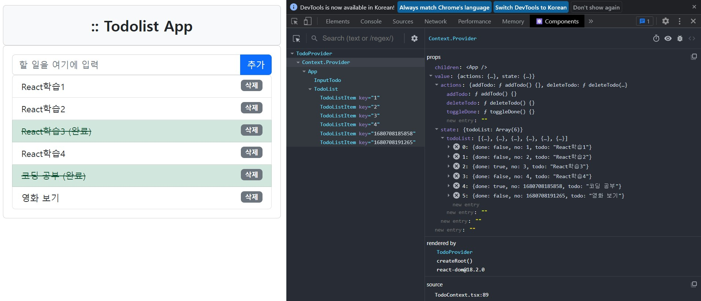
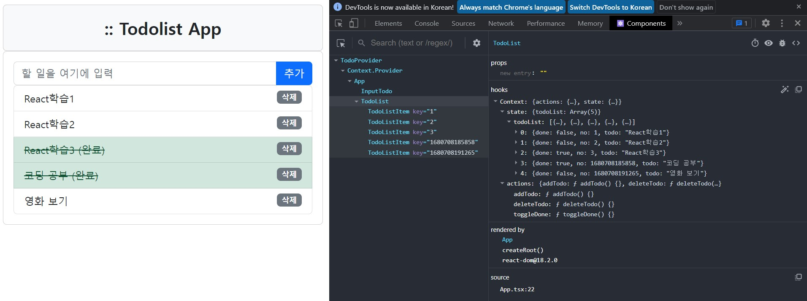

# **chapter 08**  

## 💡 `React` 

--- 
#### [Context API] 

<br>

- Context API란? <br>
    - Context API는 **컴포넌트 트리에서 속성을 전달하지 않고** 필요한 `데이터`를 컴포넌트에 전달하는 방법을 제공하는 API이다.<br>
    ```
    (기존의 방법)
    컴포넌트 상태 관리 방법은 '부모 컴포넌트'나 '주요 거점의 컴포넌트'에 상태와 상태를 변경하는 함수를 작성하고, 속성을 이용해 자식 컴포넌트로 전달하는 방법을 사용
    ```
    - 제공자(Provider)를 이용해 공유하는 데이터(value)를 제공하고, 데이터를 필요로 하는 컴포넌트는 useContext라는 훅을 이용해 데이터에 접근할 수 있다. <br>
        - 이 구조를 사용하면 속성(props)을 이용한 전달을 반복하지 않아도 된다. <br>
    - Context API를 사용하기 위한 단계 <br>
        1. Context 객체가 관리할 데이터(Value)의 타입을 정의한다.
            - **데이터의 타입을 정의할 때**는 `상태`뿐만 아니라 `상태를 변경하는 함수`까지 포함한다. 정의한 타입은 useContext 훅을 이용해 자식 컴포넌트가 데이터에 접근할 때도 사용하므로 익스포트(export)해두어야 한다. <br>
        2. React.createContext() 함수를 이용해 Context 객체를 생성한다. <br>
            - 아래 예시처럼 미리 정의한 **`데이터(value)의 타입` 또는 `null`을 허용하도록 '제네릭'으로 지정**하여 *createContext 함수를 호출*하고 *Context 객체를 생성*한다. null을 허용하는 이유는 Context를 생성할 때 null로 초기화하기 때문이다. <br>
            ```javascript
            const TodoContext = React.createContext<TodoListContextValueType | null>(null);
            ```
        3. 상태와 상태 변경 함수를 관리할 Provider 컴포넌트를 작성한다. <br>
            - 상태와 상태 변경 함수를 작성하려면 컴포넌트가 필요하므로 애플리케이션에서 사용할 Provider 컴포넌트를 하나 작성한다. Provider 컴포넌트에는 상태와 상태 변경 함수를 앞에서 정의한 데이터의 타입에 맞게 객체로 구성한 후, Context 객체의 Provider로 렌더링하도록 작성한다. 이때 Context 객체의 Provider에 데이터(value)를 value 속성으로 전달해야 한다. <br>
            ```javascript
            return (
                <TodoContext.Provider value={values}>
                    {props.children}
                </TodoContext.Provider>
            )
            ```
        4. 자식 컴포넌트에서는 `useContext` 훅을 이용해 데이터 객체(value)를 리턴받아서 상태와 상태 변경 함수를 이용한다. <br>
            ```javascript
            const values = useContext(TodoContext);
            ```


- todolist-app(4장)에 Context API 적용하기 <br>

1. React.createContext( ) 메서드를 호출하여 TodoContext 객체를 생성 <br>
2. TodoProvider 컴포넌트를 작성 <br>
    - 이 컴포넌트 내부에 상태와 상태를 변경하는 액션(함수)을 작성 <br>
3. 상태와 액션을 하나의 value 객체로 만들어서 TodoContext.Provider를 렌더링할 때 value 속성으로 전달 <br>
4. 각 자식 컴포넌트에서는 useContext 훅을 이용해 value에 접근 <br>

```
[4장 todolist-app 가져오기]
https://github.com/stepanowon/react-ts-quickstart
```

◾ 08-01 : src/TodoContext.tsx → Context 객체로 관리할 데이터의 타입과 Context 객체, 상태와 상태 변경 함수를 포함하는 TodoProvider 컴포넌트 작성 <br>

```javascript
import React, { useState } from 'react'
import produce from 'immer'

export type TodoListItemType = {
    no: number;
    todo: string;
    done: boolean;
};

// Provider로 전달한 데이터(value)의 타입 정의
export type TodoListContextValueType = {
    state: { todoList: Array<TodoListItemType> };
    actions: {
        addTodo: (todo: string) => void;
        deleteTodo: (no: number) => void;
        toggleDone: (no: number) => void;
    };
};

// 앞에서 정의한 타입 또는 null 타입을 이용해 context 객체 생성
const TodoContext = React.createContext<TodoListContextValueType | null>(null);

// TodoProvider 컴포넌트의 자식 컴포넌트 타입을 정의
// <TodoProvider> 자식 컴포넌트 </TodoProvider>
type PropsType = {
    children: JSX.Element | JSX.Element[];
};

// 상태와 상태 변경 함수를 가지는 컴포넌트
// 상태와 상태 변경 함수를 데이터 타입 형식으로 구성한 후 value 속성으로 전달
// <TodoContext.Provider value={value}>{children}</TodoContext.Provider>
export const TodoProvider = (props: PropsType) =>  {
    const [todoList, setTodoList] = useState<Array<TodoListItemType>>([
        { no: 1, todo: "React학습1", done: false },
        { no: 2, todo: "React학습2", done: false },
        { no: 3, todo: "React학습3", done: true },
        { no: 4, todo: "React학습4", done: false }
    ]);

    const addTodo = (todo: string) => {
        const newTodoList = produce(todoList, (draft: Array<TodoListItemType>) => {
            draft.push({ no: new Date().getTime(), todo: todo, done: false });
        });
        setTodoList(newTodoList);
    };

    const deleteTodo = (no: number) => {
        const index = todoList.findIndex((item) => item.no === no);
        const newTodoList = produce(todoList, (draft: Array<TodoListItemType>) => {
            draft.splice(index, 1);
        });
        setTodoList(newTodoList);
    };

    const toggleDone = (no: number) => {
        const index = todoList.findIndex((item) => item.no === no);
        const newTodoList = produce(todoList, (draft: Array<TodoListItemType>) => {
            draft[index].done = !draft[index].done;
        });
        setTodoList(newTodoList);
    };

    // <TodoContext.Provider />의 value로 전달할 객체 생성
    const values: TodoListContextValueType = {
        state: { todoList },
        actions: { addTodo, deleteTodo, toggleDone },
    };

    return (
        <TodoContext.Provider value={values}>
            {props.children}
        </TodoContext.Provider>
    );
};

export default TodoContext;
```

```
● Provider로 전달할 데이터(value)의 타입을 정의
● 상태는 state 속성으로, 모든 상태 변경 함수는 actions 속성에 포함되도록 타입 정의
● createContext 함수를 호출해 TodoContext 객체 생성
● JSX.Element를 전달할 수 있도록 PropsType의 속성을 전달받을 수 있는 TodoProvider 컴포넌트를 작성
● TodoProvider 컴포넌트에는 상태와 상태 변경 함수를 작성
● TodoContext.Provider 컴포넌트의 value 속성으로 전달할 데이터 형식으로 객체를 구성
● Context 객체의 Provider에서 value 속성으로 전달
● {props.children}은 TodoProvider 컴포넌트를 다음과 같이 렌더링할 때 <App /> 컴포넌트와 같은 자식 컴포넌트가 된다.
```
```javascript
<TodoProvider>
    <App />
</TodoProvider>
```

◾ 08-02 : src/main.tsx → TodoProvider컴포넌트 사용(App 컴포넌트를 자식으로 포함(컴포넌트 중첩 구조)) <br>

```javascript
import React from 'react'
import ReactDOM from 'react-dom/client'
import 'bootstrap/dist/css/bootstrap.css'
import { TodoProvider } from './TodoContext'
import App from './components/App'
import './index.css'

ReactDOM.createRoot(document.getElementById('root') as HTMLElement).render(
  <React.StrictMode>
    <TodoProvider>
      <App />
    </TodoProvider>
  </React.StrictMode>
);
```
일단 App 컴포넌트에서 에러 발생 → 추후 수정

◾ 08-03 : src/App.tsx → 속성을 이용하지 않고, 단지 자식 컴포넌트를 임포트하여 구성하고 조합하는 기능 제공 <br>
```
[기존 방식]
App 컴포넌트는 todoList, addTodo, deleteTodo, toggleDone 속성을 전달 받아 다시 자식 컴포넌트로 전달하는 기능을 수행
```

```javascript
import InputTodo from './InputTodo'
import TodoList from './TodoList'

const App = () => {
    return (
        <div className="container">
            <div className="card card-body bg-light">
                <div className="title">:: Todolist App</div>
            </div>
            <div className="card card-default card-borderless">
                <div className="card-body">
                    <InputTodo />
                    <TodoList />
                </div>
            </div>
        </div>
    );
};

export default App;
```
InputTodo, TodoList 컴포넌트에서 에러 발생 → 추후 수정 <br>

◾ 08-04 : src/InputTodo.tsx → useContext 훅을 이용해 value를 리턴받아 사용 <br>

```javascript
import React, { useContext, useState } from 'react'
import TodoContext from '../TodoContext'

const InputTodo = () => {
    const [todo, setTodo] = useState<string>("");

    // useContext 훅으로 TodoContext의 value 값을 받아낸다.
    const value = useContext(TodoContext);

    // value의 속성의 actions의 addTodo 함수를 호출
    const addHandler = () => {
        value?.actions.addTodo(todo);
        setTodo("");
    };

    const enterInput = (e: React.KeyboardEvent) => {
        if (e.key === "Enter") {
            addHandler();
        }
    };

    const changeTodo = (e: React.ChangeEvent<HTMLInputElement>) => {
        setTodo(e.target.value);
    };

    return (
        <div className="row">
            <div className="col">
                <div className="input-group">
                    <input id="msg" type="text" className="form-control" name="msg"
                        placeholder="할 일을 여기에 입력" value={todo}
                        onChange={changeTodo} onKeyUp={enterInput} />
                    <span className="btn btn-primary input-group-addon" onClick={addHandler}>추가</span>
                </div>
            </div>
        </div>
    );
};

export default InputTodo;
```
▶ value?.actions.addTodo(tood);와 같이 value에 **`?` 식별자**를 사용해 **선택적 속성**으로 작성 <br>
▶ TodoContext.tsx에서 Context 객체를 만들 때 사용했던 **제네릭 타입**이 <TodoListContextValueType | null>이고, **초기화 할 때 `null` 값을 부여**했으므로, **`?` 기호**를 사용해 `선택적 속성`으로 사용 <br>

```javascript
// src/TodoContext.tsx에서의 Context 객체 생성 코드
const TodoContext = React.createContext<TodoListContextValueType | null>(null);
```

◾ 08-05 : src/TodoList.tsx → useContext 훅을 이용해 value 값에 접근 <br>
→ 속성(props)은 사용하지 않는다. <br>

```javascript
import React, { useContext, useState } from 'react'
import TodoContext from '../TodoContext'
import TodoListItem from './TodoListItem'

const TodoList = () => {
    const value = useContext(TodoContext);

    let items = value?.state.todoList.map((item) => {
        return <TodoListItem key={item.no} todoItem={item}
                deleteTodo={value?.actions.deleteTodo} 
                toggleDone={value?.actions.toggleDone} />
    });

    return (
        <div className="row">
            {" "}
            <div className="col">
                <ul className="list-group">{items}</ul>
            </div>
        </div>
    );
};

export default TodoList;
```
▶ TodoList 컴포넌트에서 TodoListItem 컴포넌트로 속성을 전달하는 방법을 그대로 사용하고 있는데, 이런 경우 Context를 이용해 전달하는 것이 더 복잡하고 어렵게 때문에 기존과 같이 속성을 전달하는 것이 더 바람직하다. <br>
```
TodoList 컴포넌트에서 이용하는 todoList 상태는 '배열값'이며 TodoListItem 컴포넌트로 전달되는 속성은 todoList 배열의 각 항목이다.
```

 <br>
 <br>
▶ Context.Provider 컴포넌트와 TodoList 컴포넌트의 속성, 훅 정보를 확인 <br>

```
Context API를 이용하면 자식 컴포넌트로 반복해서 속성을 전달하지 않아도 된다. React.createContext() 함수를 이용해 Context 객체를 생성하고, Context.Provider 컴포넌트의 value 속성에 상태와 상태를 변경하는 함수를 객체로 구성하여 지정한다. 컴포넌트 트리에 있는 자식 컴포넌트에서는 useContext 훅을 이용해 value 객체를 받아내어 상태와 상태 변경 함수를 이용할 수 있다.

하지만 속성을 전혀 사용하지 않고 Context API만 이용해서 컴포넌트와 애플리케이션을 작성하는 것은 바람직하지 않다.

TodoListItem 컴포넌트와 같이 상태 데이터 중 배열의 각 항목을 이용하는 컴포넌트는 useContext를 이용해 상태에 접근할 수는 있지만, 배열 데이터 중 몇 번째 항목인지를 확인하기 힘들기 때문에 기존처럼 속성을 사용하는 것이 바람직하다.

또한 Context API를 이용하는 컴포넌트는 Context API에 종속되기 때문에 Context API를 사용하도록 개발된 애플리케이션에서만 재사용할 수 있다. 하여, 주요 거점 컴포넌트에서만 useContext 훅을 사용하고, 그 하위의 짧은 단계는 자식 컴포넌트로 속성을 전달하는 것이 바람직하다.
```

```
[주요 거점 컴포넌트]
◇ '간단한 애플리케이션'인 경우에는 최상위 컴포넌트
◇ '복잡한 컴포넌트 트리의 애플리케이션'인 경우에는 화면의 주요 영역(main, top, bottom)별 최상위 컴포넌트
◇ '많은 수의 화면을 가진 애플리케이션'인 경우에는 각 화면 단위의 최상위 컴포넌트
```