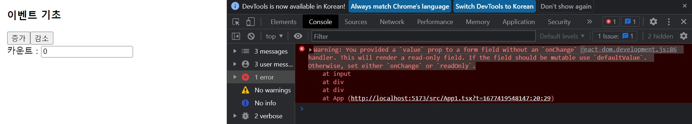
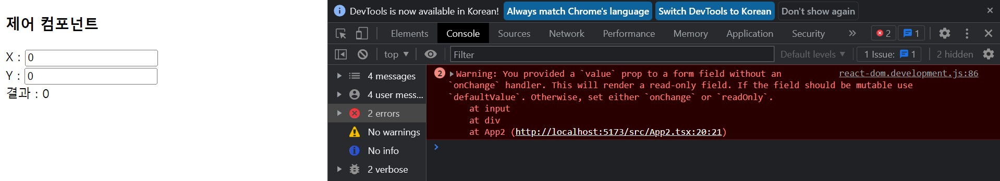
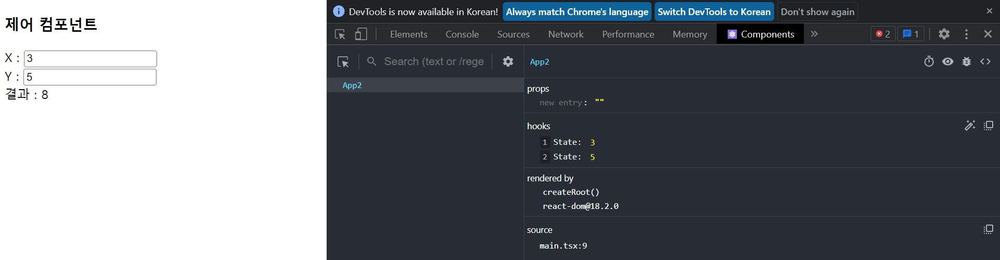
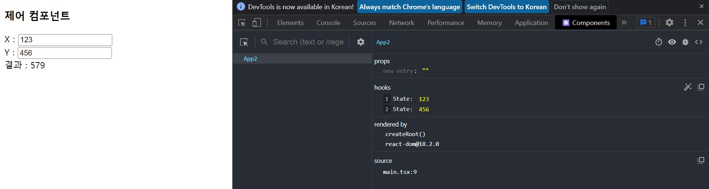
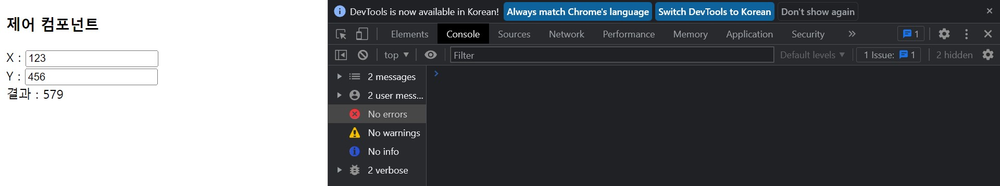

# **chapter 04**  

## 💡 `React` 

--- 
#### [리액트 컴포넌트]
- ### 리액트 이벤트 <br>
```javascript
// 함수 또는 메서드 호출
<button onClick={func} OK </button>
// 익명 함수 호출
<button onClick={() => alert('hello') }> OK </button>
```

```javascript
<MyComponent onClick={ () => alert('hello') } name={'홍길동'} />
```
▶ DOM 요소가 아닌 컴포넌트에 이벤트를 설정하면 에러 발생 <br>

- 이벤트 적용 방법 <br>
  - 이벤트 핸들러 함수를 정의하여 { } 보간법을 이용해 외부 함수를 바인딩 <br>
    (이름 없는 함수(익명 함수: anonymous function)도 바인딩 가능) <br>
    ```javascript
    const eventHandler = () => {

      // JSX 내부에서 외부 함수 바인딩
      <input type="text" ... onChange={eventHandler} />

      // JSX 내부에서 익명 함수 바인딩
      <button onClick={ () => {......} }>버튼</button>
    }
    ```
  - 이벤트 핸들러 함수의 첫 번째 인자를 이용해 이벤트 아규먼트 값을 이용
    ```javascript
    const eventHandler = (e : ChangeEvent<HTMLInputElement>) => {
      setValue(e.target.value);
    }
    ```

```
// 이벤트 아규먼트 타입에서 사용할 수 있는 속성 - 문서 참조
https://github.com/DefinitelyTyped/DefinitelyTyped/blob/master/types/react/v17/index.d.ts

// EventHandler만 검색해서 보면 찾아보기 쉽다. → ex) ChangeEventHandler
```

<br> ♧ 새로운 프로젝트 생성 <br>

```javascript
cd ..
npm init vite events-test -- --template react-ts
cd events-test
npm install
```
(src/App.tsx와 src/App.css 파일 삭제) <br>

◾ 04-18 : src/App1.tsx → 이벤트 적용 예제 작성 <br>
```javascript
import { useState } from 'react'

const App = () => {
    const [count, setCount] = useState<number>(0);
    const increment = () => {
        setCount(count + 1);
    };
    const decrement = () => {
        setCount(count - 1);
    };

    return (
        <div style={{ margin: "5px" }}>
            <h3>이벤트 기초</h3>
            <div>
                <button onClick={increment}>증가</button>
                <button onClick={decrement}>감소</button>
            </div>
            <div>
                카운트 : <input type="text" value={count} />
            </div>
        </div>
    );
};

export default App;
```

◾ 04-19 : src/main.tsx → App1 import <br>
```javascript
import React from 'react'
import ReactDOM from 'react-dom/client'
import App from './App1'
import './index.css'

ReactDOM.createRoot(document.getElementById('root') as HTMLElement).render(
  <React.StrictMode>
    <App />
  </React.StrictMode>,
);
```

 <br>
▶ 경고가 나오는 이유: state의 값은 함부로 변경되면 안 된다. <s>여기서는 const인데 값이 바뀔 수 있어서 경고 표시</s>(Read Only)
▶▶ 입력 필드에 상태가 바인딩되었는데, 이벤트 핸들러 함수가 HTML 요소에 연결되지 않았기 때문에 경고 표시

→ 리액트는 <u>단방향 데이터 바인딩</u> 구조이다. <br>
→ UI에서 입력한 값은 state(상태)에 반영되지 않기 떄문에 '이벤트 핸들러 함수'를 통해 `setState()`로 state(상태)가 변경된 것을 UI에 적용하여 갱신한다.(<u>양방향 데이터 바인딩</u>) <br>

◾ 04-20 : src/App1.tsx 변경 → 같은 state를 여러 번 변경하면 생기는 문제점 확인 <br>
▶ 세터(setter) 함수는 '비동기'로 작동하기 떄문에 이벤트 핸들러 함수 안에서 같은 state(상태)를 여러 번 변경하면 문제가 발생할 수 있다.
```javascript
import { useState } from 'react'

const App = () => {
    const [count, setCount] = useState<number>(0);
    const increment = () => {
        setCount(count + 1);
        setCount(count + 1);
        setCount(count + 1);
    };

    ·····

};

export default App;
```
setCount 상태 변경 함수는 3번 호출되지만, 1씩 증가하는 것을 확인 <br>


▶ 불가피하게 <u>같은 상태를 여러 번 변경해야 하는 경우</u> ▷ `리턴값`으로 상태를 변경하도록 작성 <br>
```javascript
const increment = () => {
        setCount((count) => count + 1);
        setCount((count) => count + 1);
        setCount((count) => count + 1);
    };
```

◾ 04-21 : src/App2.tsx → 제어 컴포넌트 확인 <br>
```javascript
import { useState } from "react";

const App2 = () => {
    const [x, setX] = useState<number>(0);
    const [y, setY] = useState<number>(0);

    return (
        <div>
            <h3>제어 컴포넌트</h3>
            X : <input type="text" value={x} />
            <br />
            Y : <input type="text" value={y} />
            <br />
            결과 : <span>{x + y}</span>
        </div>
    );
};

export default App2;
```
◾ 04-22 : src/main.tsx 변경 → App2 사용 <br>
```javascript
import React from 'react'
import ReactDOM from 'react-dom/client'
import App from './App1'
import App2 from './App2'
// import './index.css'

ReactDOM.createRoot(document.getElementById('root') as HTMLElement).render(
  <React.StrictMode>
    {/* <App /> */}
    <App2 />
  </React.StrictMode>
);
```
 <br>
브라우저에 X, Y에 값이 입력되지 않으며, 상태(state)도 바뀌지 않는다. <br><br>
 <br>
[Components] 탭에서 상태를 직접 변경하면 UI에서도 값이 바뀌는 것 확인 <br>

◾ 04-23 : src/App2.tsx 변경 → 이벤트 핸들러 사용 <br>
```javascript
import { ChangeEvent, useState } from "react";

const App2 = () => {
    const [x, setX] = useState<number>(0);
    const [y, setY] = useState<number>(0);

    const changeValue = (e: ChangeEvent<HTMLInputElement>) => {
        let newValue: number = parseInt(e.target.value);
        if (isNaN(newValue)) newValue = 0;
        if (e.target.id === "x") setX(newValue);
        else setY(newValue);
    };

    return (
        <div>
            <h3>제어 컴포넌트</h3>
            X : <input id="x" type="text" value={x} onChange={changeValue} />
            <br />
            Y : <input id="y" type="text" value={y} onChange={changeValue} />
            <br />
            결과 : <span>{x + y}</span>
        </div>
    );
};

export default App2;
```
 <br>
 <br>
input 태그의 입력 창을 입력하여 상태를 변경할 수 있고, 더 이상 경고도 나오지 않는다.

◾ 04-24 : src/App3.tsx → HTML DOM 요소에 직접 접근(defaultValue, ref 바인딩) <br>
- 사용자가 입력한 값을 획득하려면 ref객체의 current 속성을 이용
    - current 속성값이 null일 수도 있으므로(HTML DOM이 연결되지 않은 경우) 삼항 연산자를 이용하여 current 속성이 있을 때만 문자열로 값을 받아내도록 작성.
```javascript
import { useRef, useState } from 'react'

type Props = {};

const App3 = (props: Props) => {
    const [x, setX] = useState<number>(0);
    const [y, setY] = useState<number>(0);
    const [result, setResult] = useState<number>(0);

    const elemX = useRef<HTMLInputElement>(null);
    const elemY = useRef<HTMLInputElement>(null);

    const add = () => {
        let x1: number = parseInt(elemX.current ? elemX.current.value : "", 10);
        let y1: number = parseInt(elemY.current ? elemY.current.value : "", 10);
        if (isNaN(x1)) x1 = 0;    
        if (isNaN(y1)) y1 = 0;
        setX(x1);
        setY(y1);
        setResult(x1 + y1);
    };

    return (
      <div className="container">
        X : <input id="x" type="text" defaultValue={x} ref={elemX} />
        <br />
        Y : <input id="y" type="text" defaultValue={y} ref={elemY} />
        <br />
        <button onClick={add}>덧셈 계산</button>
        <br />
        결과 : <span>{result}</span>
      </div>  
    );
};

export default App3;
```

◾ 04-25 : src/main.tsx → App3 사용 <br>
```javascript
import React from 'react'
import ReactDOM from 'react-dom/client'
import App from './App1'
import App2 from './App2'
import App3 from './App3'
// import './index.css'

ReactDOM.createRoot(document.getElementById('root') as HTMLElement).render(
  <React.StrictMode>
    {/* <App /> */}
    {/* <App2 /> */}
    <App3 />
  </React.StrictMode>
);

```
 <br>
<u>`ref` 속성</u>을 이용해 'HTML DOM'에 접근하며, 사용자가 입력한 값을 획득해 상태를 변경 <br>