# **chapter 03**

## 💡 `React` 

--- 

#### [리액트 시작 & Vite]
- ### 리액트 시작 <br>
  - ES6 기반 <br>
    ```
    npx create-react-app [프로젝트명]
    ```
  - 타입스크립트 기반 <br>
    ```
    npx create-react-app [프로젝트명] --template typescript
    ```

> `src`: '자바스크립트'와 '타입스크립트' 코드를 작성하는 디렉터리. 진입(entry) 파일은 index.js 또는 index.tsx 파일이다. <br>
> `public`: 정적파일과 리소스를 이곳에 배치 <br>
> `build`: 빌드 후 생성된 산출물(artifact)이 저장되는 디렉터리. 이곳에 생성된 파일은 웹 서버에 배포 가능. <br>

<br>

- 실행/빌드 명령어 <br>
  - 개발 서버 실행 명령어 <br>
    ```
    npm run start 
    yarn start
    ```
  - 빌드 명령어 <br>
    ```
    npm run build
    yarn build
    ```
  - 테스트 명령어 <br>
    ```
    npm run test
    yarn test
    ```

- 'npx create-react-app [프로젝트명]' 오류 <br>
  ```
  "You are running 'create-react-app' x.x.x, which is behind the latest release
  (x.x.x). We no longer support global installation of Create React App."
  ```
  - 전역 설칠된 CRA(create-react-app)와 캐시를 삭제 후 프로젝트 생성 재시도 <br>
    ```
    npm uninstall -g create-react-app
    npm cache clean -force
    npm cache verify
    ``` 

> CRA는 내부적으로 webpack을 사용 <br>

<br>

- ### Vite <br>
> 프랑스어로 '빠르다'라는 뜻을 가진 단어 <br>

→ 차세대 프런트엔드 개발 도구 <br>
→ Vite가 내부적으로 사용하는 ESBuild는 '`Go`라는 네이티브 언어'로 만들어진 도구를 이용해 빌드하기 때문에 빌드 속도가 빠르다. (webpack, parcel과 비교하면 10배 이상 빠르다.) <br>
→ Vite는 `Native ESM`이라는 브러우저의 자체적인 모듈 기능을 사용(모듈 번들링 기능을 브라우저가 수행) <br>
```
cf)

기존 webpack과 같은 모듈 번들러를 이용할 때는 엔트리에서 여러 라우트와 여러 모듈을 통해 모듈 번들링을 끝낸 후 개발 서버를 구동하여 시간이 오래 걸리는 반면, Vite는 Native ESM이라는 브라우저의 자체적인 모듈 기능을 사용하여, Vite가 실행하는 개발 서버는 브라우저가 요청하는 모듈을 전송해주고, 모듈 번들링 기능을 브라우저가 수행하기 때문에 개발 서버의 구동이 빠르다.
```

- Vite 시작
  - ES6 기반
    ```
    npm init vite [프로젝트명] -- --template react
    yarn create vite [프로젝트명] -- --template react
    ```
  - 타입스크립트 기반
    ```
    npm init vite [프로젝트명] -- --template react-ts
    yarn create vite [프로젝트명] -- --template react-ts
    ```
    ```
    cf)

    npm init vite [프로젝트명] -- -- template react
    ```
    ▶ template 앞에 -- 띄고 template을 실행하면 다음과 같이 실행 된다. <br>
    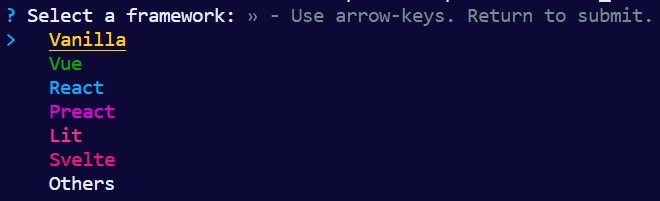 <br>
    (프레임워크 선택 가능) <br>

<br>
    
> `src`: '자바스크립트'와 '타입스크립트' 코드를 작성하는 디렉터리. 진입(entry) 파일은 main.tsx 또는 main.jsx 파일이다. <br>
> `public`: 정적파일과 리소스를 이곳에 배치. 이 디렉터리는 자동으로 만들어지지 않으므로 직접 생성 <br>
> `build`: 빌드 후 생성된 산출물(artifact)이 저장되는 디렉터리 <br>

- vite.config.js 설정
```
https://Vitejs.dev/config/#config-file
```

- helloapp <br>
Vite로 만든 프로젝트는 '의존 패키지'를 자동으로 다운로드하지 않으므로 `npm install` 명령어로 직접 다운로드 <br>
```
npm init vite helloapp -- --template react-ts
cd helloapp
npm install
```
> React/Redux/React-Native snippets ▷ VSCode 확장팩 도구 활용 <br>
>> 코드 편집 창에 tsrafce 입력 <br>
>> ▷ tsrafce: TypeScriptReactArrowFunctionComponentExport <br>
>>> 타입스크립트를 지원하는 컴포넌트는 대부분 `ts`로 시작 <br>

<br> 
코드 조각 참고

```
https://github.com/dsznajder/vscode-react-javascript-snippets/blob/HEAD/docs/Snippets.md
```


◾ 03-01 : src/App.tsx → 코드 조각 작성(함수 컴포넌트) <br>
- 작성 코드 실행 <br>
  ```
  npm run dev
  ```
  Vite 3.x 버전 이상 default port (package.json: 현재 4.1.0 버전) <br>
  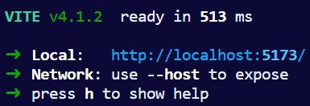 <br>

  - 포트 설정 <br>
  scripts의 "dev": "vite"를 다음과 같이 설정 <br>
  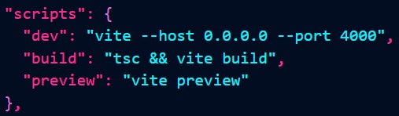 <br>
  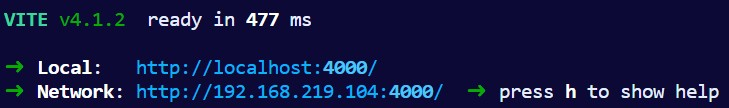 <br>

  <br>
  main.tsx의 import './index.css' 주석 처리 <br>
  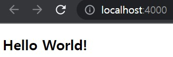 <br>

  <br>
  App.tsx 내용 수정 <br>
  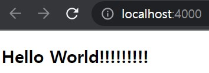 <br>
  ▶ HMR(Hot Module Replacement): 수정된 내용을 반영하여 웹 브라우저 화면이 자동으로 갱신되는 것 <br>
     (코드를 수정하면 웹 브라우저는 변경된 모듈을 개발 서버로부터 다운로드해서 화면을 즉시 갱신) <br>


◾ 03-02 : src/main.tsx → 구조 확인('./App' 상대경로로부터 import) <br>
▶ './App'은 같은 경로상의 App 컴포넌트를 참조한다는 뜻 <br>

- 절대 경로 사용 방법 <br>
  1. tsconfig.json 파일 코드 추가(수정) <br>
  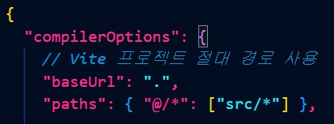 <br>
  2. npm install path 명령어를 수행하여 path 패키지 추가 <br>
  ```
  npm install path
  ```
  3. vite.config.ts 파일 코드 추가(수정) <br>
    - 변경 전 <br>
    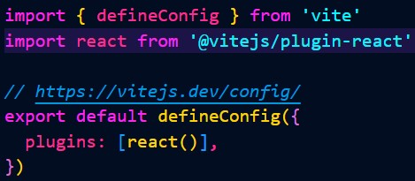 <br>
    - 변경 후 <br>
    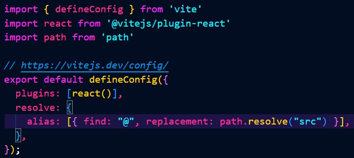 <br>
  4. 절대 경로 사용 <br>
  ```
  // import App from './App'
  // @가 src 디렉터리를 나타낸다.
  import App from '@/App'
  ```

◾ 03-03 : index.html → id가 root인 요소 찾기 <br>
◾ 03-04 : src/App.tsx 변경 → JSX(JavaScript XML) 자바스크립트 확장 문법 활용 / { } 사용  <br>
  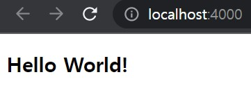 <br>
  ▶ { }는 보간법(interpolation)이라 한다. JSX의 { }에는 리턴값을 가지는 표현식(expression)이면 무엇이든 배치할 수 있다.
  ```
  보간법(補間法) 또는 내삽(內揷, interpolation)이란?
  알려진 데이터 지점의 고립점 내에서 새로운 데이터 지점을 구성하는 방식이다.
  https://ko.wikipedia.org/wiki/%EB%B3%B4%EA%B0%84%EB%B2%95 [위키백과]
  ```

◾ 03-05 : src/App.tsx 변경 → 함수 추가(addResult) & return 값 활용 <br>
  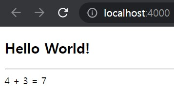 <br>

- ### css 적용 ▷ bootstrap 활용 <br>
◾ 03-06 : src/index.css → css 코드 추가 <br>
 ```
// 특정 버전 설치하려면 bootstrap@5.x.x와 같이 버전 작성
npm install bootstrap
 ```
 ```
// 기존 것 주석 처리하고 마지막에 추가
hr.dash-style {
  background-color: #fff;
  border-top:2px dashed gray;
}
 ```

◾ 03-07 : src/main.tsx 변경 → 볼드체 추가(bootstrap.css 파일 import)<br>
```
import 'bootstrap/dist/css/bootstrap.css'
```
◾ 03-08 : src/App.tsx 변경 → CSS 클래스 지정 <br>
```
import React from 'react'

const App = () => {
  let msg = "World";
  const addResult = (x: number, y: number) => {
    return (
      <div className="card card-body bg-light mb-3">
        {x} + {y} = {x + y} 
      </div>
    );
  };

  return (
    <div className="container">
      <h2>Hello {msg}!</h2>
      <hr className="dash-style" />
      {addResult(4, 3)}
    </div>
  );
};

export default App;
```
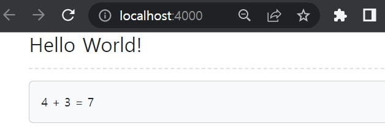 <br>
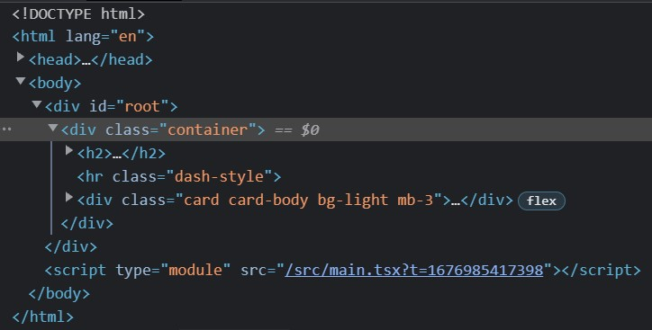 <br>
(크롬 개발자 도구 - css 지정된 것 확인) <br>

- ### JSX (자바스크립트 확장)
```
Babel REPL(https://babeljs.io/repl)
// -->> JSX 코드가 자바스크립트 코드로 변환된 것을 확인
```
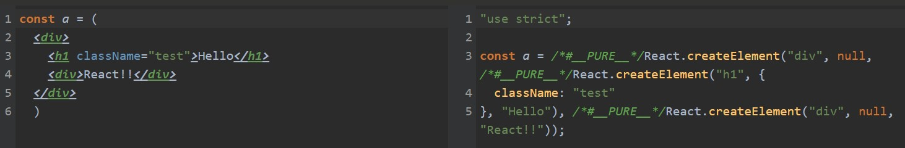 <br>

  - JSX 주의 사항 1 <br>
    - 요소의 Attribute는 카멜 표기법(camel casing)을 준수 <br>
  
  - JSX 주의 사항 2 <br>
    - '속성명'이 `DOM API` 스펙에 기반 <br>
    - `JSX`는 HTML처럼 보이지만 실제로는 자바스크립트 코드이기 때문에 **`className` 속성으로 사용**
    ```
    // Javascript 코드에서 CSS 클래스 지정
    document.getElementById("a").className="test";
    ```
  - JSX 주의 사항 3 <br>
    - `보간법( { } : interpolation)`을 사용할 때는 '표현식'을 사용
    - statement문 작성 불가
      - if문은 리턴값이 없으므로 사용 불가
      - for문도 리턴값이 없으므로 { } 내부에 사용 불가
        - **▶ `삼항 연산자` 사용!** 
        - **▶ [배열 데이터]의 렌더링을 하려면 배열 객체의 `map( )` 메서드 사용!** 
    <br>

  - JSX 주의 사항 4 <br>
  ◾ 03-09 : src/App.tsx 변경 → { } 내에 보간된 HTML '문자열'은 인코딩 된다. <br>
- `{ }` 내부에 배치한 표현식에 의해 리턴되는 값이 `문자열`인 경우, 모두 `HTML 인코딩` 된다. <br>
```
import React from 'react'

const App = () => {
  // let msg = "World";
  let msg = "<i>World</i>";

  ·····
```
```
// 크롬 개발자 도구 ▶ 콘솔 화면에 입력
document.querySelector('h2').innerHTML
```
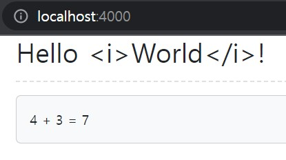 <br>
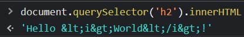 <br>
▶ 브라우저 화면에서 <i></i> 태그의 문자열이 그대로 출력되었는데, 그 이유는 웹 애플리케이션에서 흔히 발생하는 <br> 
XSS(Cross Site Scripting) 같은 공격에 대비하기 위해서 `<i>`가 `&lt;i&gt;`로 HTML 인코딩됐기 때문이다. <br>
```
// XSS(Cross Site Scripting) [위키백과]
https://ko.wikipedia.org/wiki/%EC%82%AC%EC%9D%B4%ED%8A%B8_%EA%B0%84_%EC%8A%A4%ED%81%AC%EB%A6%BD%ED%8C%85
```


<br>

[HTML 마크업 형태의 값을 보간하는 방법]

1. `dangerouslySetInnerHTML` 사용

```
return (
    <div className="container">
      {/* <h2>Hello {msg}!</h2> */}
      <h2>Hello <span dangerouslySetInnerHTML={{__html: msg }} /></h2>
      <hr className="dash-style" />
      {addResult(4, 3)}
    </div>
  );
```
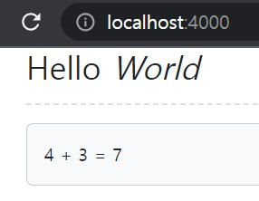 <br>

2. <u>JSX가 XSS 공격에 안전</u>하므로 HTML 문자열 대신 `JSX` 사용
```
·····
const App = () => {
  // let msg = "<i>World</i>";
  let msg = (<i>World</i>);
  ·····

  return (
    <div className="container">
      <h2>Hello {msg}!</h2>
      ·····
  );
};

export default App;
```
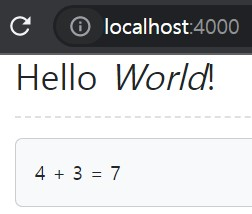 <br>

  - JSX 주의 사항 5 <br>
    - JSX는 <u>단일 루트 요소</u>만 렌더링

  ```
  // 사용 불가
  return (
    <div>Hello</div>
    <div>World</div>
  );
  ```
  ```
  // 사용 가능
  return (
    <>
      <div>Hello</div>
      <div>World</div>
    </>
  );
  ```
  - JSX 적용 예제 <br>
  ◾ 03-10 : src/CountryList.tsx → 컴포넌트 작성(arrow 함수형) <br>
    - 삼항 연산식 사용

◾ 03-11 : src/App.tsx 변경 → CountryList 컴포넌트 추가 <br>
```
import React from 'react'
import CountryList from './CountryList';
·····

return (
    <div className="container">
      <h2>Hello {msg}!</h2>
      <hr className="dash-style" />
      {addResult(4, 3)}
      <CountryList />
    </div>
  );
};

export default App;
```
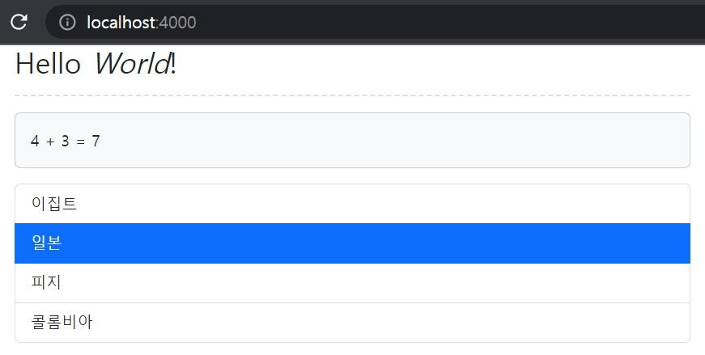 <br>

- ### 속성 / 속성 적용 예제 <br>
```
// Type을 이용하는 경우
type TestPropsType = {
  name : string;
  age : number;
}

const Test = (props:TestPropsType) => {
  ·····
}

// Interface를 이용하는 경우
interface ITestprops {
  name : string;
  age : number;
}

const Test = (props:ITestProps) => {
  ·····
}
```

◾ 03-12 : src/App.tsx 변경 → App 컴포넌트에 CountryList의 데이터 선언, `속성`을 이용해 CountryList로 전달 <br>
```
import React from 'react'
import CountryList from './CountryList';

export type CountryType = {
  no: number;
  country: string;
  visited: boolean;
};

const App = () => {
  let list: Array<CountryType> = [
    { no: 1, country: "이집트", visited: false },
    { no: 2, country: "일본", visited: true },
    { no: 3, country: "피지", visited: false },
    { no: 4, country: "콜롬비아", visited: false }
  ];

  ·····

  return (
    <div className="container">
      ·····
      <CountryList countries={list} />
    </div>
  );
};

export default App;
}
```

◾ 03-13 : src/CountryList.tsx 변경 → countries 속성으로 (부모)데이터 전달 <br>
```
import React from 'react'
import { CountryType } from './App';

type CountryListPropsType = {
    countries: Array<CountryType>
};

const CountryList = (props:CountryListPropsType) => {
    const list = props.countries;
    ·····

    return <ul className="list-group">{countries}</ul>
};

export default CountryList;
    
```
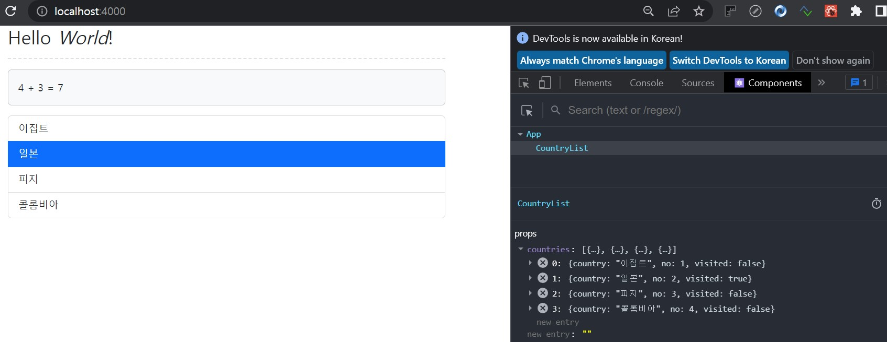 <br>
(속성 전달 확인) <br>

- ### 컴포넌트 세분화 <br>

◾ 03-14 : src/CountryItem.tsx → CountryList 세분화 <br>
```
import React from "react";
import { CountryType } from "./App";

type CountryItemPropsType = {
    countryitem: CountryType;
};

const CountryItem = (props:CountryItemPropsType) => {
    let item = props.countryitem;
    return (
        <li className={item.visited ? "list-group-item active" : "list-group-item"} >
            {item.country}
        </li>
    );
};

export default CountryItem;
```
◾ 03-15 : src/CountryList.tsx 변경 → CountryItem 컴포넌트 렌더링 / 컴포넌트 세분화 <br>
```
import React from 'react'
import { CountryType } from './App';
import CountryItem from './CountryItem';

·····

const CountryList = (props:CountryListPropsType) => {
    const list = props.countries;
    let countries = list.map((item, index) => {
      return <CountryItem key={item.no} countryitem={item} />
    });

    return <ul className="list-group">{countries}</ul>
};

export default CountryList;
```
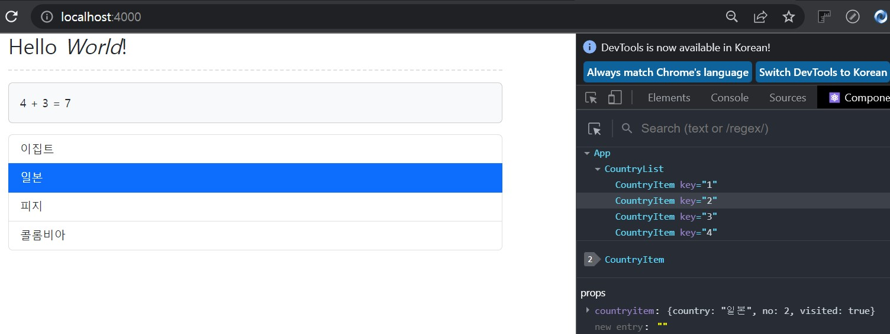 <br>
(속성 전달 확인) <br>
<br>
[컴포넌트 세분화의 장점]
- 컴포넌트 기능이 단순해지기 때문에 에러가 발생할 가능성이 줄어들며 디버깅과 테스트가 쉬워진다.
- 컴포넌트의 재사용성이 높아진다.
- 렌더링 성능을 최적화하기가 더 용이하다.
  - 리액트 컴포넌트는 '컴포넌트 단위'로 렌더링할지 여부를 결정
  - 컴포넌트 내부의 데이터와 속성이 일치한다면 렌더링을 하지 않도록 컴포넌트를 작성 가능
  - 컴포넌트를 세분화하면 렌더링 단위를 더 정교하게 지정 가능

◾ 03-16 : src/App.tsx 변경 → 상태 정의, 상태를 속성으로 전달 <br>
(상태를 변경하면 렌더링과 함께 속성이 전달되면서 화면 전체가 갱신)

```
import { useState } from 'react'
import CountryList from './CountryList';

·····

const App = () => {
  const [msg, setMsg] = useState<string>("World");
  const [list, setList] = useState<Array<CountryType>>([
    { no: 1, country: "이집트", visited: false },
    { no: 2, country: "일본", visited: true },
    { no: 3, country: "피지", visited: false },
    { no: 4, country: "콜롬비아", visited: false }
  ]);

  const addResult = (x: number, y: number) => {
    return (
      <div className="card card-body bg-light mb-3">
        {x} + {y} = {x + y} 
      </div>
    );
  };
  
·····

  );
};

export default App;
```

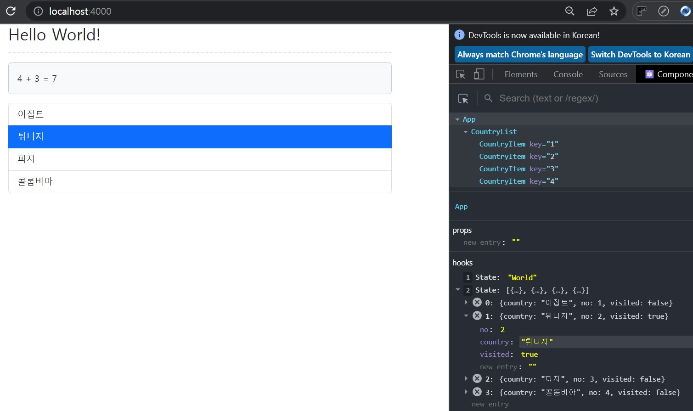 <br>
상태를 App(부모)에서 직접 변경해보면 각 자식 컴포넌트로 전달되는 속성이 변경되면서 화면 갱신 <br>

---
---
---


# **chapter 04**  

## 💡 `React` 

--- 
#### [리액트 컴포넌트]
- ### HTML에서의 스타일 지정
  - 인라인 스타일 지정 <br>
    ```
    <div style="width:200px; height:60px; color:yellow; border:solid 1px gray; background-color:purple;">
      Hello
    </div>
    ```
  - &lt;style&gt;&lt;&#47;style&gt; 요소 이용 <br>
    - HTML '페이지 단위'로 스타일을 정의하고, 같은 페이지에서는 스타일을 재사용 할 수 있다. <br>
  - 외부 CSS 파일 참조 <br>
    - 스타일 파일을 CSS파일로 작성하고 &lt;link &#47;&gt; 태그로 참조. <br>

<br>

- ### 리액트에서의 스타일 지정
  - import '[CSS 파일 경로]' 
    ```
    // src/main.tsx
    import './index.css'
    // npm install bootstrap 후 node_modules/bootstrap/dist/css/bootstrap.css 임포트
    import 'bootstrap/dist/css/bootstrap.css'
    ```
    - 임포트한 CSS파일의 스타일은 모든 컴포넌트에서 사용 가능.

<br>

- ### 리액트 인라인 스타일 지정
```
// Javascript 객체로 스타일 정보 정의
const styles = {
  color: "yellow", backgroundColor: "purple"
}

// style 특성을 이용해 스타일 지정
<div style={styles}>Hello</div>
```

##### css코드를 자바스크립트 객체로 변환해주는 온라인 도구
```
https://transform.tools/css-to-js
```
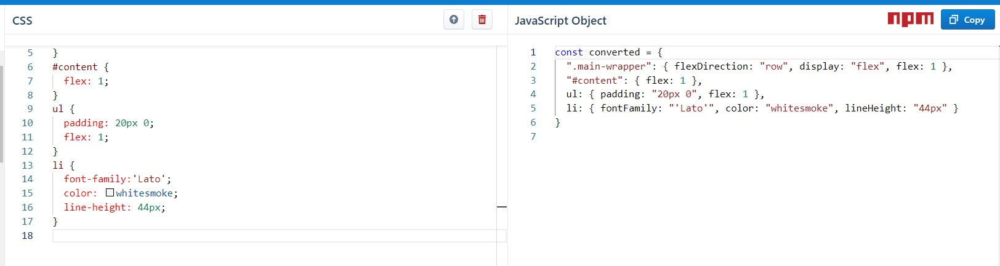 <br>

<br>

◾ 04-01 : src/styles.ts → 스타일 정보를 지정하는 소스 코드 파일 추가(인라인 스타일 적용) <br>
```
const styles = {
    listItemStyle : {
        fontStyle: "italic", 
        textDecoration: "underline"
    },
    dashStyle: {
        backgroundColor: "#fff",
        borderTop: "2px dashed gray"
    }
}

export default styles;
```

◾ 04-02 : src/App.tsx 변경 → App 컴포넌트에 styles(CSS) 적용  <br>
```
·····
import styles from './styles'
·····

return (
    <div className="container">
      <h2>Hello {msg}!</h2>
      <hr style={styles.dashStyle} />
      {addResult(4, 3)}
      <CountryList countries={list} />
    </div>
  );
};

export default App;
```

◾ 04-03 : src/CountryItem.tsx 변경 → CountryItem컴포넌트에 styles(CSS) 적용 <br>
```
·····
import styles from './styles'

·····

const CountryItem = (props:CountryItemPropsType) => {
    let item = props.countryitem;
    return (
        <li style={styles.listItemStyle}
            className={item.visited ? "list-group-item active" : "list-group-item"} >
            {item.country}
        </li>
    );
};

export default CountryItem;
```

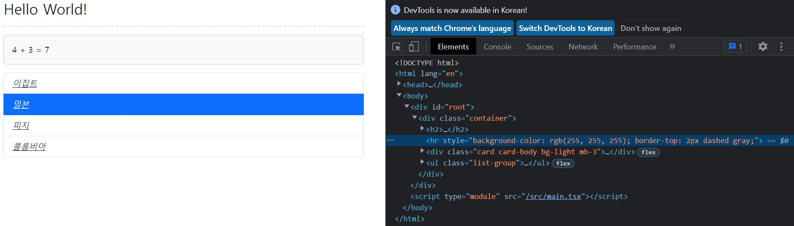 <br>
(&lt;hr&gt; 요소에 인라인 스타일이 지정된 결과)

<br>

- ### CSS 모듈
```
import styleApp from './App.module.css'
```

◾ 04-04 : src/App.module.css → CSS 모듈 추가 <br>
```
.test {
    color: blue;
    background-color: bisque;
}
```

◾ 04-05 : src/App.tsx → App 컴포넌트 변경(모듈 적용) <br>
```
·····
import AppCssModule from './App.module.css'
·····

 return (
    <div className="container">
      <h2 className={AppCssModule.test}>Hello {msg}!</h2>
      <hr style={styles.dashStyle} />
      {addResult(4, 3)}
      <CountryList countries={list} />
    </div>
  );
};

export default App;
```
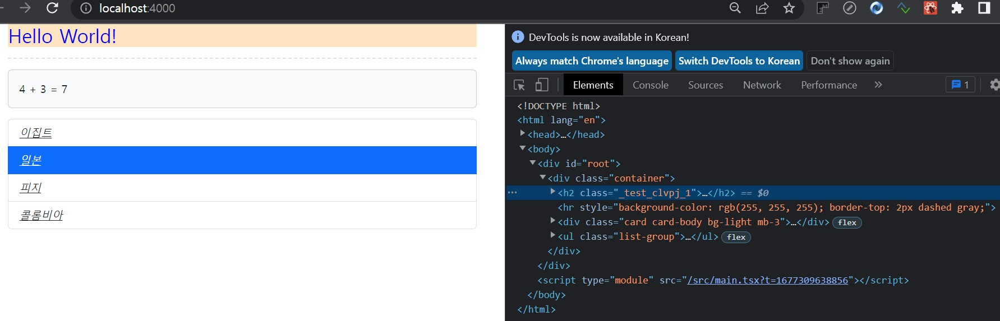 <br>

- ### styled-components
  ▶ ES6의 태그된 템플릿 리터럴(tagged template literal) 문법을 사용해 컴포넌트에 동적인 CSS를 사용할 수 있게 하는 라이브러리
  - ES6의 태그된 템플릿 리터럴(tagged template literal)
    ```
    const getPercent = function(str, ...values) {
      var result = "";
      for (var i = 0; i < str.length; i++) {
        result += str[i];
        if (values[i])
          result += Math.round(Values[i] * 100) + "%";
      }
      return result;
      
      let v1 = 0.222;
      let v2 = 0.78999;
      let r2 = getPercent `첫 번째 값은 ${v1}이고, 두 번째 값은 ${v2}이다.`;
      console.log(r2);
    }
    ```
    ```
    // 템플릿 리터럴(Template literals) 참조
    https://developer.mozilla.org/ko/docs/Web/JavaScript/Reference/Template_literals
    ```
```
// styled-components를 사용하기 위해 패키지 설치
npm install styled-components @types/styled-components

// npm install styled-components → 이 명령어로만 설치 가능
// @types/styled-components → 오류 시 이 명령어 추가하여 설치(버전 안 맞아서 생기는 문제)
```

◾ 04-06 : src/Footer.tsx → styled-components 사용 <br>
```
import React from 'react'
import styled from 'styled-components'

type FooterPropsType = {
    theme: string;
};

const Footer = (p1: FooterPropsType) => {
    const FooterBox = styled.div`
        position: absolute;
        right: 0;
        bottom: 0;
        left: 0;
        padding: 1rem;
        background-color: ${(p2) => (p2.theme === "basic" ? "skyblue" : "yellow")};
        text-align: center;
    `;
    return <FooterBox theme={p1.theme}>React styled-components Test</FooterBox>
};

export default Footer;
```
(스타일이 적용된 div를 리턴하는 컴포넌트 ▷ FooterBox)

◾ 04-07 : src/App.tsx 변경 → Footer 사용 <br>
```
·····
import Footer from './Footer'
·····

  const [theme, setTheme] = useState<string>("basic");

  ·····
  return (
    <div className="container">
      <h2 className={AppCssModule.test}>Hello {msg}!</h2>
      <hr style={styles.dashStyle} />
      {addResult(4, 3)}
      <CountryList countries={list} />
      <Footer theme={theme} />
    </div>
  );
};

export default App;
```
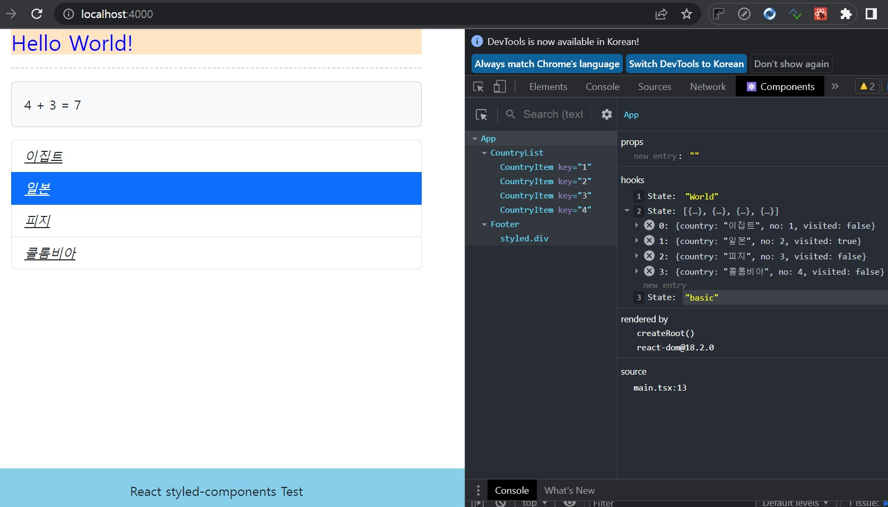 <br>
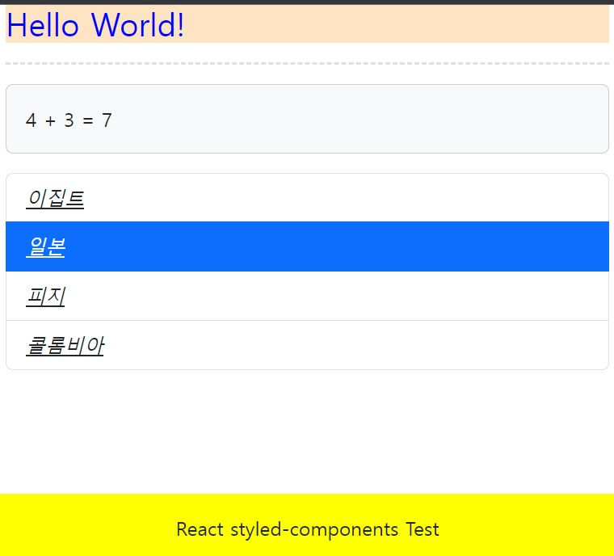 <br>

◾ 04-08 : src/Buttons.tsx → styled-components로 작성한 컴포넌트 스타일 확장 <br>
```
// styled-components로 작성한 컴포넌트 A
const A = styled.div`·····`;
// A 컴포넌트를 확장한 컴포넌트 B
const B = styled(A)`·····`;
```

```
import styled from 'styled-components'

const BasicButton = styled.button`
    background-color: purple;
    color: yellow;
    padding 5px 10px;
    margin: 5px;
`;
const UnderLineButton = styled(BasicButton)`
    text-decoration: underline;
`;
const ItalicButton = styled(BasicButton)`
    font-style: italic;
`;
const WhiteUnderLineButton = styled(UnderLineButton)`
    color: white;
`;

export { BasicButton, ItalicButton, UnderLineButton, WhiteUnderLineButton };
```

◾ 04-09 : src/App.tsx 변경 → Buttons 사용 <br>
```
·····
import Footer from './Footer'
import { BasicButton, ItalicButton, UnderLineButton, WhiteUnderLineButton } from './Buttons'
// import { 
//   BasicButton, ItalicButton, 
//   UnderLineButton, WhiteUnderLineButton 
// } from './Buttons'
·····

return (
    <div className="container">
      ·····
      <BasicButton>기본</BasicButton>
      <ItalicButton>이탤릭</ItalicButton>
      <UnderLineButton>언더라인</UnderLineButton>
      <WhiteUnderLineButton>화이트 언더라인</WhiteUnderLineButton>
      <Footer theme={theme} />
    </div>
  );
};

export default App;
```
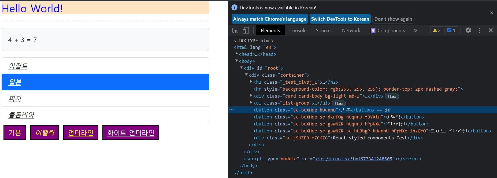 <br>