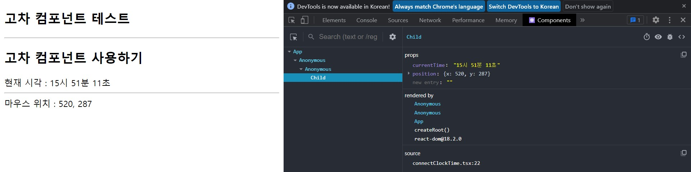

# **chapter 07**  

## 💡 `React` 

--- 
#### [고차 함수와 렌더링 최적화] 

<br>

- 고차 함수란? <br>
  - `고차 함수(higher-order-function)`는 *다른 함수*와 *컴포넌트*를 **인자로 전달받거나 리턴하는 함수**를 말한다. <br>
    - 사용 <br>
        - 리액트 훅 <br>
        - 고차 함수 <br>
  - 공통으로 필요한 기능을 컴포넌트를 작성할 때마다 작성하는 것은 비효율적이기 때문에 고차 함수를 만들어서 적용하면 편리하고, 공통 로직의 재사용도 손쉬워진다. <br>
    - 이 밖에 에러 처리, 로깅 등의 기능에서도 고차 함수를 사용. <br>
    


<br> ♧ 새로운 프로젝트 생성 <br>
```
cd ..
npm init vite hof-test-app -- --template react-ts
cd hof-test-app
npm install
npm install datw-and-time
```

◾ 07-01 : src/connectClockTime.tsx → 컴포넌트를 인자로 전달 받는 고차 함수 작성 <br>

```javascript
import { useEffect, useState } from 'react'
import DateAndTime from 'date-and-time'

export enum TimeFormatEnum {
    HHmmss = "HH:mm:ss",
    HHmm = "HH:mm",
    HHmmKOR = "HH시 mm분",
    HHmmssKOR = "HH시 mm분 ss초"
}

export const connectClockTime = (
    TargetComponent: React.ComponentType<any>,
    timeFormat: TimeFormatEnum,
    interval: number
) => {
    return (props: any) => {
        let [currentTime, setCurrentTime] = useState<string>(DateAndTime.format(new Date(), timeFormat));
        useEffect(() => {
            const handle = window.setInterval(() => {
                setCurrentTime(DateAndTime.format(new Date(), timeFormat));
            }, interval);

            return () => {
                window.clearInterval(handle);
            };
        }, []);

        return <TargetComponent {...props} currentTime={currentTime} />
    };
};
```
→ 컴포넌트(TargetComponent)를 인자로 전달 받고 그 컴포넌트에 currentTime 속성을 추가하여 다시 리턴 <br>
→ {...props} 코드는 기존 컴포넌트가 사용하는 속성을 그대로 다시 전달하기 위해 반드시 작성해야 한다. <br>
```javascript
export default connectClockTime(Child, TimeFormatEnum.HHmmssKOR, 5000);
```

cf) 사용자 정의 훅은 함수 그 자체를 리턴하며, 훅을 사용할 때는 다음과 같이 컴포넌트 내부의 코드에서 훅을 호출하여 리턴받은 객체를 이용 <br>
```javascript
// 6장 사용자 정의 함수 - useClockTime.ts 참조
const currentTime = useClockTime(1000, TimeFormatEnum.HHmmssKOR);
```

◾ 07-02 : src/connectMousePos.tsx → 마우스 위치를 획득하는 고차 함수 작성 <br>

```javascript
import { useEffect, useState } from 'react'

export type PositionType = {
    x: number;
    y: number;
};

export const connectMousePos = (TargetComponent: React.ComponentType<any>) => {
    return (props: any) => {
        let [position, setPosition] = useState<PositionType>({ x: 0, y: 0 });
        useEffect(() => {
            const onMove = (e: MouseEvent) => setPosition({ x: e.pageX, y: e.pageY });
            window.addEventListener("mousemove", onMove);

            return () => {
                window.removeEventListener("mousemove", onMove);
            };
        }, []);
        
        return <TargetComponent {...props} position={position} />;
    };
};
```

◾ 07-03 : src/Child.tsx → connectClockTime, connectMousePos 두 고차 함수를 사용 <br>

```javascript
import React from 'react'
import { connectClockTime, TimeFormatEnum } from './connectClockTime'
import { connectMousePos, PositionType } from './connectMousePos'

type PropsType = { currentTime: string; position: PositionType };

const Child = (props: PropsType) => {
    return (
        <div>
            <h2>고차 컴포넌트 사용하기</h2>
            <div>현재 시각 : {props.currentTime}</div>
            <hr />
            <div>
                마우스 위치 : {props.position.x}, {props.position.y}
            </div>
        </div>
    );
};

export default connectMousePos(
    connectClockTime(Child, TimeFormatEnum.HHmmssKOR, 5000)
);
```

◾ 07-04 : src/App.tsx → Child 컴포넌트 임포트 <br>

```javascript
import React from 'react'
import Child from './Child'

const App = () => {
  return (
    <div>
      <h2>고차 컴포넌트 테스트</h2>
      <hr />
      <Child />
    </div>
  );
};

export default App;
```

 <br>
▶ [components] 탭에서 컴포넌트 트리 구조와 각 컴포넌트의 상태를 확인 <br>
▶ 익명(Anonymous)의 컴포넌트 두 개가 바로 고차 함수(고차 컴포넌트) <br>
▶ 속성(props)을 통해서 Child 컴포넌트에 전달하도록 작성된 것을 확인 <br>

```
● [클래스 컴포넌트]의 공통 로직을 분리하는 경우라면 '고차 함수'를 사용할 수밖에 없다.
● [함수 컴포넌트]를 사용한다면 '사용자 정의 훅'을 작성하여 공통의 로직을 분리할 것을 권장.

- 함수 컴포넌트를 사용할 때 고차 함수 방식을 권장하지 않는 이유
    → 한 컴포넌트에 여러 고차 함수를 적용할 때 동일한 이름의 속성을 사용하고 있다면 충동 발생
    →  인자로 전달되는 '컴포넌트'의 속성이 무엇일지 알 수 없으므로 암묵적으로 any 타입을 사용할 수밖에 없다. 즉, 타입스크립트와 같은 정적 타입 언어를 적용할 때 어려움이 있다.
```

```javascript
export const connectMousePos = (TargetComponent: React.ComponentType<any>) => {

}
```