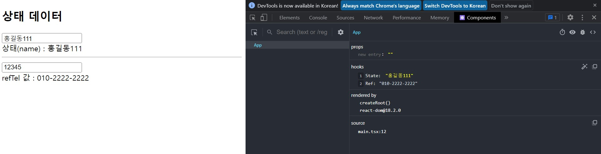
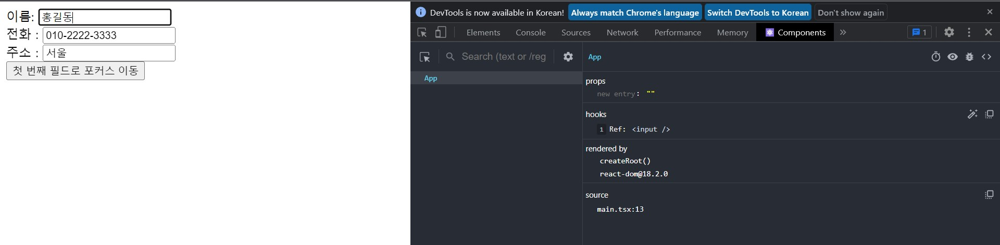
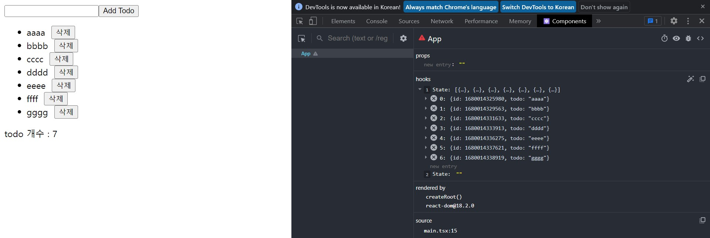
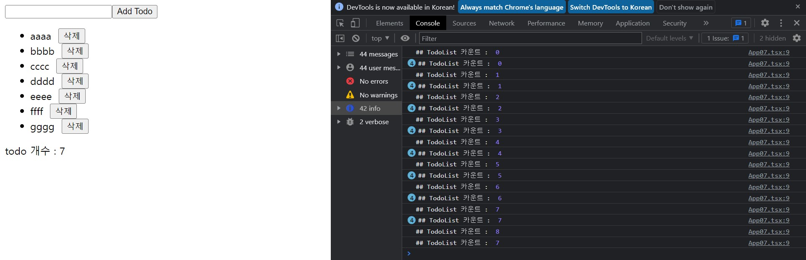
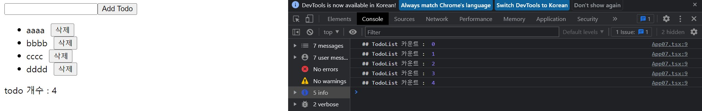
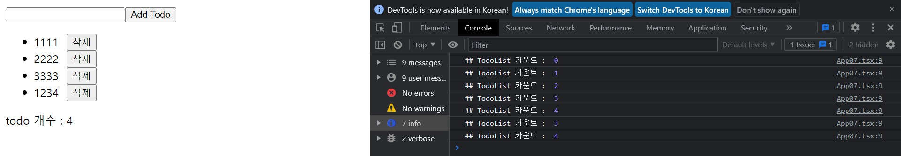
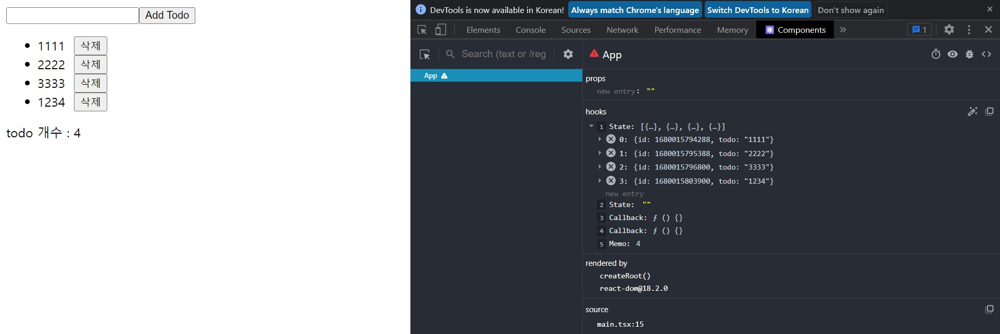
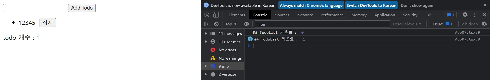
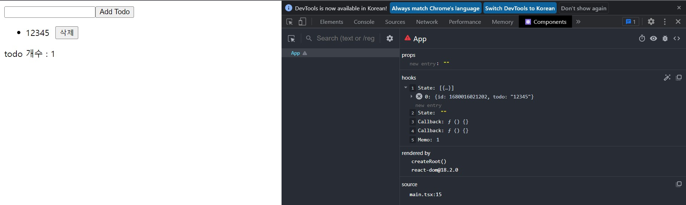

# **chapter 06**  

## 💡 `React` 

--- 
#### [리액트 훅] 

<br>

- 함수 컴포넌트와 리액트 훅 <br>
  - 리액트 16.8버전부터 리액트 훅(react-hook)이 추가됐고, 상태 관리와 주요 생명주기 이벤트 기능을 사용할 수 있게 되면서 대부분 함수 컴포넌트를 사용 <br>

<br> ♧ 새로운 프로젝트 생성 <br>
```
cd ..
npm init vite hook-test-app -- --template react-ts
cd hook-test-app
npm install
```

- useState 훅 <br>
  - `상태`를 이용하기 위해 사용하는 훅 <br>
```javascript
// getter: 읽기 전용의 속성
// setter: 상태를 변경할 때 사용하는 함수
// StateType: 상태 데이터의 타입
// initialValue: 상태 초깃값
const [getter, setter] = useState<StateType>(initialValue);
```


◾ 06-01 : src/main.tsx → src/App.tsx를 App01.tsx로 변경 및 App01 추가(수정) <br>
```javascript
import React from 'react'
import ReactDOM from 'react-dom/client'
import App from './App01'
// import './index.css'

// ReactDOM.createRoot(document.getElementById('root') as HTMLElement).render(
ReactDOM.createRoot(document.getElementById('root')!).render(
  <React.StrictMode>
    <App />
  </React.StrictMode>,
);
```

◾ 06-02 : src/App01.tsx → 상태 관리 및 변경, 바인딩 <br>
```javascript
import { ChangeEvent, useState } from 'react'

function App() {
  const [msg , setMsg] = useState<string>("");

  return (
    <div>
      <input type="text" value={msg} 
            onChange={(e: ChangeEvent<HTMLInputElement>) => setMsg(e.target.value)} />
      <br />
      <span>입력 메시지 : {msg}</span>
    </div>
  );
};

export default App;
```

 <br>

- useEffect 훅 <br>
```javascript
// effectCallback : 필수로 작성해야 하는 함수로, 클린업 함수를 리턴할 수 있습니다.
// depsList : 선택적으로 전달하는 의존 객체 배열 값
useEffect(effectCallback[, depsList]);
```
-   
  - effectCallback 함수는 useEffect 훅을 사용할 때 반드시 작성 <br>
    - 컴포넌트가 마운트되거나 depsList 배열에 지정한 상태나 속성이 변경되면 호출 <br>
      - 클린업 함수를 리턴할 수 있으며 클린업 함수는 컴포넌트가 언마운트될 때 실행 <br>

◾ 06-03 : src/App02.tsx → 새로운 컴포넌트 추가 및 src/main.tsx에 App02 추가 <br>
▷ <u>컴포넌트</u>가 `마운트`되거나 `업데이트`될 때 'effectCallback' 함수가 실행되도록 예제를 작성 <br>
```javascript
// src/main.tsx
·····
// import App from './App01'
import App from './App02'
·····
```

```javascript
// src/App02.tsx

import { ChangeEvent, useEffect, useState } from 'react'

const App = () => {
    const [count, setCount] = useState<number>(0);
    const [name, setName] = useState<string>("아이유");

    useEffect(() => {
        console.log(`${name}님이 ${count}번 클릭했습니다.`);
    });

    return (
        <div>
            이름 변경 :
            <input type="text" value={name}
                    onChange={(e: ChangeEvent<HTMLInputElement>) => setName(e.target.value)} />
            <hr />
            <button onClick={() => setCount(count + 1)}>카운트 1 증가</button>
            <p>
                {name}님이 {count}번 클릭했습니다.
            </p>
        </div>
    );
};

export default App;
```

 <br>
 <br>

◾ 06-04 : src/App02.tsx → depsList 지정, count가 바뀔 때만 effectCallback이 실행되도록 지정 <br>
```javascript

·····

// mount, 카운트가 바뀔 때만
    useEffect(() => {
        console.log(`${name}님이 ${count}번 클릭했습니다.`);
    }, [ count ]);


    ·····

    );
};

export default App;
```

 <br>
(count가 바뀔 때만 effectCallback 함수가 실행, 이름을 변경하였음에도 effectcallback 함수는 실행되지 않는다.) <br>

◾ 06-05 : src/App02.tsx → [ ] '빈 배열'을 전달하여 effectCallback 함수는 `컴포넌트가 마운트될 때`만 실행 <br>
```javascript

·····

useEffect(() => {
        console.log(`${name}님이 ${count}번 클릭했습니다.`);
    }, []);

    ·····

    );
};

export default App;
```
 <br>
(카운트 버튼을 눌러도 컴포넌트가 마운트될 때만 effectCallback 함수 실행)

- useEffect의 장점 <br>
  - 한 컴포넌트 내부에 useEffect 훅을 여러 개를 사용할 수 있으며, 상태와 상태 관련 로직을 중심으로 useEffect 훅을 작성할 수 있어서 관련된 코드들이 함께 모여 있으므로 코드를 이해하기가 편리하다. <br>
  (클래스 컴포넌트 componentDidMount, componentWillUnmount 생명주기 메서드는 하나씩만 작성 가능) <br>

<br>

◾ 06-08 : src/App03.tsx → useEffect 여러 개 사용 <br>
→ src/App02.tsx를 복사해 src/App03.tsx를 작성 <br>
▶ useEffect 훅을 두 개 작성하고 각각 name, count 상태가 변경될 때의 처리만을 수행 <br>
```javascript
import { ChangeEvent, useEffect, useState } from 'react'

const App = () => {
    const [count, setCount] = useState<number>(0);
    const [name, setName] = useState<string>("아이유");

    useEffect(() => {
        console.log(`이름 ${name}`);
    }, [name]);

    useEffect(() => {
        console.log(`카운트 : ${count}`);
    }, [count]);

    useEffect(() => {
        console.log(`${name}님이 ${count}번 클릭했습니다.`);
    }, []);

    return (
        <div>
            이름 변경 :
            <input type="text" value={name}
                    onChange={(e: ChangeEvent<HTMLInputElement>) => setName(e.target.value)} />
            <hr />
            <button onClick={() => setCount(count + 1)}>카운트 1 증가</button>
            <p>
                {name}님이 {count}번 클릭했습니다.
            </p>
        </div>
    );
};

export default App;
```

```javascript
// main.tsx 수정
import App from './App03'
```

 <br>

<br>

- 리액트 훅의 생명주기 <br>
▶ 클래스 컴포넌트처럼 함수 컴포넌트도 나름의 생명주기를 가지고 있지만, 구조적인 차이 때문에 클래스 컴포넌트의 생명주기와는 분명히 다르다. <br>
  - 컴포넌트가 마운트될 때 <br>
    - 레이지 초기화: 레이지 초기화(lazy initializer)를 실행한다. 레이지 초기화는 useState()나 useReducer에 전달하는 함수이다. 이 함수는 <u>'비동기'로 지연되어 호출</u> <br>
      - 일반적인 초기화
      ```javascript
      const count = useState<number>(0);
      ```
      - 레이지 초기화
      ```javascript
      const count2 = useState<number>(() => { return 0; })
      ```
      → 이 단계는 컴포넌트가 마운트될 때만 실행. 특히 레이지 초기화를 실행할 때 인자로 전달되는 함수 내부에서 실행되는 코드는 마운트될 때만 실행. <br>
      → 상태로 사용할 데이터를 도출하기 위해 복잡한 로직이 필요한 경우에 레이지 초기화가 유용하다. <br>
    - 렌더링: 함수 컴포넌트의 내부 코드가 실행. 이때 가상 DOM에 대한 쓰기 작업을 수행한다. <br>
    - 가상 DOM 업데이트: 가상 DOM 트리를 업데이트한다. <br>
    - LayoutEffects 실행: useLayoutEffect 훅을 지정한 함수를 실행한다. (useLayoutEffect 훅은 다음 페이지의 Note에서 자세히 설명) <br>
    - 브라우저 DOM 업데이트: 브라우저 DOM을 업데이트. 이 단계가 완료되면 브라우저 화면의 갱신이 완료된 상태가 된다. <br>
    - Effects 실행: useEffect 훅에 지정한 함수가 호출 <br>
  - 컴포넌트가 업데이트될 때 <br>
  ▶ 이 단계는 부모 컴포넌트가 다시 렌더링되거나 컴포넌트 자신의 상태, 속성이 바뀔 때 일어난다. <br>
    - 렌더링: 컴포넌트가 마운트될 때와 같다. <br>
    - 가상 DOM 업데이트: 컴포넌트가 마운트될 때와 같다. <br>
    - LayoutEffect 클린업: useLayoutEffect 훅의 두 번째 인자(의존 객체 배열: depsList) 전달 여부에 따라 리턴한 클린업 함수가 호출. <br>
    - LayoutEffects 실행: useLayoutEffect 훅의 두 번째 인자 전달 여부에 따라 지정한 함수를 실행 <br>
    - 브라우저 DOM 업데이트: 컴포넌트가 마운트될 때와 같다. <br>
    - Effects 클린업: useEffect 훅의 두 번째 인자 전달 여부에 따라 리턴한 클린업 함수가 호출 <br>
    - Effects 실행: useEffect 훅의 두 번째 인자 전달 여부에 따라 지정한 함수를 실행 <br>
  - 컴포넌트가 언마운트될 때 <br>
    - LayoutEffects 클린업: useLayoutEffect 훅이 리턴하는 클린업 함수가 호출 <br>
    - Effects 클린업: useEffect 훅이 리턴하는 클린업 함수가 호출 <br>

  ＃ useLayoutEffect 훅이란? <br>
  → useEffect와 유사한 이름의 useLayoutEffect라는 훅이 있다. LayoutEffect는 useLayoutEffect 훅에 의해 실행되는 콜백 함수이다. useEffect 훅의 콜백 함수는 컴포넌트가 완전히 마운트된 상황, 즉 브라우저가 DOM에 렌더링 작업(paint)이 완료된 후에 실행되는 반면 useLayoutEffect 훅의 콜백 함수는 컴포넌트가 렌더링되고 브라우저 DOM에서의 렌더링이 실행되기 전에 호출되며 `동기적으로만 실행`한다. <br>
  → 따라서 복잡한 처리 과정이나 외부 백엔드 API를 읽어오는 등 대부분의 작업은 useEffect 훅을 사용할 것을 권장하며, 간단한 작업이면서 다시 렌더링으로 인한 화면의 깜빡임을 사용자에게 보여주고 싶지 않을 때는 useLayoutEffect 훅을 사용한다. <br>

  ```javascript
  useEffect(() => {
    //-----------
    // 영역 1
    //-----------

  // 클린업 함수
  return () => {
    //----------
    // 영역 2
    //----------
    };
  }, depsList);
  ```
  → 컴포넌트가 마운트될 때: 영역1이 항상 실행 <br>
  → 컴포넌트가 언마운트될 때: 영역2가 항상 실행 <br>
  → 컴포넌트가 업데이트될 때: 다시 다음의 세 가지 경우로 나뉜다. <br>
    - 두 번째 인자인 depsList를 전달하지 않을 떄 <br>
      - 컴포넌트가 업데이트될 때마다 영역2에서 영역1순으로 실행 <br>
    - 두 번째 인자로 빈 배열([ ])을 전달할 때 <br>
      - 영역1, 영역2 모두 실행되지 않음 <br>
    - 두 번째 인자로 [dep1, dep2]와 같이 의존 객체 배열을 지정하여 전달할 때 <br>
      - 지정한 의존 객체(dep1 또는 dep2)가 바뀔 때만 영역2에서 영역1순으로 실행 <br>

<br>
  
- useReducer 훅 <br>
  - 상태와 관련된 로직을 컴포넌트 밖으로 분리시킬 수 있다. <br>
  - 여러 컴포넌트가 유사한 상태 관련 로직이 필요한 경우에 유용하다. <br>
  ```
  리듀서란?
  리듀서라는 이름은 배열의 메서드 중 reduce 메서드에 인자로 전달되는 함수로부터 유래.
  reduce 메서드는 배열의 데이터를 이용해 합계를 구할 때 사용할 수 있는 메서드이다.
  ```

  ```javascript
  // reducer: 리듀서 함수
  // initialValue : 합계를 구할 때의 초깃값으로 선택적으로 사용할 수 있는 인자
  reduce(reducer [, initialValue])
  ```

◾ 06-09 : Typescript Playground에 작성 → reduce(reducer) 함수 사용 <br>
```
Typescript Playground(https://www.typescriptlang.org/play)
```

```javascript
type MemberType = {
    name: string;
    point: number;
}

const familyMembers: Array<MemberType> = [
    { name: "홍길동", point: 10000 },
    { name: "성춘향", point: 20000 },
    { name: "홍예지", point: 15000 },
    { name: "홍철수", point: 5000 },
    { name: "홍희수", point: 10000 }
];

const initialPoint = 10000;
const reducer = (totalPoint: number, member: MemberType) => {
    totalPoint += member.point;
    
    return totalPoint;
}

const totalPoint = familyMembers.reduce(reducer, initialPoint);
console.log(`가족 합계 포인트 : ${totalPoint}`)
```

 <br>
▶ 리듀서 함수 내부에서는 배열의 각 항목의 값들을 이용해 합계를 연산한 다음, 새로운 합계 값을 리턴한다. <u>리턴된 합계 값은 상태로 유지</u>된다. <br>

  ```
  리듀서 함수는 순수 함수(pure function)

  ◈ 입력 인자가 동일하면 리턴 값도 동일해야 한다.
    - totalPoint와 member 데이터가 같다면 리턴되는 값이 동일하다.
  ◈ 부수 효과(side effect)가 없어야 한다.
    - 함수에 전달되는 인자 이외의 외부 리소스에 영향을 주거나 외부 리소스로부터 영향을 받는 부분이 없어야 한다.
  ◈ 함수에 전달되는 인자는 불변성을 가져야 한다. 따라서 인자를 변경할 수 없다.
    - 리듀서 함수에 전달된 인자 totalPoint, member를 변경하지 않는다. 새로운 값을 만들어서 리턴해야 한다.
  ```

```javascript
(state, action) => {
  // state와 action을 이용해 연산을 수행한 후 새로운 상태(newState)를 리턴한다.
  return newState
}
```

```
불변성을 이용하는 경우

1. 상태의 변경을 추적하기가 용이
2. 디버깅도 편리
```
▷ 리액트 애플리케이션에서는 상태가 바뀌면 UI도 갱신되므로 상태의 변경 추적이 디버깅 시에 필요한데, <b>`리듀서`를 사용하면 과거 시점의 상태가 그대로 유지되므로 언제든지 과거 시점의 상태 데이터를 확인할 수 있고 시간대별로 상태가 어떻게 변경됐는지 추적할 수 있다.</b> <br>

<br>

```javascript
// state : 상태
// dispatch : 상태를 변경하는 메서드
// reducer : 새로운 상태를 리턴하는 리듀서 함수
// initialState : 초기 상태로 지정할 객체
const [state, dispatch] = useReducer(reducer, initialState);
```

immer 설치(불변성의 라이브러리) <br>
```
npm install immer
```

◾ 06-10 : src/TodoReducer.ts → 리듀서 함수와 관련된 타입 작성 <br>
```javascript
import produce from 'immer'

export type TodoItemType = { id: number; todo: string };

export const TODO_ACTION = {
    ADD: "addTodo" as const,
    DELETE: "deleteTodo" as const
};

export const TodoActionCreator = {
    addTodo: (todo: string) => ({ type: TODO_ACTION.ADD, payload: { todo: todo } }),
    deleteTodo: (id: number) => ({ type: TODO_ACTION.DELETE, payload: { id: id }})
};

export type TodoActionType = 
    | ReturnType<typeof TodoActionCreator.addTodo>
    | ReturnType<typeof TodoActionCreator.deleteTodo>;

export const TodoReducer = (state: Array<TodoItemType>, action: TodoActionType) => {
    switch (action.type) {
        case TODO_ACTION.ADD:
            return produce(state, (draft: Array<TodoItemType>) => {
                draft.push({ id: new Date().getTime(), todo: action.payload.todo });
            });
        case TODO_ACTION.DELETE:
            let index = state.findIndex((item) => item.id === action.payload.id);
            return produce(state, (draft: Array<TodoItemType>) => {
                draft.splice(index, 1);
            });
        default:
            return state;
    }
};
```

```javascript
// TodoActionType의 형식은 다음과 같다.

type TodoActionType = {
  type: "addTodo";
  payload: {
    todo: string;
  };
} | {
  type: "deleteTodo";
  payload: {
    id: number;
  };
}
```

◾ 06-11 : src/App04.tsx → TodoReducer.ts 사용 <br> 
```javascript
import { useReducer, useState } from 'react'
import { TodoActionCreator, TodoItemType, TodoReducer } from './TodoReducer'

let idNow = new Date().getTime();
const initialTodoList: Array<TodoItemType> = [
    { id: idNow, todo: "운동" },
    { id: idNow + 1, todo: "독서" },
    { id: idNow + 2, todo: "음악감상" }
];

const App = () => {
    const [todoList, dispatchTodoList] = useReducer(TodoReducer, initialTodoList);
    const [todo, setTodo] = useState("");
    const addTodo = () => {
        dispatchTodoList(TodoActionCreator.addTodo(todo));
        setTodo("");
    };
    const deleteTodo = (id: number) => {
        dispatchTodoList(TodoActionCreator.deleteTodo(id));
    };
    return (
        <div style={{ padding: "20px" }}>
            <input type="text" onChange={(e) => setTodo(e.target.value)} value={todo} />
            <button onClick={addTodo}>할 일 추가</button>
            <ul>
                {todoList.map((item) => (
                    <li key={item.id}>
                        {item.todo} &nbsp;&nbsp;
                        <button onClick={() => deleteTodo(item.id)}>삭제</button>
                    </li>
                ))}
            </ul>
        </div>
    );
};

export default App;
```

◾ 06-12 : src/main.tsx 변경 → App04 임포트 <br> 
```javascript
// src/main.tsx

import App from './App04'
```

 <br>
 <br>

```
useReducer의 장점
＊ 상태 관리 기능을 컴포넌트로부터 분리할 수 있고, 유사한 상태 관리 기능을 사용하는 여러 컴포넌트가 상태 변경과 관리 기능을 공유할 수 있다.
＊ 불변성을 가지는 상태 변경을 강제하게 되므로 상태 변경을 추적하기가 용이하다.
```

- useRef 훅 <br>
  ```
  useState 훅을 이용해 생성한 상태를 업데이트하면 컴포넌트가 다시 렌더링 된다.
  반면에 컴포넌트 내부에 직접 정의한 변수들은 컴포넌트가 다시 렌더링되면 모두 초기화되어 버린다.
  ```
  - useRef 훅을 호출한 뒤 리턴받은 ref 객체는 컴포넌트의 모든 생명주기 동안에 유지되므로 다시 렌더링되더라도 기존 참조 데이터를 유지한다. <br>
  - 대신 ref 객체가 참조하는 데이터가 변경되더라도 다시 렌더링이 일어나지 않는다. <br>
  - useRef를 이용하면서 동시에 브라우저 DOM 요소의 태그에서 ref 특성을 사용하면 브라우저 DOM의 요소에 직접 접근할 수 있다. <br>
  - useRef 훅의 리턴값은 값에 대한 참조를 포함하는 객체이다. <br>
  - 참조 데이터에 접근하려면 반드시 `.current` 속성을 사용해야 한다. <br>
```javascript
// initialValue : 참조 객체로 주어질 초깃값
const refObject = useRef(initialValue);
```

◾ 06-13 : src/App05.tsx → useRef 훅을 이용해 상태와 달리 다시 렌더링되지 않는 데이터 관리 <br> 

```javascript
import { useRef, useState } from 'react'

const App = () => {
    const [name, setName] = useState("홍길동");

    const refTel = useRef("010-2222-2222");

    return (
        <div className="boxStyle">
            <h2>상태 데이터</h2>
            <input type="text" value={name} onChange={(e) => setName(e.target.value)} />
            <br />
            <div>상태(name) : {name}</div>
            <hr />
            <input type="text" onChange={(e) => (refTel.current = e.target.value)} />
            <br />
            <div> refTel 값 : {refTel.current}</div>
        </div>
    );
};

export default App;
```
▶ <u>참조 객체</u>는 반드시 `current` 속성을 통해서 접근해야 한다. <br>

```javascript
import App from './App05'
```

 <br>

##### 상태를 변경할 때 즉시 렌더링, 참조 객체를 변경할 때는 다시 렌더링 되지 않는다. <br>

◾ 06-14 : src/App06.tsx → useRef 훅을 이용해 브라우저 DOM에 접근 <br> 

```javascript
import React, { useRef } from 'react'

const App = () => {
    const elName: React.RefObject<HTMLInputElement> = useRef<HTMLInputElement>(null);
    const goFirstInputElement = () => {
        if (elName.current) elName.current.focus();
    };

    return (
        <div className="boxStyle">
            이름: <input ref={elName} type="text" defaultValue="홍길동" />
            <br />
            전화 : <input  type="text" defaultValue="010-2222-3333" />
            <br />
            주소 : <input type="text" defaultValue="서울" />
            <br />
            <button onClick={goFirstInputElement}>첫 번째 필드로 포커스 이동</button>
        </div>
    );
};

export default App;
```
▶ elName.current로 &lt;input&gt; 요소에 접근, focus( ) 메서드를 호출해 마우스 포커스를 해당 요소로 위치 <br>

```javascript
import App from './App06'
```

 <br>

##### 브라우저 DOM 요소에 접근하기 <br>

- 메모이제이션 훅 <br>
  - 기존에 연산된 결괏값을 메모리에 캐싱하고, 동일한 입력과 환경에서 재사용하는 기법 <br>
  - 이 기법을 적절히 사용하면 중복 처리를 피할 수 있어서 애플리케이션의 성능을 최적화할 때 종종 사용. <br>
    - useMemo
      ```
      useMemo는 함수가 호출되고 연산된 리턴값을 캐싱하여 재사용한다. 캐싱되는 것은 함수를 호출한 후의 리턴값이다.
      ```
    - useCallback
      ```
      useCallback은 컴포넌트 내부의 함수를 캐싱하고, 렌더링할 때마다 함수가 생성되지 않게 재사용한다. 캐싱되는 것은 컴포넌트 내부의 함수이다.
      ```


◾ 06-15 : src/App07.tsx → 랜더링할 때마다 함수 호출 <br> 
```javascript
import { useState } from 'react'

type TodoListItemType = {
    id: number;
    todo: string;
};

const getTodoListCount = (todoList: Array<TodoListItemType>) => {
    console.log("## TodoList 카운트 : ", todoList.length);
    return todoList.length;
};

const App = () => {
    const [todoList, setTodoList] = useState<Array<TodoListItemType>>([]);
    const [todo, setTodo] = useState<string>("");

    const addTodo = (todo: string) => {
        let newTodoList = [...todoList, { id: new Date().getTime(), todo: todo }];
        setTodoList(newTodoList);
        setTodo("");
    };

    const deleteTodo = (id: number) => {
        let index = todoList.findIndex((item) => item.id === id);
        let newTodoList = [...todoList];
        newTodoList.splice(index, 1);
        setTodoList(newTodoList);
    };

    return (
        <div className="boxStyle">
            <input type="text" value={todo} onChange={(e) => setTodo(e.target.value)} />
            <button onClick={() => addTodo(todo)}>Add Todo</button>
            <br />
            <ul>
                {todoList.map((item) => (
                    <li key={item.id}>
                        {item.todo}&nbsp;&nbsp;
                        <button onClick={() => deleteTodo(item.id)}>삭제</button>
                    </li>
                ))}
            </ul>
            <div>todo 개수 : {getTodoListCount(todoList)}</div>
        </div>
    );
};
export default App;
```

◾ 06-16 : src/main.tsx 변경 → App07.tsx 컴포넌트 참조 <br> 

```javascript
import React from 'react'
import ReactDOM from 'react-dom/client'
import App from './App07'

ReactDOM.createRoot(document.getElementById('root')!).render(<App />);
```
▷ StrictMode는 제거. 콘솔 로그에 메시지가 출력되는데, StrictMode는 내부 에러 확인을 위해 한 번 더 렌더링하기 때문에 콘솔 로그에 메시지가 두 번씩 출력되어 기능을 확인하기 불편하다. <br>

 <br>
 <br>
▶ 입력 필드에 값을 입력할 때도 콘솔 로그에 메시지가 출력되는데, 다시 렌더링될 때마다 getTodoListCount 함수가 실행되기 때문이다. 새로운 할 일을 입력 필드에 입력하는 동안은 할 일의 개수가 바뀌지 않으므로 매번 getTodoListCount 함수를 호출할 필요는 없다. → 메모이제이션 기능을 제공하는 훅을 사용하여 해결 <br>

- useMemo 훅 <br>
```javascript
// factory : 캐싱할 값을 만들어내는 함수이다.
// depsList : 의존 배열 객체로, 이 배열의 값이 바뀌기 전까지는 캐시를 유지한다. ★
// 캐싱할 값은 제네릭으로 T에 타입을 지정한다.
const memoizedValue = useMemo<T>(factory: ( ) => T, depsList)
```

◾ 06-17 : src/App07.tsx 변경 → useMemo 훅 적용 <br> 
```javascript
import { useMemo, useState } from 'react'

·····

const getTodoListCount = (todoList: Array<TodoListItemType>) => {
    console.log("## TodoList 카운트 : ", todoList.length);
    return todoList.length;
};

const App = () => {
   
    ·····

    const memoizedCount = useMemo<number>(() => getTodoListCount(todoList), [todoList]);

    return (
        <div className="boxStyle">
            
            ·····

            <div>todo 개수 : { memoizedCount }</div>
        </div>
    );
};
export default App;
```

 <br>
▶ getTodoListCount 함수를 호출한 결과를 캐싱한다. 의존 객체 배열(depsList) 값으로 todoList 배열을 지정하였으므로 todoList 배열이 변경되기 전까지는 getTodoListCount 함수를 호출하지 않고 캐시를 이용한다. <br>

- useCallback 훅 <br>
```javascript
// callback : 캐싱하려는 대상 함수이다.
// depsList : 함수를 캐싱할 때 의존 객체 배열이다. 이 배열의 값에 변화가 없으면 함수를 새로 만들지 않는다.
const memoizedCallback
```

◾ 06-18 : src/App07.tsx 변경 → addTodo 함수와 deleteTodo 함수에 useCallback 훅 적용 <br> 

```javascript
import { useCallback, useMemo, useState } from 'react'

·····

const App = () => {
    const [todoList, setTodoList] = useState<Array<TodoListItemType>>([]);
    const [todo, setTodo] = useState<string>("");

    const addTodo = useCallback((todo: string) => {
        let newTodoList = [...todoList, { id: new Date().getTime(), todo: todo }];
        setTodoList(newTodoList);
        setTodo("");
    }, [todoList]);
    
    const deleteTodo = useCallback((id: number) => {
        let index = todoList.findIndex((item) => item.id === id);
        let newTodoList = [...todoList];
        newTodoList.splice(index, 1);
        setTodoList(newTodoList);
    }, [todoList]);

    ·····
};
export default App;
```
★ useCallback의 두 번째 인자인 의존 객체 배열(depsList)을 적절하게 지정해야 한다. `useCallback` 훅에 의해 캐싱된 함수는 <u>함수가 생성될 때</u>의 <b>상태나 속성을 참조</b>하기 때문이다. <br> 
의존 객체 배열을 지정하지 않는다면 캐싱된 함수는 갱신되지 않으며, 항상 초기 상태의 todoList인 빈 배열( [ ] )을 참조한다. <br>

 <br>
 <br>

---
```javascript
const addTodo = useCallback((todo: string) => {
        let newTodoList = [...todoList, { id: new Date().getTime(), todo: todo }];
        setTodoList(newTodoList);
        setTodo("");
    }, []);
    
    const deleteTodo = useCallback((id: number) => {
        let index = todoList.findIndex((item) => item.id === id);
        let newTodoList = [...todoList];
        newTodoList.splice(index, 1);
        setTodoList(newTodoList);
    }, []);
```
 <br>
 <br>
▶ 의존 객체 배열을 비웠을 때, 값이 갱신되지 않으며 새롭게 등록되지 않는다. (콘솔창에 '##TodoList 카운트 : 1'의 숫자가 늘어나는 것을 확인할 수 있다.)<br>
※ `메모이제이션 훅(useMemo, useCallback)`은 <b>캐싱</b>으로인해 추가적인 <u>메모리를 사용</u>하기 때문에 남용하면 오히려 성능에 나쁜 영향을 줄 수 있으니 주의(메모이제이션 훅을 반드시 사용할 필요는 없다.) <br>