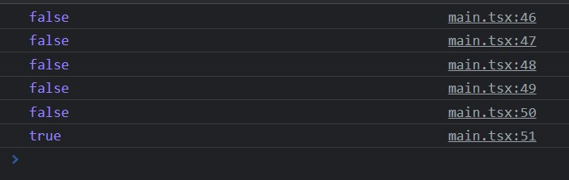

# **chapter 04**  

## 💡 `React` 

--- 
#### [리액트 컴포넌트]
- ### 상태 심화 <br>

- 렌더링 최적화와 불변성 <br>
```
¤ 복잡한 객체 구조의 상태 데이터가 부모 컴포넌트에서 정의되었고,
¤ 상태 데이터의 하위 필드들을 자식 컴포넌트의 속성(props)으로 전달하며,
¤ 상태 데이터의 객체 트리 구조가 컴포넌트의 트리 구조와 비슷하다고 가정.
```
[깊은 비교 & 얕은 비교] <br>
⊙ 깊은 비교(deep compare): 컴포넌트 속성으로 전달받은 객체 트리를 따라 내려가며 이전 객체 트리와 상태나 속성이 다른 부분이 있는지를 일일이 비교하며 자기 자신을 렌더링해야 할지를 결정. <br>
⊙ 얕은 비교(shallow compare): 상태 트리 끝단의 값이 변경되면 상태 트리의 루트 경로로 거슬러 올라가는 경로상의 객체를 모두 새로운 객체로 바꿔서 기존 트리와는 다른 새로운 객체 트리가 변경된 경로 상에 만들어 주고(immer과 같은 불변성 라이브러리가 담당), 컴포넌트의 속성으로 전달된 하위 객체 트리와 이전의 객체 트리가 단순히 같은 객체인지를 비교하는 것만으로 렌더링 여부를 쉽게 결정. <br>
```javascript
let obj2 = obj; // shallow copy
obj2.name = "이순신";
```
객체의 메모리 주소를 복사한 것으로 obj2.name을 변경하면 obj.name에도 영향.(불변성x) <br>

▶ 불변성을 가지도록 하기 위해 `전개 연산자(spread operator)` 사용 <br>
```javascript
let obj3 = { ... obj, name: "이순신" };
```
기존 객체의 속성 값을 복사한 후, name 속성을 이순신으로 변경한 새로운 객체를 생성 <br>
(obj3의 속성을 변경하더라도 obj의 값이 변경되지 않는다.) <br>

- 불변성 라이브러리(immer) <br>
복잡한 객체 트리가 불변성을 가지도록 별도의 불변성 라이브러리를 사용 <br>

```javascript
// immer 함수를 produce라는 이름으로 임포트
import produce from 'immer'

const currendtState = [
    { todo: "Learn es6", done: true },
    { todo: "Try immer", done: false },
]
// produce 함수의 첫 번째 인자 : 변경 대상 객체
// produce 함수의 두 번째 인자 : 불변성 변경 함수
// 상태 변경 함수의 인자 : 상태 변경을 위한 draft 버전의 객체
const nextState = produce(currentState, (draft) => {
    draft[1].done = true
})
```

<br> ♧ 새로운 프로젝트 생성 <br>

```
cd ..
npm init vite immutables-test -- --template react-ts
cd immutables-test
npm install
npm install immer
```

◾ 04-26 : src/main.tsx → 복잡한 트리 구조 객체를 정의 <br>
(UI를 작성하지 않으므로 main 컴포넌트만 수정) <br>
```javascript
import produce from 'immer'
import React from 'react'
import ReactDOM from 'react-dom/client'
import App from './App'
import './index.css'

ReactDOM.createRoot(document.getElementById('root') as HTMLElement).render(
  <React.StrictMode>
    <App />
  </React.StrictMode>,
)

let quiz = {
  "students" : ["홍길동", "성춘향", "박문수", "변학도"],
  "quizlist" : [
    {
      "question": "한국 프로 야구팀이 아닌 것은?",
      "options": [
        { "no": 1, "option" : "삼성 라이온즈" },
        { "no": 2, "option" : "기아 타이거즈" },
        { "no": 3, "option" : "두산 베어스" },
        { "no": 4, "option" : "LA 다저스" }
      ],
      "answer": 4
    },
    {
      "question": "2018년 크리스마스는 무슨 요일인가?",
      "options": [
        { "no": 1, "option": "월" },
        { "no": 2, "option": "화" },
        { "no": 3, "option": "수" },
        { "no": 4, "option": "목" }
      ],
      "answer": 2
    }
  ]
};

const quiz2 = produce(quiz, draft => {
  // 상태 트리의 끝단 변경
  draft.quizlist[0].options[0].option = "LG트윈스";
});

// 예상 결과 : false, false, false, false, false, true
// 마지막은 왜 true인가? 변경된 객체 트리의 끝단으로부터 루투로의 경로가 아니므로
console.log(quiz === quiz2);
console.log(quiz.quizlist === quiz2.quizlist);
console.log(quiz.quizlist[0] === quiz2.quizlist[0]);
console.log(quiz.quizlist[0].options[0] === quiz2.quizlist[0].options[0]);
console.log(quiz.quizlist[0].options[0].option === quiz2.quizlist[0].options[0].option);
console.log(quiz.students === quiz2.students);
```
 <br>