# **chapter 04**  

## 💡 `React` 

--- 
#### [리액트 컴포넌트]
- ### 속성의 유효성 검증
  - 타입스크립트의 정적 타입 지원 기능 이용 <br>
    - 컴파일(빌드)시에 타입을 검사
  - propTypes - 리액트 지원 기능
    - 컴파일할 때가 아닌 '실행 중'에 `속성`에 대한 유효성 검증 - 속성으로 전달하는 값과 타입에 따라 경고 발생

**▶ [타입스크립트 + propTypes]를 사용하면 엄격한 속성 유효성 검증 가능**

<br>
새로운 프로젝트 생성

```
cd ..
npm init vite proptypes-test -- --template react-ts
cd proptypes-test
npm install
```
(src/App.css 파일 삭제)

◾ 04-10 : src/Calc.tsx → 타입스크립트로 정적 타입의 속성을 전달 <br>
```
import React from 'react'

type CalcPropsTypes = {
    x: number;
    y: number;
    oper: string;
};

const Calc = (props: CalcPropsTypes) => {
    let result: number = 0;
    switch (props.oper) {
        case "+":
            result = props.x + props.y;
            break;
        case "-":
            result = props.x - props.y;
            break;
        case "*":
            result = props.x * props.y;
            break;
        case "/":
            result = props.x / props.y;
            break;
        case "%":
            result = props.x % props.y;
            break;
        default:
            result = 0;
    };

    return (
        <div>
            <h3>연산 방식 : {props.oper}</h3>
            <hr />
            <div>
                {props.x} {props.oper} {props.y} = {result}
            </div>
        </div>
    );
};

export default Calc;
```

◾ 04-11 : src/App.tsx → Calc 사용 <br>
```
import { useState } from 'react'
import Calc from './Calc'

// function App() {
const App = () => {
  const [x, setX] = useState<number>(100);
  const [y, setY] = useState<number>(200);
  const [oper, setOper] = useState<string>("+");

  return (
    <div>
      <Calc x={x} y={y} oper={oper} />
    </div>
  );
};

export default App
```

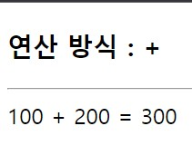

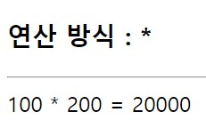
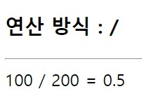 
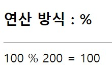
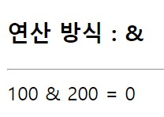 <br>

◾ 04-12 : src/Calc.tsx 변경 → propTypes 적용, propTypes 정적 멤버 추가 <br>

패키지 설치 <br>
```
npm install prop-types
```

```
import React from 'react'
import PropTypes from 'prop-types'
·····
// 기존 함수 컴포넌트 코드는 변경하지 않음
const Calc = (props: CalcPropsTypes) => {
·····
};

const calcChecker = (props: any, propName: string, componentName: string) => {
    if (propName === "oper") {
        if (props[propName] !== "+" && props[propName] !== "-" && props[propName] !== "*" && props[propName] !== "/" && props[propName] !== "%") {
            return new Error(`${propName}속성의 값은
                반드시 '+', '-', '*', '/', '%'만 허용합니다(at ${componentName}).`);
        };
    };
};

Calc.propTypes = {
    x: PropTypes.number.isRequired,
    y: PropTypes.number.isRequired,
    oper: calcChecker
};

export default Calc;
```
(사용자 정의 유효성 검증 - 함수 정의 사용)

◾ 04-13 : src/App.tsx 변경 → state 값 변경하여 확인 (oper -> "&") <br>
```
import { useState } from 'react'
import Calc from './Calc'

const App = () => {
  const [x, setX] = useState<number>(100);
  const [y, setY] = useState<number>("ab"); // 값 변경
  const [oper, setOper] = useState<string>("&"); // 값 변경

  return (
    <div className="App">
      <Calc x={x} y={y} oper={oper} />
    </div>
  );
};

export default App
```

속성을 필수로 전달 할 때 <br>
> - isRequired로 전달 <br>
> → PropTypes는 여러 가지 타입에 대한 기본적인 설정을 할 수 있도록 number, string, boolean과 같은 타입 정보를 제공 <br>
```
Calc.propTypes = {
    x: PropTypes.number.isRequired,
    y: PropTypes.number.isRequired,
    oper: calcChecker
};
```
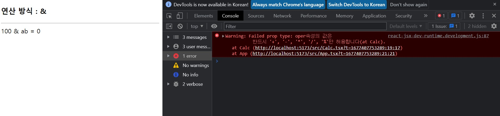 <br>
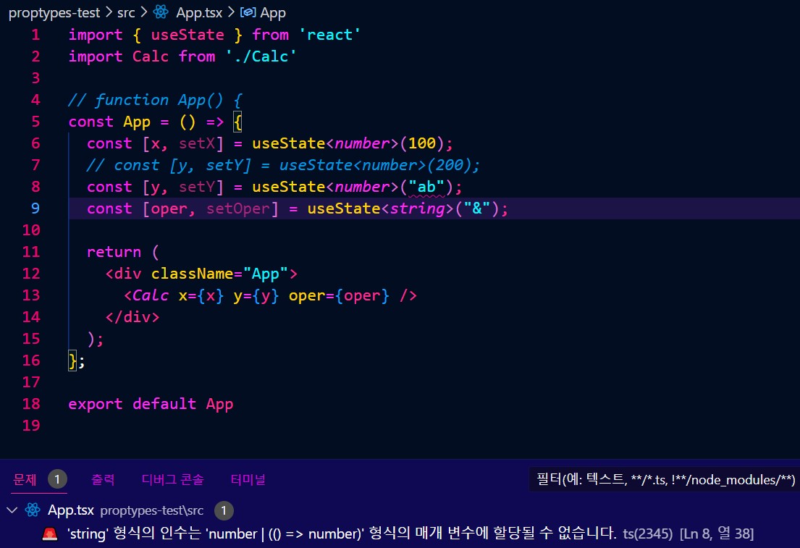 <br>
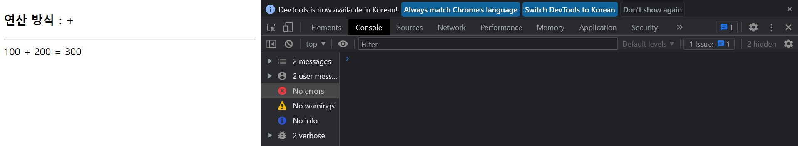 <br>


<br>

- 지정 가능한 유효성 타입 <br>

    - 단순 타입 <br>

    > - PropTypes.array: 배열 타입 <br> 
    > - PropTypes.bool: true/falsed의 불리언 타입 <br>
    > - PropTypes.func: 속성을 이용해 함수와 메서드를 전달하는 함수 타입 <br>
    > - PropTypes.number: 숫자 타입 <br>
    > - PropTypes.object: 객체 타입 <br>
    > - PropTypes.string: 문자열 타입 <br>

    - 유효성 검증 타입 <br>
    > - PropTypes.instanceOf(Customer): Customer 클래스의 인스턴스인지를 검증 <br>
    > - PropTypes.oneOf(['+', '*']): [ ]에 포함된 값 중의 하나인지를 검증 <br>
    > - PropTypes.oneOfType([PropTypes.number, PropTypes.string]): [ ]에 포함된 타입의 값인지를 검증 <br>
    > - PropTypes.arrayOf(PropTypes.object): 객체의 배열인지를 검증 <br>

<br>
→ 복잡한 객체 속성 검증

```
PropTypes.shape({
    name: PropTypes.string.isRequired,
    age: PropTypes.number
});
```
##### ▷ 문자열의 필수 정보인 name과 숫자 형식의 age 속성을 가진 객체인지를 검증

<br>

◾ 04-14 : src/Calc.tsx 변경 → calcChecker 함수에 추가(사용자 정의 유효성 검증 추가) <br>
```
·····

const calcChecker = (props: any, propName: string, componentName: string) => {

    ·····

    if (propName === "y") {
        let y = props[propName];
        if (y > 100 || y < 0 || y % 2 !== 0) {
            return new Error(`${propName}속성의 값은
                0 이상 100 이하의 짝수만 허용합니다.(at ${componentName}).`);
        };
    };
};

Calc.propTypes = {
    x: PropTypes.number.isRequired,
    y: calcChecker,
    oper: calcChecker
};

export default Calc;
```

◾ 04-15 : src/App.tsx 변경 → state 값 변경하여 확인[y -> (0 < y < 100) && (y % 2 == 0)] <br>
(y가 올바르지 않은 값이 전달되도록 변경)
```
import { useState } from 'react'
import Calc from './Calc'

// function App() {
const App = () => {
  const [x, setX] = useState<number>(100);
  const [y, setY] = useState<number>(200); // 유효하지 않는 값 (0 < y < 100 사이의 값 + 짝수)
  const [oper, setOper] = useState<string>("+");

  return (
    <div>
      <Calc x={x} y={y} oper={oper} />
    </div>
  );
};

export default App

```
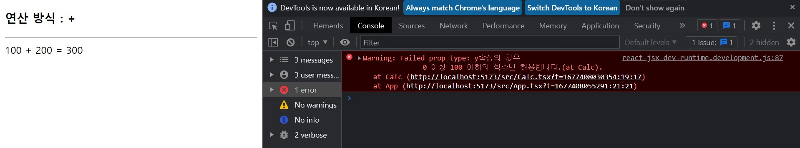 <br>
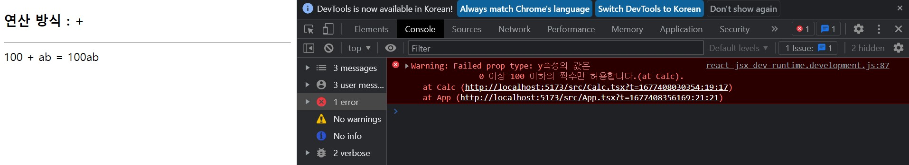 <br>
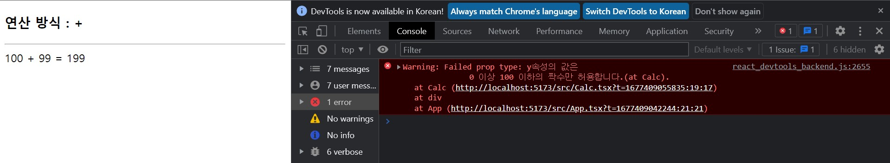 <br>
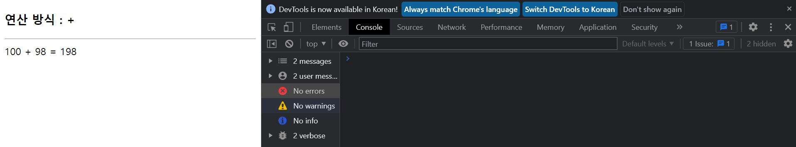 <br>


- 속성의 기본값 지정(default 값 지정)

◾ 04-16 : src/Calc.tsx 변경 → 속성의 기본값 설정(default props) <br>
(속성의 기본값이 설정되면 isRequired를 사용하지 않아도 된다.)
```
·····

Calc.proptypes = {
    x: PropTypes.number,
    y: calcChecker,
    oper: calcChecker
};

Calc.defaultProps = {
    x: 100,
    y: 20,
    oper: "+"
}

export default Calc;
```

◾ 04-17 : src/App.tsx 변경 → y와 oper 속성 사용하지 않도록 코드 변경(x속성만 전달) <br>
```
import { useState } from 'react'
import Calc from './Calc'

const App = () => {
  const [x, setX] = useState<number>(100);
  // const [y, setY] = useState<number>(200);
  // const [oper, setOper] = useState<string>("&");

  return (
    <div>
      <Calc x={x} />
    </div>
  );
};

export default App
```
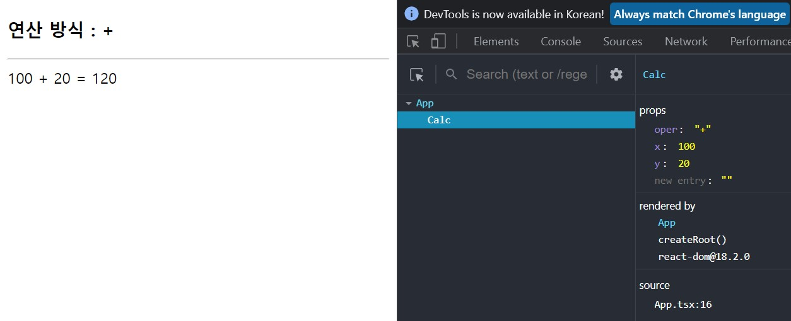 <br>
x는 지정된 값, y와 oper의 값은 기본값(default value)이 전달된 것을 확인할 수 있다. <br>
