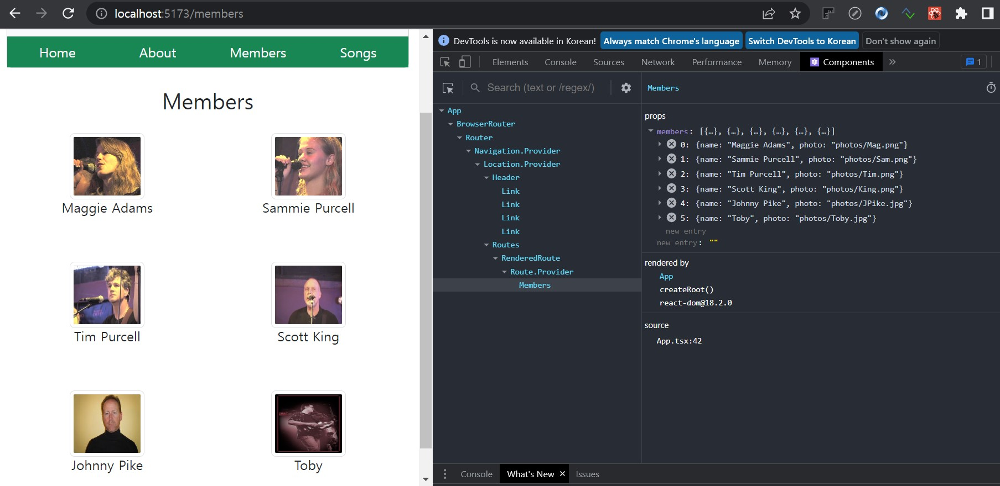

# **chapter 09**  

## 💡 `React` 

--- 
#### [리액트 라우터] 

<br>

- 리액트 라우터란? <br>
    - `리액트 라우터`는 리액트 기반의 강력한 라우팅 라이브러리로서 화면에 렌더링하는 컴포넌트와 URI 경로를 동기화하면서 새로운 화면과 흐름을 애플리케이션에 빠르게 추가할 수 있는 기능을 제공한다. <br>
    - `리액트 라우터`를 이용하면 **SPA(Single Page Application)** 를 손쉽게 작성할 수 있다. <br>
        - `SPA`는 하나의 HTML 페이지로 여러 개의 화면을 전환할 수 있는 내비게이션 기법이다. <br>
        - `SPA`는 하나의 HTML 페이지에서 요청된 URI 경로를 이용해 화면을 전환하기 때문에 화면의 전환을 위해 웹 서버로부터 새로운 페이지를 로딩하지 않는다. <br>
            - **★ 화면 전환에 필요한 모든 코드는 첫 화면을 로딩할 때 한꺼번에 서버에서 로딩한다.**

```
[리액트 라우터를 사용하기 위해 필요한 패키지(2개)]

npm install react-router react-router-dom


[리액트 라우터 명시적 설치]

npm install react-router@6.x.x react-router-dom@6.x.x → 명시적으로 6버전 설치
```

```
리액트 라우터는 버전별로 적용 방법이 많이 다르기 때문에 버전을 꼭 확인

5.x 버전으로부터 마이그레이션하는 방법 홈페이지 참조
■ https://reactrouter.com/en/6.10.0
```

```
URI(Uniform Resource Identifier) → '식별자(Identifier)'를 의미
URL(Uniform Resource Locator) → 이 식별자 중 하나인 '위치 표시자'를 의미
▷ URL은 URI의 서브셋이다.

리액트 애플리케이션에서 사용하는 경로는 HTML 문서와 같은 리소스가 위치하지 않는다. 즉, 위치 표시자의 의미가 아니라 어떤 컴포넌트를 화면에 렌더링할지 구분하기 위한 식별자로써 경로가 사용된다.
```

<br> ♧ 새로운 프로젝트 생성 <br>
```
cd ..
npm init vite router-test-app -- --template react-ts
cd router-test-app
npm install bootstrap

[명시적 설치]
npm install bootstrap@5.x.x react-router@6.x.x react-router.dom@6.x.x
```
- 컴포넌트 계층 구조 <br>
    - App <br>
        - Header <br>
            - Home <br>
                - About <br>
                    - Members <br>
                        - SongList <br>

                        <br>

- 리액트 라우터가 제공하는 컴포넌트 <br>   
    - Router <br>
        - Routes <br>
            - Route <br>

```
◎ Router: 자식 컴포넌트로 URI 경로 정보를 처리하는 Routes, Route 컴포넌트를 배치할 수 있으며 라우팅하는 방법을 결정한다.
◎ Routes: Route 컴포넌트들을 묶어서 배치하는 역할을 한다. 
◎ Route: 직접적으로 URI 경로와 렌더링할 컴포넌트나 요소를 지정하는 기능을 제공한다.
```

- BrowserRouter 사용 <br>
(BrowserRouter, HashRouter, MemoryRouter, NativeRouter 존재)

```javascript
<Router>
    ······
    <Routes>
        <Route path="/" element={<Home />}>
        ······
    </Routes>
    ······    
</Router>
```

◾ 09-01 : src/pages/Home.tsx → URI 경로별로 보여줄 컴포넌트 작성 <br>

```javascript
import React from 'react'

type Props = {};

const Home = (props: Props) => {
    return (
        <div className="card card-body">
            <h2>Home</h2>
        </div>
    );
};

export default Home;
```

◾ 09-01 : src/pages/About.tsx → URI 경로별로 보여줄 컴포넌트 작성 <br>

```javascript
import React from 'react'

type Props = {};

const About = (props: Props) => {
    return (
        <div className="card card-body">
            <h2>About</h2>
        </div>
    );
};

export default About;
```
◾ 09-01 : src/pages/Members.tsx → URI 경로별로 보여줄 컴포넌트 작성 <br>

```javascript
import React from 'react'

type Props = {};

const Members = (props: Props) => {
    return (
        <div className="card card-body">
            <h2>Members</h2>
        </div>
    );
};

export default Members;
```
◾ 09-01 : src/pages/SongList.tsx → URI 경로별로 보여줄 컴포넌트 작성 <br>

```javascript
import React from 'react'

type Props = {};

const SongList = (props: Props) => {
    return (
        <div className="card card-body">
            <h2>SongList</h2>
        </div>
    );
};

export default SongList;
```
▶ 각 컴포넌트들의 라우팅 여부를 확인하기 위해 자기 자신의 컴포넌트 이름을 출력 <br>

◾ 09-02 : src/components/Header.tsx → Link 컴포넌트 사용 <br>
→ Link: &lt;Link &nbsp;&#47;&gt; 컴포넌트는 내비게이션을 위한 링크를 생성해준다. <br>

```javascript
<Link to={이동시킬 경로}>링크를 보여줄 요소</Link>
```

```javascript
import { Link } from 'react-router-dom'

const Header = () => {
    return(
        <div className="card bg-light">
            <div className="card-heading">
                <h2 className="text-center m-3">Foxes and Fossils</h2>
                <p>
                    <a href="http://foxesandfossils.com">http://foxesandfossils.com</a>
                </p>
                <div className="row">
                    <div className="col-12">
                        <Link className="btn btn-success menu" to="/">Home</Link>
                        <Link className="btn btn-success menu" to="/about">About</Link>
                        <Link className="btn btn-success menu" to="/members">Members</Link>
                        <Link className="btn btn-success menu" to="/songs">Songs</Link>
                    </div>
                </div>
            </div>
        </div>
    );
};

export default Header;
```

◾ 09-03 : src/App.tsx → 라우팅 컴포넌트(Router, Routes, Route) 배치 <br>
▷ Router, Routes, Route 컴포넌트를 이용해 요청된 URI 경로에 따라 각기 다른 컴포넌트가 렌더링되도록 구성 <br>

```javascript
import { BrowserRouter as Router, Routes, Route } from 'react-router-dom'
import Header from './components/Header'
import Home from './pages/Home'
import About from './pages/About'
import SongList from './pages/SongList'
import Members from './pages/Members'

const App = () => {
  return (
    <Router>
      <div className="container">
        <Header />
        <Routes>
          <Route path="/" element={<Home />} />
          <Route path="/about" element={<About />} />
          <Route path="/members" element={<Members />} />
          <Route path="/songs" element={<SongList />} />
        </Routes>
      </div>
    </Router>
  );
};

export default App;
```

◾ 09-04 : src/index.css → 메뉴, 화면의 일부 요소가 사용하는 스타일 작성 <br>

```css
body {
  margin: 0;
  padding: 0;
  font-family: sans-serif;
}

.container {
  text-align: center;
  margin-top: 20px;
}

.menu {
  width: 25%;
  border-radius: 0 !important;
}
```

◾ 09-05 : src/main.tsx → index.css와 bootstrap.css 참조 <br>

```javascript
import React from 'react'
import ReactDOM from 'react-dom/client'
import 'bootstrap/dist/css/bootstrap.css'
import App from './App'
import './index.css'

ReactDOM.createRoot(document.getElementById('root') as HTMLElement).render(
  <React.StrictMode>
    <App />
  </React.StrictMode>,
)
```

 <br>
 <br>
▶ 메뉴 탭을 선택할 때마다 주소창의 URL과 Route.Provider의 자식 내용이 바뀌는 것을 확인 <br>

- 라우팅된 컴포넌트로 속성 전달하기 <br>

◾ 09-06 : src/App.tsx 변경 → 속성 전달 <br>
▷ Route 컴포넌트의 element 속성에 지정된 JSX 요소에 직접 속성을 전달할 수 있다. <br>

```javascript
·····

const App = () => {
  return (
    <Router>
      <div className="container">
        <Header />
        <Routes>
          <Route path="/" element={<Home />} />
          <Route path="/about" element={<About title={'여우와 늙다리들'} />} />
          ·····
        </Routes>
      </div>
    </Router>
  );
};

export default App;
```
(title 오류 → 추후 수정) <br>

◾ 09-07 : src/pages/About.tsx 변경 → App 컴포넌트에서 전달하는 속성 받기 <br>

```javascript
import React from 'react'

type Props = { title: string };

const About = (props: Props) => {
    return (
        <div className="card card-body">
            <h2>About {props.title}</h2>
        </div>
    );
};

export default About;
```
(title 오류 사라진다.) <br>

 <br>
▶ 컴포넌트로 전달된 속성 확인 <br>

- 복잡한 객체를 속성으로 전달하기 <br>

◾ 09-08 : src/App.tsx 변경 → '배열' 형태의 상태를 속성으로 전달 <br>

```javascript
import { useState } from 'react'
·····

export type MemberType = { name: string; photo: string };

const App = () => {
  const [members] = useState<Array<MemberType>>([
    { name: "Maggie Adams", photo: "photos/Mag.png" },
    { name: "Sammie Purcell", photo: "photos/Sam.png" },
    { name: "Tim Purcell", photo: "photos/Tim.png" },
    { name: "Scott King", photo: "photos/King.png" },
    { name: "Johnny Pike", photo: "photos/JPike.jpg" },
    { name: "Toby", photo: "photos/Toby.jpg" }
  ]);

  return (
    <Router>
      ·····
          <Route path="/members" element={<Members members={members} />} />
          ·····
    </Router>
  );
};

export default App;
```

```
[photos.zip 사진파일 다운로드]
http://github.com/stepanowon/react-ts-quickstart

public/photos/'사진 파일'들 위치
```

◾ 09-09 : src/Pages/Members.tsx 변경 → 전달 받은 members 속성 사용 <br>

```javascript
import { MemberType } from '../App'

type Props = { members: Array<MemberType> };

const Members = (props: Props) => {
    let imgstyle = { width: 90, height: 80 };
    let list = props.members.map((member) => {
        return (
            <div key={member.name} className="col-6 col-md-4 col-lg-3">
                
                <br />
                <h6>{member.name}</h6>
                <br />
                <br />
            </div>
        );
    });
    return (
        <div>
            <h2 className="m-4">Members</h2>
            <div className="container">
                <div className="row">{list}</div>
            </div>
        </div>
    );
}

export default Members;
```

 <br>
▶ members 속성으로 전달된 것을 확인[name, photo] <br>


- URI 파라미터 이용 <br>
    - URI 파라미터란? <br>
        URI 경로에 동적으로 매번 다른 값이 포함되고, 컴포넌트를 실행할 때 URI 경로의 동적인 값을 받아서 이용해야 하는 경우가 있는데, 이럴 때 사용할 수 있는 것이 **동적 파라미터**이다. <br>
        ```javascript
        <Route path="/songs/:id" element={<SongDetail songs={songs} />} />
               // path="/songs/:id" - ①
        ```
        ① :id와 같이 URI 경로의 파라미터 이름을 지정 <br>
        ▷ 이 파라미터 값은 element로 렌더링하는 컴포넌트에서 받아낼 수 있다. <br>
        
        <br>

        ```javascript
        type SongParam = { id? : string }; // - ②

        const SongDetail = (……) => {
            …
            const { id } = useParams<SongParam>(); // - ③
            …
        }
        ```
        ② 파라미터 타입을 정의 <br>
        ▷ id 파라미터가 전달되지 않는 경우를 처리하기 위해 URI 파라미터에 `?` 기호를 붙여서 **선택적 파라미터**로 정의 <br>
        ③ id 값을 받아낼 때 `useParams` 훅을 사용 <br>
        ▷ URI 경로로 전달되는 값은 기본적으로 **문자열**이므로 문자열 타입으로 파라미터 타입을 지정(②) <br>
        - URI 파라미터는 여러 개를 사용할 수도 있으며, 와일드 카드(*)를 이용할 수도 있다. <br>
            ```
            ● /orders/:id/:date

            ● /groups/*
            ```
```
[경로에서 사라진 정규 표현식]

리액트 라우터 버전 5.x까지는 /profiles/:userid([0-9]{10})처럼 정규 표현식을 이용해 경로를 표현할 수 있었지만,
버전 6에서는 이를 지원하지 않는다.

리액트 라우터 팀에서는 정규식을 이용한 경로가 라우트 매칭 우선순위 적용에 문제가 있다고 판단해서 외부 의존성
라이브러리(path-to-regexp)를 없애고, 브라우저에 로딩되는 패키지의 무게를 줄이기 위해 적용하지 않기로 하였다.

따라서 경로를 표현할 때 '경로 파라미터' 값을 받은 다음, 코드 수준에서 조건 또는 분기 처리해야 한다.

▷ 참조 
https://reactrouter.com/en/v6.3.0/faq#what-happened-to-regexp-routes-paths
```

- URI 파라미터 적용하기 <br>
```
[곡 정보 다운로드]


https://github.com/stepanowon/react-ts-quickstart

이 곡들은 Foxes and Fossils 밴드의 유튜브 영상 링크 정보를 포함하고 있다.
```

◾ 09-10 : src/App.tsx 변경 → URI 파라미터 적용 <br>
▷ App 컴포넌트에 곡 정보 상태를 추가, 추가한 상태를 속성으로 SongList와 SongDetail 컴포넌트에 전달 <br>

```javascript
import { useState } from 'react'
import { BrowserRouter as Router, Route, Routes } from 'react-router-dom'
…
import SongDetail from './pages/SongDetail'

…
export type SongType = { id: number; title: string; musician: string; youtube_link: string };

const App = () => {
  const [members] = useState<Array<MemberType>>([……]);

  const [songs] = useState<Array<SongType>>([
    { id: 1, title: "Fallin' for you", musician: "Colbie callet", youtube_link: "PABUl_EX_hw"},
    { id: 2, title: "Can't hurry love", musician: "The supremes", youtube_link: "EJDPhjQft04"},
    { id: 3, title: "Landslide", musician: "Dixie chicks", youtube_link: "V2N7gYom9-A" },
    { id: 4, title: "Can't let go", musician: "Linda ronstadt", youtube_link: "P-EpGKXmoe4" },
    { id: 5, title: "Doctor my eyes", musician: "Jackson Browne", youtube_link: "7JlFKS_1oZk" },
    { id: 6, title: "We gotta get you a woman", musician: "Todd Rundgren", youtube_link: "EyUjbBViAGE" },
    { id: 7, title: "Hip to my heart", musician: "Band Perry", youtube_link: "vpLCFnD9LFo" },
    { id: 8, title: "Rolling in the deep", musician: "Adele", youtube_link: "EvK8pDK6IQU" }
  ]);

  return (
    <Router>
      <div className="container">
        <Header />
        <Routes>
          <Route path="/" element={<Home />} />
          …
          <Route path="/songs" element={<SongList songs={songs} />} />
          <Route path="/songs/:id" element={<SongDetail songs={songs} />} />
        </Routes>
      </div>
    </Router>
  );
};

export default App;
```
(임포트한 SongDetail 및 SongList의 props(songs) 오류 → 추후 작성) <br>

◾ 09-11 : src/pages/SongList.tsx 변경 → songs 속성으로 전달받은 데이터를 목록으로 출력 <br>
▷ &lt;`Link` /&gt; 컴포넌트를 이용해 내비게이션할 수 있는 링크를 동적으로 생성 <br>

```javascript
import { Link } from 'react-router-dom'
import { SongType} from '../App'

type Props = { songs: Array<SongType> };

const SongList = (props: Props) => {
    let list = props.songs.map((song) => {
        return (
            <li className="list-group-item" key={song.id}>
                <Link to={`/songs/${song.id}`}
                    style={{ textDecoration: "none"}}>
                    {song.title} ( {song.musician} )
                </Link> 
            </li>
        );
    });
    return (
        <div>
            <h2 className="mt-4 mb-2">Song List</h2>
            <ul className="list-group">{list}</ul>
        </div>
    );
};

export default SongList;
```
(App.tsx에 SongList의 props(songs) 오류 사라짐) <br>

◾ 09-12 : src/pages/SongDetail.tsx → URL 경로 문자열 받아내기 / useParams, useNavigate 훅 사용하기 <br>

```javascript
import React, { useEffect, useState } from 'react'
import { Link, useParams, useNavigate } from 'react-router-dom'
import { SongType } from '../App'

type Props = { songs: Array<SongType> };
type SongParam = { id? : string };

const SongDetail = (props: Props) => {
    const { id } = useParams<SongParam>();
    const navigate = useNavigate();
    const [title, setTitle] = useState<string>("");
    const [musician, setMusician] = useState<string>("");
    const [link, setLink] = useState<string>();
    const YOUTUBE_LINK = "https://m.youtube.com/watch?v=";

    useEffect(() => {
        const song = props.songs.find((song) => song.id === parseInt(id ? id : "", 10));

        if (song) {
            setLink(song?.youtube_link ? YOUTUBE_LINK + song.youtube_link : "");
            setTitle(song?.title ? song.title : "");
            setMusician(song?.musician ? song?.musician : "");
        } else {
            navigate("/songs");
        }
    }, []);

    return (
        <div className="mt-5">
            <h2>{title}</h2>
            <p>Original Musician : {musician}</p>
            <p>
                <a href={link} target="new">
                    View Youtube
                </a>
            </p>
            <Link to="/songs">Return SongList</Link>
        </div>
    );
};

export default SongDetail;
```
(App.tsx에 임포트한 SongDetail 오류 사라짐) <br>
▶ useParams 훅을 이용해 URI 파라미터로 전달된 id값을 받아내고, useEffect 훅을 이용해 컴포넌트가 마운트된 후 id를 이용해 한 곡 정보를 찾아낸다. 찾아낸 한 곳의 정보는 title, link, musician 등의 상태에 담아 화면에 출력 <br>
▶ id가 일치하는 곳이 없다면 useNavigate 훅으로 만든 navigate 함수를 이용해 다시 /songs 경로로 이동 <br>
(useNavigate : 경로를 이동시켜주는 기능을 제공 → useNavigate는 뒤에서 더 자세히 다루기로 함.) <br>

 <br>
 <br>
 <br>
▶ SongDetail 컴포넌트가 렌더링될 때 params 훅 정보가 어떻게 전달되는지와 매칭된 &lt;`Route` /&gt; 컴포넌트 정보를 확인할 수 있다. (URI 파라미터 기능 확인) <br>

<br>

- 클래스 컴포넌트에 URI 파라미터 적용하기 <br>
```
클래스 컴포넌트에서는 훅을 이용할 수 없다.
```
`클래스 컴포넌트`에서 '동적 파라미터'를 이용하려면 **고차 함수**를 만들어서 useParams 훅으로 획득한 params 객체를 클래스 컴포넌트에 속성으로 전달하는 방법을 사용할 수 있다. <br>

◾ 09-13 : src/pages/SongDetail2.tsx → 클래스 컴포넌트에서 동적 파라미터를 이용하기 위해 고차 함수 생성 <br>

```javascript
import React, { Component } from 'react'
import { useParams, useNavigate } from 'react-router'
import { Link } from 'react-router-dom'
import { SongType } from '../App'

type SongParam = { id?: string };
type Props = { songs: Array<SongType> };
type SongDetailProps = { 
    navigate: Function;
    params: SongParam;
    songs: Array<SongType>
};
type SongDetailState = {
    title: string;
    musician: string;
    link: string
};

// 고차 함수
const withSongParams = (Component: React.ComponentType<SongDetailProps>) => {
    return (props: Props) => <Component {...props} 
                            params={useParams<SongParam>()} 
                            navigate={useNavigate()} />;
};

const YOUTUBE_LINK = "https://m.youtube.com/watch?v=";

class SongDetail2 extends Component<SongDetailProps, SongDetailState> {
    constructor(props: SongDetailProps) {
        super(props);
        this.state = { title: "", link: "", musician: "" };
    }

    componentDidMount() {
        const id = this.props.params.id;
        const song = this.props.songs.find((song) => song.id === parseInt(id ? id : ""));

        if (song) {
            this.setState({
                link: song?.youtube_link ? YOUTUBE_LINK + song?.youtube_link : "",
                musician: song?.musician ? song.musician : "",
                title: song?.title ? song.title : ""
            });
        } else {
            this.props.navigate("/songs");
        }
    }

    render() {
        return (
            <div className="mt-5">
                <h2>{this.state.title}</h2>
                <p>Origianl Musician : {this.state.musician}</p>
                <p>
                    <a href={this.state.link} target="new">
                        View Youtube
                    </a>
                </p>
                <Link to="/songs">Return SongList</Link>
            </div>
        );
    }
}

export default withSongParams(SongDetail2);
```
▶ *withSongParams*에서 전달할 속성의 형식을 정의하고 있고, **클래스 컴포넌트**가 사용할 수 없는 `useParams` 훅, `useNavigate` 훅의 리턴 값을 **고차 함수**를 사용하여 전달해 주고 있다. <br> 
▶ params와 navigate 속성으로 각각 params 정보와 navigate 함수를 전달 <br>
▶ **고차 함수**의 `Component 파라미터`로 **클래스 컴포넌트**가 인자로 전달되면 클래스 컴포넌트에 params, navigate 속성을 추가하여 리턴함으로써 클래스 컴포넌트에 params, navigate 속성을 이용할 수 있게 된다. <br>

◾ 09-14 : src/App.tsx 변경 → SongDetail2 컴포넌트 사용 <br>

```javascript
…
import SongDetail from './pages/SongDetail2'
…

const App = () => {
    …
};

export default App;
```

 <br>
 <br>


- 중첩 라우트 <br>
    - 중첩 라우트란? <br>
    `중첩 라우트(nested route)`는 &lt;Route /&gt; 컴포넌트에 의해 렌더링된 컴포넌트에 기존 Route의 중첩된 &lt;Route /&gt;의 컴포넌트가 나타나도록 구성하는 &lt;Route /&gt; 컴포넌트의 적용 방법이다. <br>

```
[별개의 <Route /> 컴포넌트로 구성하여 렌더링]

● /songs로 요청 : SongList 컴포넌트 렌더링
● /songs/:id로 요청 : SongDetail 컴포넌트 렌더링
```

```
[중첩 라우트(nested route) 컴포넌트 구성하여 렌더링]

● /songs로 요청 : SongList 컴포넌트 렌더링
● /songs/:id로 요청 : SongList 컴포넌트와 Player 컴포넌트 렌더링
```

▷ 중첩 라우트를 작성하는 방법은 &lt;Route /&gt; 컴포넌트 내부에 다시 &lt;Route /&gt; 컴포넌트를 배치하는 것 <br>

```javascript
…
    <Route path="/songs" element={<SongList songs={songs} />}>
        <Route path=":id" element={<Player songs={songs} />} />
    </Route>
…
```


```javascript
/* /songs로 요청 */

// [SongList 컴포넌트]
<Route path="/songs" ... /> // 요청 경로가 /songs와 매칭 : SongList 컴포넌트만 렌더링
```

```javascript
/* /songs/:id로 요청 */

// [SongList 컴포넌트]
<Route path="/songs" ... /> // 요청 경로가 /songs와 매칭
     /* ↓↓↓ */
// [Player 컴포넌트]
<Route path=":id" ... /> // 요청 경로가 /songs/:id와 매칭 : SongList, Player 컴포넌트 모두 렌더링

// ★ 중첩 라우트에서 요청 경로의 차이에 따른 렌더링
```

▷ 중첩 라우트를 렌더링하기 위한 Outlet 컴포넌트 <br>

```javascript
<Routes>
    <Route path="/songs" element={<SongList song={songs} />}>
        <Route path=":id" element={<Player songs={songs} />} />
    </Route>
</Routes>

// <Player songs={songs} /> → Outlet
```
▶ 중첩 라우트의 바깥쪽 &lt;Route /&gt; 컴포넌트에 의해 렌더링되는 컴포넌트에는 중첩된 내부 &lt;Route /&gt;에 의해 렌더링되는 컴포넌트를 담을 컨테이너로써 &lt;Outlet /&gt; 컴포넌트를 작성해야 한다. <br>
▶ /songs/:id 경로 패턴에 매칭되면 Player 컴포넌트가 SongList 내부의 Outlet 컴포넌트에 렌더링 된다. <br>


|||||||
|:---:|:---:|:---:|:---:|:---:|:---|
|||`Router`||||
|||↓||||
|||`App`||||
|`Header`|←|↓||||
||┌|`Routes`|─|┐||
||│|│|│|│||
||↓|↓|↓|↓||
||`Home`<br>*exact* /|`About`<br>/about|`Members`<br>/members|`SongList`<br>/songs||
|||||↓||
|||||**`Outlet`**||
|||||↓|/songs/:id|
|||||`Player`||
|||||||


■ 중첩 라우트 적용하기 <br>
- **player** 컴포넌트는 CSS 레이어로 SongList 컴포넌트 위에 `모달` 창처럼 나타나도록 하기 <br>
    - 유튜브 플레이어 기능을 제공하는 컴포넌트 패키지 설치 (react-youtube 패키지 설치) <br>
        ```
        npm install react-youtube  @types/youtube-player
        ```

◾ 09-15 : src/pages/songs/Player.tsx → 속성으로 전달 받은 songs 정보에서 :id 파라미터 값으로 한 곡의 정보를 획득해 플레이어를 렌더링 <br>

```javascript
import { useEffect, useState } from 'react'
import { useParams, Navigate, useNavigate } from 'react-router'
import { Link } from 'react-router-dom'
import Youtube from 'react-youtube'
import { SongType } from '../../App'

type Props = { songs: Array<SongType> };
type SongIdParam = { id: string };

const Player = (props: Props) => {
    const params = useParams<SongIdParam>();
    const navigate = useNavigate();
    const [title, setTitle] = useState<string>("");
    const [youtubeLink, setYoutubeLink] = useState<string>("");

    useEffect(() => {
        const id = params.id ? parseInt(params.id, 10) : 0;
        const song = props.songs.find((song) => song.id === id);
        
        if (song) {
            setTitle(song?.title ? song.title : "");
            setYoutubeLink(song?.youtube_link ? song.youtube_link : "");
        } else {
            navigate("/songs");
        }
    });

    return (
        <div className="modal">
            <div className="box">
                <div className="heading">
                    <Link className="menu" to="/songs">
                        <span className="float-start badge bg-secondary pointer">X</span>
                    </Link>
                    <span className="title">$nbsp;$nbsp;$nbsp;{title}</span>
                </div>
                <div className="player">
                    <div>
                        <Youtube videoId={youtubeLink} 
                            opts={{ width: "320", height: "240", playerVars: { autoplay: 1} }} />
                    </div>
                </div>
            </div>
        </div>
    );
}

export default Player;
```

◾ 09-16 : src/pages/SongList.tsx 변경 → 중첩 &lt;Route /&gt;의 &lt;Outlet /&gt; 컴포넌트 추가 <br>

```javascript
import { Link, Outlet} from 'react-router-dom'
import { SongType} from '../App'

type Props = { songs: Array<SongType> };

const SongList = (props: Props) => {
    let list = props.songs.map((song) => {
        return (
            <li className="list-group-item" key={song.id}>
                <Link to={`/songs/${song.id}`} style={{ textDecoration: "none" }}>
                    {song.title} ( {song.musician} )
                    <span className="float-end badge bg-secondary">
                        <i className="fa fa-play"></i>
                    </span>
                </Link>
            </li>
        );
    });
    return (
        <div>
            <h2 className="mt-4 mb-2">Song List</h2>
            <ul className="list-group">{list}</ul>
            <Outlet />
        </div>
    );
};

export default SongList;
```

◾ 09-17 : src/index.css 변경 → CSS 스타일 추가 / font-awesome 라이브러리 참조 <br>

```css
/* font-awesome이 제공하는 아이콘을 사용하기 위한 참조 */
@import "https://cdnjs.cloudflare.com/ajax/libs/font-awesome/4.7.0/css/font-awesome.min.css";


/* 기존 스타일 */
body {
  margin: 0;
  padding: 0;
  font-family: sans-serif;
}

.container {
  text-align: center;
  margin-top: 20px;
}

.menu {
  width: 25%;
  border-radius: 0 !important;
}


/* 모달 창과 Youtube 플레이어를 위한 스타일 추가 */
.modal {
  display: block;
  position: fixed;
  z-index: 1;
  left: 0;
  top: 0;
  width: 100%;
  height: 100%;
  overflow: auto;
  background-color: rgba(0, 0, 0, 0.4);
}

.box {
  background-color: white;
  margin: 100px auto;
  min-width: 100px;
  max-width: 330px;
  min-height: 250px;
  font: 12px "verdana";
  padding: 5px;
}

.box div {
  padding: 0;
  display: block;
  margin: 5px 0 0;
}

.box .heading {
  background:  #33A17F;
  font-weight: 300;
  text-align: left;
  color: #fff;
  margin: 0;
  padding: 10px;
  min-width: 200px;
  max-width: 360px;
}

.box .player {
  background: white;
}

.pointer {
  cursor: pointer;
}

.play-button {
  width: 15px;
  height: 15px;
}

.play-button-disabled {
  opacity: 0.3;
}
```

◾ 09-18 : src/App.tsx 변경 → Player 컴포넌트를 임포트하여 중첩된 라우트로 구성 <br>

```javascript
…

// import SongDetail from './pages/SongDetail2'
import Player from './pages/songs/Player'

…

const App = () => {
  
  …

  return (
    <Router>
      <div className="container">
        <Header />
        <Routes>
          …
          <Route path="/songs" element={<SongList songs={songs} />}>
            <Route path=":id" element={<Player songs={songs} />} />
          </Route>
        </Routes>
      </div>
    </Router>
  );
};

export default App;
```

 <br>


■ index 라우트 설정 <br>
```
중첩 라우트에서 상위 경로(부모 경로)까지만 매칭이 되는 경우에는 
부모 경로의 <Route /> 컴포넌트의 element만 렌더링
```
`index 라우트`를 설정하면 부모 경로까지만 매칭되는 경우에도 자식 컴포넌트를 렌더링할 수 있다. <br>

```javascript
<Route path="/parents" element={ <Parent /> }>
    <Route index element={ <DefaultChild />} />
    <Route path=":param" element={ <Child1 />} />
</Route>
```
```
● parents로 요청 : Parent, DefaultChild 컴포넌트 렌더링
● parents/:param으로 요청 : Parent, Child1 컴포넌트 렌더링
```

◾ 09-19 : src/pages/songs/Index.tsx → index 라우트 적용(준비) <br>

```javascript
import React from 'react'

const Index = () => {
    return (
        <>
            <hr />
            <h3>현재 재생 중인 곡 없음</h3>
        </>
    );
}

export default Index;
```

◾ 09-20 : src/App.tsx 변경 → Index.tsx 임포트 <br>

```javascript
…
import SongIndex from './pages/songs/Index'


const App = () => {
  …

  return (
    <Router>
      <div className="container">
        <Header />
        <Routes>
            …
          <Route path="/songs" element={<SongList songs={songs} />}>
            <Route index element={<SongIndex />} />
            <Route path=":id" element={<Player songs={songs} />} />
          </Route>
        </Routes>
      </div>
    </Router>
  );
};

export default App;
```


 
 <br>
 <br>

<br>

- 리액트 라우터가 제공하는 훅 <br>
`useParams`, `useNavigate`는 **리액트 라우터**가 제공하는 훅이며, 이외에도 리액트 라우터가 제공하는 다양한 훅들이 있다. <br>

    |||
    |:---|:---|
    |**리액트 라우터 훅**|**설명**|
    |`useMatch()`|현재 요청 경로가 지정한 경로 패턴에 매칭되는 경우 'PathMatch 객체'를 리턴한다.<br>PathMatch는 매칭된 경로 정보를 담고 있다.|
    |`useParams()`|URI 파라미터 값을 포함하는 'Params 객체'를 리턴한다.|
    |`useSearchParams()`|현재 요청의 '쿼리 문자열'을 읽거나 수정할 수 있다.<br>쿼리 문자열은 URL 뒤에 ?a=1&b=2와 같이 따라붙는 문자열 정보이다.|
    |`useLocation()`|현재 요청된 경로 정보를 포함하는 'Location 객체'를 리턴한다.|
    |`useNavigate()`|화면 전환(이동)을 위한 'Navigate 함수'를 리턴한다.|
    |`useOutletContext()`|상위 경로에 상태를 저장하고, *Outlet* 컴포넌트에 렌더링하는 자식 컴포넌트에서<br>상태에 접근할 수 있도록 한다.|
    |||


- `useMatch` <br>
    `useMatch` 훅은 현재 요청된 URI 경로가 인자로 전달한 경로 패턴과 매칭하는지 확인하고 **PathMatch 객체**를 리턴한다. <br>
    ```javascript
    // 경로 패턴에는 <Route /> 컴포넌트의 path 속성에 지정하던 경로 형태를 전달한다.

    const pathMatch = useMatch(경로패턴);
    ```
    - 응답한 pathMatch 객체는 다음과 같은 속성이 있다. <br>
        ```
        ● params : URI 경로 파라미터
        ● pathname : 요청된 경로
        ● pattern : 요청된 경로 패턴
        ```

◾ 09-21 : src/pages/SongList.tsx 변경 → useMatch 사용, 리턴된 pathMatch 객체에 따른 스타일 적용 <br>

```javascript

import { Link, Outlet, useMatch} from 'react-router-dom'

…

const SongList = (props: Props) => {
    const pathMatch = useMatch("/songs/:id");
    let param_id: number = pathMatch?.params?.id ? parseInt(pathMatch.params.id, 10) : -1;

    let list = props.songs.map((song) => {
        let cn = "list-group-item";
        cn += param_id === song.id ? " list-group-item-secondary" : "";

        return (
            <li className={cn} key={song.id}>
                …
            </li>
        );
    });
   …
   
};

export default SongList;
```
▶ useMatch 훅을 이용해 현재 요청된 경로에 매칭되는 PathMatch 객체를 받아내고, 여기서 id 파라미터를 알아낸다. <br>
▶ &lt;li /&gt; 요소를 렌더링할 때 각 곡(song)의 id와 비교하여 param_id와 song.id가 일치할 때만 list-group-item-secondary라는 CSS 클래스 적용 <br>


 <br>

- `useSearchParams` <br>
    `useSearchParams` 훅은 요청 시 전달하는 '쿼리 문자열' 정보를 읽어내거나 설정하는 기능을 제공한다. <br>
    ```javascript
    // searchParams : 쿼리 문자열을 읽을 수 있는 전용의 객체
    // ?a=1&b=2와 같이 요청한 경우 searchParams.get("a")와 같이 값에 접근할 수 있다.
    // setSearchParams : 쿼리 문자열을 설정할 수 있는 기능을 제공하는 함수
    // setSearchParams({ a: 3, b: 4 })와 같이 설정할 수 있다.

    const [searchParams, setSearchParams] = useSearchParams();
    ```

◾ 09-22 : src/pages/About.tsx 변경 → useSearchParams 훅 사용 <br>
``` 
통상적으로는 게시판에서 페이징을 할 때 ?page=1과 같이 쿼리 문자열을 자주 이용하는데,
여기서는 실제 데이터를 화면에 출력하진 않고 페이징 기능만을 기존 예제의 About 컴포넌트에 추가
```

```javascript
import { useEffect, useState } from 'react'
import { useSearchParams, useNavigate } from 'react-router-dom'

type Props = { title: string };

const About = (props: Props) => {
    let [searchParams, setSearchParams] = useSearchParams();
    const [page, setPage] = useState<number>(1);
    const navigate = useNavigate();

    useEffect(() => {
        const strPage = searchParams.get("page");
        setPage(parseInt(strPage !== null ? strPage : "1", 10));
    }, [searchParams]);

    const goPrev = () => {
        if (page > 1) navigate(location.pathname + "?page=" + (page - 1));
    };

    const goNext = () => {
        navigate(location.pathname + "?page=" + (page + 1));
    };

    return (
        <div className="card card-body">
            <h2>About {props.title}</h2>
            <div>
                <div className="m-2">현재 페이지 : {page}</div>
                <button className="btn btn-secondary m-1" onClick={goPrev}>
                    prev
                </button>
                <button className="btn btn-secondary m-1" onClick={goNext}>
                    next
                </button>
            </div>
        </div>
    );
};

export default About;
```
▶ useSearchParams 훅을 호출하여 searchParams 객체와 setSearchParams 함수를 리턴 받는다. <br>
▶ useEffect 훅을 이용해 컴포넌트가 마운트될 때 searchParams 값이 바뀌면 실행하는 함수를 등록하고, 이 함수에서는 변경된 쿼리 문자열의 page 파라미터를 읽어서 page 상태에 설정 <br>
▶ 이전 버튼(prev), 다음 버튼(next)을 클릭하면 navigate 함수를 이용해 현재 요청 경로 뒤에 ?page=4와 같이 이전 또는 다음 페이지 번호를 붙여서 이동 <br>

 <br>

```
[리액트의 Provider와 Context API]

router-test-app 예제를 실행한 후 브라우저 개발자 도구의 [Components] 탭을 자세히 살펴보면
Route.Provider, Navigation.Provider와 같이 Provider들이 보일 것이다. 
이 중 하나를 클릭해보면 value 속성을 확인할 수 있다.

☆ 리액트 라우터는 내부적으로 Context API를 사용한다.
Context 정보에 접근하여 필요한 정보를 획득하는 것이 리액트 라우터 훅들이다.
```

- `useNavigate`와 `useLocation` <br>
    `useNavigate` 훅을 호출하면 URI 경로를 이동할 수 있는 **navigate 함수**가 리턴된다. 이 함수를 호출하여 다양한 방법으로 경로를 이동하고 화면을 전환할 수 있다. <br>
    ```javascript
    // navigate(to, options)
    // - to : 이동하려는 경로
    // - options : 경로를 이동할 때 지정할 수 있는 옵션

    const navigate = useNavigate();
    ```

    ```
    [navigate 함수의 두 번째 인자(option)에서 사용할 수 있는 속성]

    ● replace : 내부적으로 이용하는 브라우저 히스토리(history)의 항목을 교체할 것인지를 true/false로 지정.
                기본 값은 false

    ● state : 내비게이션할 때 전달할 상태 정보.
              이 정보는 경로 이동이 완료된 후 location 객체의 state 속성(location.state)을 이용해 접근할 수 있다.
    ```

    현재 경로 : /d (처음에 [/a] 경로에서 [/b]─[/c]─[/d]로 순차적으로 이동한 상태라고 가정) <br>
    ||||||||||||
    |:---:|:---:|:---:|:---:|:---:|:---:|:---:|:---:|:---:|:---:|:---|
    |/a|/b|/c|/d| ▶ |/a|/b|/c|/d|/e| navigate("/e", { replace: false } ) |
    ||||||/a|/b|/c|/e|| navigate("/e", { replace: true } ) |
    ||||||||||||

    navigate("/e", { replace: false } )와 같이 `replace` 옵션을 **false**로 지정하여 호출하면 *history* 객체에 새로운 방문 이력으로 [/e] 경로가 `등록` 된다. 반면, `replace` 옵션을 **true**로 지정하면 현재 경로의 방문 이력을 새로운 경로로 `교체`한다. <br> 
    
    - `navigate` 함수 대신에 **JSX 구문**에 포함시켜서 선언적으로 사용할 수 있는 **&lt;Navigate /&gt;** 컴포넌트도 있다.
    ```javascript
    /* isLoggined 값이 false면 /login 경로로 바로 이동 */

    import { Navigate } from 'react-router-dom'
    …

    // JSX 구문 내에서 사용 예시
    return (
        <div>
            { isLoggined ? <App /> : <Navigate to="/login" replace={true} />}
        </div>
    );
    ```

◾ 09-23 : src/pages/Members.tsx 변경 → useNavigate 훅 사용 <br>
▷ &lt;Go Home&gt; 버튼 추가 <br>
▷ 버튼을 클릭하면 Home으로 이동하기 위해 navigate 함수를 이용 <br>
▷ 이때 어디에서 Home으로 이동했는지 식별할 수 있도록 state 정보를 전달 <br>

```javascript
import { useNavigate } from 'react-router'
import { MemberType } from '../App'

type Props = { members: Array<MemberType> };

const Members = (props: Props) => {
    const navigate = useNavigate();
    const goHome = () => {
        if (window.confirm('정말로 홈으로 이동할까요?')) {
            navigate('/', { state: { from: '/members'} });
        }
    }
    …
   
    return (
        <div>
           …

            <button className="btn btn-secondary" onClick={goHome} >
                Go Home
            </button>
        </div>
    );
}

export default Members;
```

`useLocation`는 Members 컴포넌트(/members)에서 Home(/)으로 이동한 후 **state 정보**를 엑세스하려면 useLocation 훅을 사용하면 된다. <br>
```javascript
const location = useLocation();
```

```
[location 객체가 제공하는 속성]

● pathname: 현재 요청된 경로
● search: 쿼리 문자열
● state: navigate()로 이동할 때 전달된 상태(state) 정보
```

◾ 09-24 : src/pages/Home.tsx 변경 → useLocation 훅 사용 <br>

```javascript
import React from 'react'
import { useLocation } from 'react-router'

type Props = {};
type LocationStateType = {
    from: string;
};

const Home = (props: Props) => {
    const location = useLocation(); // location 객체를 획득
    const state = location.state as LocationStateType; // location.state를 LocationStateType으로 타입을 변환
    const from = state ? state.from : "";

    return (
        <div className="card card-body">
            <h2>Home</h2>
            {from !== "" ? <h4>state.from : {from}</h4> : ""}
        </div>
    );
}

export default Home;
```
＃ 처음 Home에서 시작해 Members로 이동했다가 &lt;Go Home&gt; 버튼을 클릭해 다시 Home으로 이동해보기 <br>
▶ Members에서 Home으로 이동하면 navigate() 함수로 state를 전달 <br>


 
 <br>
 <br>
 <br>
 <br>
 <br>

▶ 네비게이션 메뉴의 Home 텝을 눌러 이동하면 navigate() 함수로 state를 전달하지 않기 때문에 state 값(텍스트)은 없어진다. [ state === null ] <br>

- `useOutletContext` <br>
    `useOutletContext` 훅은 **중첩된 라우트**를 사용할 때 '상위 경로'의 &lt;Outlet /&gt; 컴포넌트를 이용해 상태 정보를 저장해두고 '하위 경로'에서 접근할 수 있도록 하는 기능을 제공한다. <br>
    ```
    ● 상위 라우트가 렌더링하는 컴포넌트(<Outlet /> 컴포넌트를 렌더링하는 컴포넌트)에서 상태 또는 속성을 <Outlet /> 컴포넌트의 'context'에 지정하여 전달한다.
    ● 중첩 라우트의 자식 컴포넌트에서 useOutletContext() 훅을 이용해 'context' 객체를 받아서 사용할 수 있다.
    ```

    ```javascript
    // [상위 라우트 컴포넌트에서 상태를 context로 전달하는 경우]

    const parentComponent = () => {
        const [title, setTitle] = React.useState('Hello React!!');
    }

    return (
        …
        <Outlet context={ {title} } /> 
        …
    );

    export default Home;
    ```
    ```javascript
    // [중첩 라우트 컴포넌트에서 useOutletContext 훅으로 context 객체를 이용하는 경우]

    type ContextStateType = { title : string };
    const childComponent = () => {
        const { title } = useOutletContext<ContextStateType>();
    }
    ```

    - 기존의 방식 : Player 컴포넌트에 songs 속성 전달 <br>
        ```javascript
        <Route path="/songs" element={<SongList songs={songs} />}>
            <Route index element={<SongIndex />} />
            <Route path=":id" element={<Player songs={songs} />} />
        </Route>
        ```

◾ 09-25 : src/App.tsx 변경 → &lt;Player /&gt; 컴포넌트로 속성을 전달하지 않도록 변경 <br>
▷ (Player 컴포넌트가 SongList 컴포넌트와 항상 함께 사용되며 중첩 라우트로 사용된다는 가정 하에) OutletContext 속성을 이용해 songs 속성을 전달 <br>

```javascript
    …
        <Route path="/songs" element={<SongList songs={songs} />}>
            <Route index element={<SongIndex />} />
            <Route path=":id" element={<Player />} /> {/* 속성을 전달하지 않도록 수정 */}
        </Route>
    …
```
(Player 컴포넌트 오류 발생) <br>

◾ 09-26 : src/pages/SongList.tsx 변경 → 전달받은 songs 속성을 &lt;Outlet /&gt;의 context로 전달 <br>

```javascript
    …
    <div>
        …
        <Outlet context={{ song: props.songs }} />
    </div>
    …
```

◾ 09-27 : src/pages/Player.tsx 변경 → useOutletContext 훅 사용 : songs 데이터 이용 <br>

```javascript
…
import { useParams, useNavigate, useOutletContext} from 'react-router'
…

// type Props = { songs: Array<SongType> };
type Props = {};
type SongIdParam = { id: string };
type ContextType = { songs: Array<SongType> };

const Player = (props: Props) => {
    const { songs } = useOutletContext<ContextType>();
    const params = useParams<SongIdParam>();
    const navigate = useNavigate();
    const [title, setTitle] = useState<string>("");
    const [youtubeLink, setYoutubeLink] = useState<string>("");

    useEffect(() => {
        const id = params.id ? parseInt(params.id, 10) : 0;
        // const song = props.songs.find((song) => song.id === id);
        const song = songs.find((song) => song.id === id);
        
        if (song) {
            setTitle(song?.title ? song.title : "");
            setYoutubeLink(song?.youtube_link ? song.youtube_link : "");
        } else {
            navigate("/songs");
        }
    });

    return (
        …
    );
}

export default Player;
```

 <br>
▶ 영상 재생 후 Player 컴포넌트의 OutletContext 확인 <br>

- 라우터 관련 컴포넌트 <br>

    ```
    [컴포넌트]

    BrowserRouter, Routes, Route, Link, Navigate 컴포넌트 … 외 다른 컴포넌트가 있다.
    ```
    - `Router 컴포넌트` <br>
        - `BrowserRouter` <br> 
            BrowserRouter는 HTML5 History API를 사용하여 URI와 UI를 동기화한 상태를 유지할 수 있는 기능을 제공한다. BrowserRouter는 URI 경로를 사용하여 브라우저의 주소를 저장하고, 브라우저 history 객체의 스택을 사용해 탐색한다. BrowserRouter 사용은 웹 브라우저에서 리액트 라우터를 적용할 때 가장 권장하는 방법이다. <br>
        - `HashRouter` <br>
            URL의 해시 정보를 이용해서 URI 경로와 UI를 동기화한 상태로 유지시킨다. 해시는 # 기호로 표시된다. 이 라우터는 주로 BrowserRouter가 지원되지 않는 환경일 때 사용을 권장한다. 
            ```
            HashRouter는 http://localhost:3000/#/about과 같이 # 다음에 /about처럼 라우팅에 사용하는 경로가 브라우저의 주소 입력란에 찍힌다.
            ```
        - `MemoryRouter` <br>
            MemoryRouter는 애플리케이션의 메모리 영역에 배열을 만들어 라우팅 정보를 저장하고 UI와 동기화시킨다. 따라서 URI 경로가 브라우저의 주소창에 표시되지 않고 메모리에만 유지된다. 브라우저 주소 UI를 보여주지 않아도 되는 하이브리드 앱 같은 경우에 사용할 수 있다. <br>
        
    □ 일반적인 '웹 애플리케이션'이라면 `BrowserRouter`를 권장한다. 하지만, `BrowserRouter`를 사용하려면 **리액트 애플리케이션을 호스팅하는 웹 서버가 `fallback UI`를 지원**해야 한다. fallback UI는 웹 서버에서 404 Not Found 에러가 발생하더라도 정해진 기본 페이지를 응답하는 기능이다. <br>
    ```
    SPA는 웹 브라우저에서 작동되면서 라우팅한다.

    fallback UI를 지원하지 않는 웹 서버에 호스팅된 리액트 라우터 애플리케이션을 
    브라우저에서 실행할 때 브라우저에 http://server/about과 같이 
    직접 주소를 입력하고 요청하면 브라우저 화면에 '404 Not Found' 에러가 발생할 것이다.
    ```

    &lt;fallback UI를 지원하지 않는 웹 서버일 때&gt; <br>
    |||||
    |:---:|:---:|:---:|:---|
    |브라우저<br>┃■┃<br>┃■┃<br>┃■┃<br>┃■┃|/about 직접 요청<br>────────────▷<br>◁────────────<br>404 Not Found 오류 발생|웹 서버<br>┃▲┃<br>┃▲┃<br>┃▲┃<br>┃▲┃|SPA앱은 index.html 문서<br>하나만 존재하므로<br>/about 경로의 리소스가<br>존재하지 않음|
    |||||

    → 404에러가 발생하는 것은, SPA는 HTML 문서를 /index.html 단 하나만 가지고 있기 때문이다. <br>

    <br>

    &lt;fallback UI를 지원하는 웹 서버일 때&gt; <br>
    |||||
    |:---:|:---:|:---:|:---|
    |브라우저<br><br><br>-------------------------|① /about 직접 요청<br>────────────▷<br><br><br>◁────────────<br>② /index.html 응답|웹 서버<br><br><br><br>|웹 서버가 fallback UI를 제공한다면?<br> - fallback UI : /index.html|
    |│<br>│<br>▽||||
    |③ /about 경로에 대한 라우팅 수행||||
    |⊙||||
    |||||

    → fallback UI가 /index.html로 지정 <br>
    → http://server/about과 같이 존재하지 않는 경로를 요청하더라도 일단 /index.html문서를 응답할 것이다. <br>
    → 다음에 웹 브라우저 상에서 리액트 라우터 애플리케이션이 &lt;Route /&gt; 컴포넌트로 매칭된 컴포넌트를 렌더링해주도록 정상 작동할 것이다. <br>

    ```
    웹 서버에 fallback UI를 어떻게 설정하는가?

    웹 서버마다 fallback UI를 지정하는 방법이 다르다. 따라서 인터넷을 검색해서 fallback UI를
    지원하는지를 찾아보는 것이 좋다. 다음은 리액트가 아니라 Vue의 공식 문서 내용이지만
    Vue Router의 사용 가이드에 서버 설정 방법이 소개되어 있으므로 참고.
    (Apache, Nginx, Node.js, Express, IIS 등 주요 웹 서버의 설정 방법이 안내되어 있다.)

    
    https://v3.router.vuejs.org/kr/guide/essentials/history-mode.html#서버-설정-예제
    ```

    - fallback UI가 없는 웹 서버에서의 에러 확인 <br>
        *npm run dev* 명령으로 실행한 개발 서버는 fallback UI가 /index.html로 지정되어 있기 때문에 에러가 발생하지 않았다. <br>
        
        <br>
        
        router-test-app을 빌드 <br>
        빌드된 산출물은 'dist' 디렉터리에 생성 <br>
        ```
        npm run build    
        ```

        node 기반의 웹 서버로 구동 <br>
        프로젝트 디렉터리에서 웹 서버를 구동 <br>
        ```
        npx serve dist --listen 3000
        ```
        → serve는 node 기반의 웹 서버인데 fallback UI 기능이 없다. <br>
        → 앞의 명령은 dist 디렉터리를 웹 서버의 루트 디렉터리로 설정해서 웹 서버를 구동한 것으로, 브라우저에서 확인하면 Home 화면이 나타날 것이다. <br>

        

         <br>
         <br>
        ▶ fallback UI가 없을 때 에러가 발생하는 화면을 테스트 <br>
        ```
        Ctrl + C를 눌러 serve 웹 서버를 중단하고
        다시 npm run dev 명령으로 개발 서버를 구동하면
        개발 서버는 fallback UI가 지원되므로 정상적으로 About 컴포넌트가 나타난다.
        (localhost:3000/about)
        ```
         <br>


        ♠ **만일 fallback UI를 지원하도록 웹 서버를 설정할 수 없다면, 이때는 `HashRouter`를 사용하면 된다. HashRouter를 사용하면 웹서버가 fallback UI를 지원하지 않아도 에러가 발생하지 않는다.** <br>
        ```javascript
        // App 컴포넌트에 HashRouter로 변경
        import { HashRouter as Router, Routes, Route } from 'react-router-dom'
        ```

         <br>
        ▶ 주소창에 URL이 http://localhost:5173/#/about으로 나타난다. <br>
        (PC 환경과 포트 설정에 따라 포트 번호 다를 수 있다.) <br>

        ```
        해시(hash : #) 기호를 기준으로

        앞부분이 웹 서버로 요쳥되는 경로,
        뒷부분이 문서 내부의 콘텐츠를 의미

        웹 서버로는 'http://localhost:3000/'까지만 요청되어
        기본 문서인 /index.html을 응답하므로 404 에러 없이 정상적으로 실행되는 것이다.
        ```

    - 404 라우트와 리디렉션 구성 <br> 
        ```
        App 컴포넌트에서 HashRouter를 사용하도록 변경했던 부분을 
        다시 BrowserRouter로 복원하고 개발 서버로 실행
        ```
        http://localhost:5173/asdf와 같이 &lt;Route /&gt;에 매칭되지 않는 경로를 브라우저에 직접 요청하는 경우, &lt;Route /&gt;에 매칭되는 URI 경로가 아니므로 &lt;Route /&gt; 위치에 아무것도 나타나지 않는다. <br>

         <br>
        ▶ 웹 서버는 fallback UI를 지정했기 때문에 위 그림처럼 4040 에러 대신 /index.html을 응답한다. <br>
        
        <br>

        따라서 404 에러 화면을 리액트 라우터 수준에서 처리해야 하는데, 이를 `404 라우트`라고 부른다. 404 라우트는 App 컴포넌트에서 &lt;Routes /&gt; 내부의 가장 마지막에 &lt;Route path="*" … /&gt;와 같이 만들어주면 된다. <br>
        ```javascript     
         /* <Route />의 매칭 방법 */
           
        <Routes>
            <Route path="/" element={<Home />} />
            <Route path="/about" element={<About title={"여우와 늙다리들"} />} />
            <Route path="/members" element={<Members members={members} />} />
            <Rtoue path="/songs" element={<SongList songs={songs} />}>
                <Route index element={<SongIndex />} />
                <Route path=":id" element={<Player />} />
            </Rtoue>
        </Routes>
        ```

        리액트 라우터의 &lt;Route /&gt;는 위에서 아래로 내려오면서 경로의 매칭 여부를 확인하다가 매칭되는 것이 발견되면 그 컴포넌트를 렌더링한다. 즉, **매칭된 이후의 &lt;Route /&gt;에 대해서는 매칭 여부를 확인하지 않는다.** <br>
        따라서 /asdf와 같이 존재하지 않는 경로일 때는 레이아웃을 제외하고 아무것도 나타나지 않았다. <br>
        이 문제를 해결하기 위해 404 라우트를 마지막에 배치하여 사용한다. <br>

        ```javascript
        // 마지막 Route로 404 라우트를 배치한다.

        <Routes>
            …
            <Route path="*" element={ <NotFound /> } />
        </Routes>
        ```
        404 라우트는 경로(path)가 *이므로 이전에 아무것도 매칭되지 않았다면 무조건 404 라우트에 지정된 컴포넌트가 렌더링 된다. <br>
        또한, 특정 경로로 요청하면 다른 경로로 강제 이동시켜야 하는 경우가 있는데, 이와 같은 방법을 리디렉션(Redirection)이라고 부르며, 리액트 라우터 6 버전에서  &lt;`Navigate` /&gt; 컴포넌트를 활용할 수 있다. <br>

        ```javascript
        // /a로 요청했을 때 /b로 리디렉션
        <Route path="/a" element={<Navigate to="/b" />} />
        <Route path="/b" element={<BComponent />} />
        ```


◾ 09-28 : src/components/NotFound.tsx → location 객체를 이용 <br>
▷ location 객체를 이용해 현재 요청된 경로명을 화면에 보여주면서 존재하지 않는 경로임을 나타낸다. <br>

```javascript
import React from 'react'
import { useLocation } from 'react-router'

const NotFound = () => {
    const location = useLocation();

    return (
        <div className="m-3">
            <h3>존재하지 않는 경로</h3>
            <p>요청 경로 : {location.pathname}</p>
        </div>
    );
}

export default NotFound;
```

◾ 09-29 : src/App.tsx 변경 → &lt;Route /&gt; 컴포넌트 설정 <br>

```javascript
import { BrowserRouter as Router, Routes, Route, Navigate } from 'react-router-dom'
…
import NotFound from './components/NotFound'
…

const App = () => {
  const [members] = useState<Array<MemberType>>([
    { name: "Maggie Adams", photo: "photos/Mag.png" },
    { name: "Sammie Purcell", photo: "photos/Sam.png" },
    { name: "Tim Purcell", photo: "photos/Tim.png" },
    { name: "Scott King", photo: "photos/King.png" },
    { name: "Johnny Pike", photo: "photos/JPike.jpg" },
    { name: "Toby", photo: "photos/Toby.jpg" }
  ]);

  const [songs] = useState<Array<SongType>>([
    { id: 1, title: "Fallin' for you", musician: "Colbie callet", youtube_link: "PABUl_EX_hw"},
    { id: 2, title: "Can't hurry love", musician: "The supremes", youtube_link: "EJDPhjQft04"},
    { id: 3, title: "Landslide", musician: "Dixie chicks", youtube_link: "V2N7gYom9-A" },
    { id: 4, title: "Can't let go", musician: "Linda ronstadt", youtube_link: "P-EpGKXmoe4" },
    { id: 5, title: "Doctor my eyes", musician: "Jackson Browne", youtube_link: "7JlFKS_1oZk" },
    { id: 6, title: "We gotta get you a woman", musician: "Todd Rundgren", youtube_link: "EyUjbBViAGE" },
    { id: 7, title: "Hip to my heart", musician: "Band Perry", youtube_link: "vpLCFnD9LFo" },
    { id: 8, title: "Rolling in the deep", musician: "Adele", youtube_link: "EvK8pDK6IQU" }
  ]);

  return (
    <Router>
      <div className="container">
        <Header />
        <Routes>
          <Route path="/" element={<Navigate to="/home" /> } /> {/* 리디렉션 기능 추가 */}
          <Route path="/home" element={<Home />} /> {/* 리디렉션 기능 추가 */}
          <Route path="/about" element={<About title={'여우와 늙다리들'} />} />
          <Route path="/members" element={<Members members={members} />} />
          <Route path="/songs" element={<SongList songs={songs} />}>
            <Route index element={<SongIndex />} />
            <Route path=":id" element={<Player />} />
          </Route>
          <Route path="*" element={<NotFound />} /> {/* 404 라우트 */}
        </Routes>
      </div>
    </Router>
  );
};

export default App;
```
▶ 리디렉션 기능 추가 : /로 요청하면 /home으로 리디렉션되며, /home 경로에서 Home 컴포넌트로 렌더링한다. <br>

<br>

 <br>
 <br>
▶ 잘못된 경로를 입력하면 위 사진처럼 404 라우트(NotFound)가 렌더링 되는 것을 확인 <br>
▶ http://localhost:5173/을 요청하면 /home 경로로 리디렉션되는 것도 확인 <br>

- 
    - `NavLink 컴포넌트` <br>
    앞서 Header 컴포넌트에서 화면 전환을 위한 링크를 생성하기 위해 Link 컴포넌트를 사용하였다. <br>
    ```javascript
    // Link 컴포넌트
    
    <Link className="btn btn-success menu" to="/about">
        About
    </Link>
    ```

    `NavLink 컴포넌트`는 Link 컴포넌트와 유사해 보이지만 '현재 요청된 경로와의 일치 여부에 따라 각기 다른 스타일을 부여할 수 있는 Link 컴포넌트'이다. <br>

    ```javascript
    // style에 동적으로 부여
    <NavLink to="/blog" style={ ({ isActive }) => {
        return isActive ? activeStyle : undefined
    }}>
        Blog
    </NavLink>


    // className에 동적으로 부여
    <NavLink to="/catalogs" className={ ({ isActive }) => {
        return isActive ? activeClassName : undefined
    }}>
        Catalogs
    </NavLink>
    ```
    NavLink 사용 예시를 살펴보면 style과 className 속성에 함수를 바인딩하고 있으며, 이 함수의 인자로 전달된 객체의 isActive 속성에 따라 각기 다른 스타일과 클래스명을 리턴한다. 이 함수는 NavLink의 내부에서 사용하며, isActive 값으로는 요청된 경로와 NavLink의 to 속성의 경로가 매칭될 때 true가 전달된다. <br>

◾ 09-30 : src/components/Header.tsx 변경 → NavLink 사용 <br>

```javascript
import { NavLink } from 'react-router-dom'

const Header = () => {
    return(
        <div className="card bg-light">
            <div className="card-heading">
                <h2 className="text-center m-3">Foxes and Fossils</h2>
                <p>
                    <a href="http://foxesandfossils.com">http://foxesandfossils.com</a>
                </p>
                <div className="row">
                    <div className="col-12">
                        {/* <Link className="btn btn-success menu" to="/">Home</Link>
                        <Link className="btn btn-success menu" to="/about">About</Link>
                        <Link className="btn btn-success menu" to="/members">Members</Link>
                        <Link className="btn btn-success menu" to="/songs">Songs</Link> */}

                        <NavLink to="/home" className={ ({ isActive }: any) => {
                            return isActive ? "btn menu btn-dark" : "btn menu btn-success";
                        }}>
                            Home
                        </NavLink>
                        <NavLink to="/about" className={ ({ isActive }: any) => {
                            return isActive ? "btn menu btn-dark" : "btn menu btn-success";
                        }}>
                            About
                        </NavLink>
                        <NavLink to="/members" className={ ({ isActive }: any) => {
                            return isActive ? "btn menu btn-dark" : "btn menu btn-success";
                        }}>
                            Member
                        </NavLink>
                        <NavLink to="/songs" className={ ({ isActive }: any) => {
                            return isActive ? "btn menu btn-dark" : "btn menu btn-success";
                        }}>
                            Songs
                        </NavLink>
                    </div>
                </div>
            </div>
        </div>
    );
};

export default Header;
```
▶ 함수 파라미터 isActive에 에러나는 것, any 타입을 지정하여 오류 수정 <br>
(책에는 타입 지정 없음) <br>

```javascript
…
    <NavLink to="/home" className={ ({ isActive }) => { // 타입 지정 안 되어 있다.
        return isActive ? "btn menu btn-dark" : "btn menu btn-success";
    }}>
        Home
    </NavLink>
…
```

 <br>
 <br>
▶ 브라우저 화면에서 확인하면 현재 요청과 매칭되는 메뉴가 NavLink의 스타일로 인해 메뉴 스타일이 다르게 나타난다. <br>
