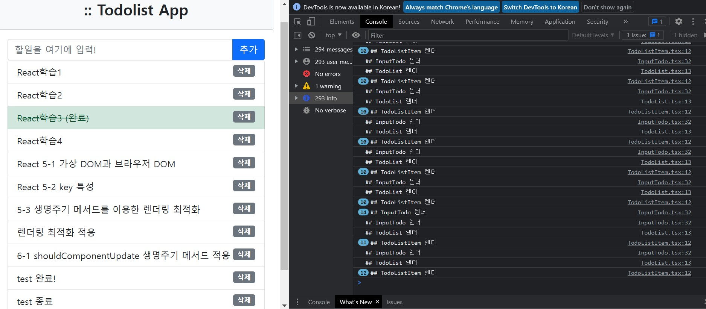
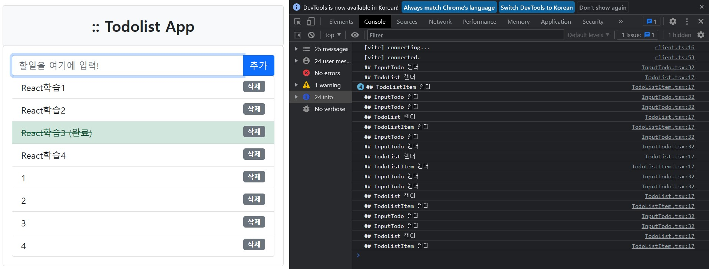
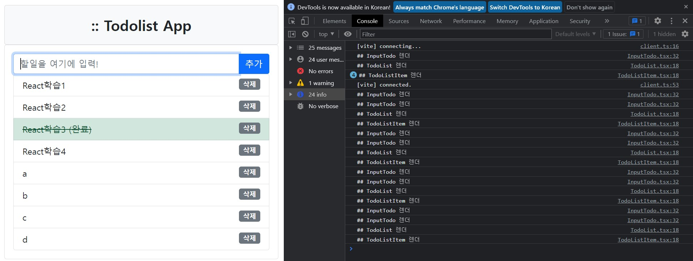

# **chapter 05**  

## 💡 `React` 

--- 
#### [리액트 클래스 컴포넌트] 

<br>

- 가상 DOM과 조정 <br>
    - 가상 DOM과 브라우저 DOM <br>
        - 가상 DOM은 브라우저 DOM의 트리 구조를 그대로 브라우저 메모리상에 구현한 DOM 트리 객체이다. <br>
        - 가상 DOM을 사용하는 이유 <br>
            - 브라우저 DOM을 조작하는 것은 느리기 때문 <br>
                - 정확하게는 자바스크립트 언어로 브라우저 DOM을 조작하는 코드를 실행하는 것은 느리지 않지만, <u>화면을 브라우저에 다시 그려내는 작업이 느리다.</u> <br>
                
                <br>

        - reflow(relayout): 렌더링할 DOM 트리를 새롭게 만들고 HTML 요소들의 위치와 크기를 계산해 배치하는 단계. <br>
        - repaint: reflow가 완료되고 나면 HTML 요소에 스타일 요소를 입히고 UI를 그려내는 repaint 단계가 실행. <br>

▶ 브라우저 DOM을 조작할 때마다 reflow, repaint 단계가 실행되면서 브라우저 리소스를 소모하고, 이로 인해 렌더링 성능이 저하되기 때문에 매번 브라우저 DOM을 조작하는 것은 바람직하지 않고, 이 문제 점을 해결하기 위해 가상 DOM을 사용한다. <br>
→ 가상 DOM을 이용하면 가상 DOM 수준에서 이전 버전과 현재 버전의 DOM 트리를 비교해서 차이가 나는 부분만을 브라우저 DOM에 업데이트하기 때문에 브라우저 DOM 수준에서 불필요한 reflow, repaint 작업을 줄일 수 있다. 이러한 과정을 `조정(reconciliaiton)`이라고 한다. <br>
```
리액트 컴포넌트의 상태나 속성이 변경되면 컴포넌트는 항상 컴포넌트 자신 전체를 렌더링 한다. 이는 개발자가 원하는 UI를 선언적으로 작성하기 때문이다. 따라서 UI 성능을 개선하려면 '가상DOM'을 사용해야 한다. 브라우저 DOM의 업데이트 기능을 가상 DOM이 처리하므로 개발자가 직접 신경 쓰지 않아도 되고, 가상 DOM을 업데이트하는 것은 `브라우저의 메모리에 작성`하는 작업이므로 브라우저 DOM을 업데이트하는 것에 비해 더 빠르다.
```

- key 특성 <br>
    - key의 특성(attribute)은 컴포넌트 내부에서 <u>반복적으로</u> `자식 컴포넌트`와 `요소`를 <b>렌더링</b>할 때 지정 <br>
        - 반복적인 리스트 항목에 일부 항목들이 추가, 삭제, 변경되는 경우, 이러한 리스트 항목의 변경을 추적하기 위해 key 특성을 사용 <br>

(4장의 todolist-app 프로젝트의 일부[TodoList] - 리스트 항목 렌더링) <br>
```javascript
let items = props.todoList.map((item) => {
    return <TodoListItem key={item.no}
            todoItem={item}
            deleteTodo={props.deleteTodo}
            toggleDone={props.toggleDone} />
});
```
→ key 특성은 배열 데이터(상태, 속성)를 이용해 반복적인 렌더링을 할 때 각 항목의 고유 키가 된다. <br>
→ key를 지정하지 않으면 배열 데이터의 어떤 값이 어느 요소에 렌더링됐는지를 추적할 방법이 없으므로 리스트 전체를 다시 렌더링해야 한다. <br>
→ 하지만 key 특성을 지정하면 배열 데이터의 어떤 값이 어느 요소에 렌더링됐는지를 key를 비교해서 추적할 수 있기에 리스트 전체를 다시 렌더링하지 않아도 되므로 조정 작업을 효율적으로 수행할 수 있다. <br>

- 생명주기 메서드를 이용한 렌더링 최적화 <br>
    - 리액트 클래스 컴포넌트에서 `shouldComponentUpdate` <b>생명주기 메서드</b>는 컴포넌트의 `render()` 메서드가 호출되기 전에 실행되는 메서드이다. <br>
    - <b>이 메서드에서 <u>리턴 값이 false이면</u> 이 메서드 이후의 생명주기 메서드를 실행하지 않으므로 `render()`, `componentDidUpdate()`메서드가 모두 실행되지 않는다.</b>
        - render() 메서드를 실행하지 않으므로 가상 DOM에 대한 다시 렌더링을 실행하지 않기 때문에, 가상 DOM의 쓰기 작업도 줄이고 브라우저 DOM의 업데이트도 최소화 할 수 있다. <br>
        - `shouldComponentUpdate()` 메서드에서 렌더링 여부를 빠르게 결정하려면 불변성을 가진 상태 변경이 필요하다.  <br>
        ```
        immer와 같은 불변성 라이브러리를 이용하면 상태 트리 끝단에서 값을 변경했을 때 끝단으로부터 최상위로 거슬러 올라가는 경로상의 객체를 모두 새로운 객체로 변경하며, 이전 버전의 객체 트리와 현재 버전의 객체 트리를 비교하는 작업은 '객체의 메모리 주소가 같은지만을 비교하면 된다. 이러한 비교를 얕은 비교(shallow compare)라고 한다.'  
        ```

- shouldComponentUpdate 생명주기 메서드 적용 <br>
    - <u>shouldComponentUpdate</u> 생명주기 메서드를 이용해 `성능 최적화` <br>


<br> ♧ 깃허브에서 프로젝트 다운로드 <br>
```
https://github.com/stepanowon/react-ts-quickstart
ch05/todolist-app-class 프로젝트 다운로드
(4장에서 작성한 todolist-app을 '클래스 컴포넌트' 기반으로 변환한 것)
cd todolist-app-class
npm install (필요한 패키지 라이브러리 다운로드)
```

◾ 05-12 : src/components/TodoList.tsx / src/components/TodoListItem.tsx / src/components/InputTodo.tsx <br>
 → 컴포넌트마다 render()메서드의 첫 줄에 console.log() 코드 추가 <br>
```javascript
// TodoList.tsx의 render() 메서드 내부에 다음 코드를 추가합니다.
console.log("## TodoList 렌더");

// TodoListItem.tsx의 render() 메서드 내부에 다음 코드를 추가합니다.
console.log("## TodoListItem 렌더");

// InputTodo.tsx의 render() 메서드 내부에 다음 코드를 추가합니다.
console.log("## InputTodo 렌더");
```

```javascript

·····

export default class TodoList extends Component<Props> {
  render() {
    console.log("## TodoList 렌더");
    ·····
  }
}
```

```javascript

·····

export default class TodoListItem extends Component<Props> {
  render() {
    console.log("## TodoListItem 렌더");
    ·····
  }
}
```

```javascript

·····

export default class InputTodo extends Component<Props, State> {
  state = {
    todo: "",
  };

  ·····

  render() {
    console.log("## InputTodo 렌더");
    ·····
  }
}
```

◾ 05-13 : src/main.tsx 변경 → &lt;React.StrictMode&gt;&lt;/React.StrictMode&gt;를 렌더링하지 않도록 변경 <br>

- `StrictMode`는 애플리케이션 내부에 포함된 '문제점'을 파악하기 위해 사용하는 도구로, <u>'컴포넌트 트리'에 대한 추가적인 검사</u>를 수행하기 때문에 render()가 한 번 더 호출 된다. <br>
```javascript
import React from "react";
import ReactDOM from "react-dom/client";
import AppContainer from "./AppContainer";
import "bootstrap/dist/css/bootstrap.css";
import "./index.css";

ReactDOM.createRoot(document.getElementById("root")!).render(<AppContainer />);
```

 <br>
▶ 할 일 아이템을 추가할 때마다 TodoListItem 컴포넌트 모두가 다시 렌더링되는 것을 확인 <br>
- 모든 TodoListItem이 매번 다시 렌더링 되는 이유? <br>
    - <b>기본적으로 부모 컴포넌트의 상태가 변경되어 다시 렌더링되면 모든 자식 컴포넌트도 함께 랜더링 된다.</b> <br>
        - TodoListItem의 개수가 많아지면 추가된 아이템 이외의 다른 TodoListItem은 변경된 것이 없어도 다시 렌더링되기 때문에 렌더링이 느려진다. <br>
        - render()는 가상 DOM에 쓰는 것이지만 이 또한 반복적으로 수행되면 성능에 나쁜 영향이 끼친다. <br>

◾ 05-14 : src/components/TodoList.tsx 변경 → shouldComponentUpdate() 생명주기 메서드를 이용해 최적화 <br>
```javascript

·····

export default class TodoList extends Component<Props> {
  shouldComponentUpdate(nextProps: Props, nextState: {}) {
    if (nextProps.todoList !== this.props.todoList) return true;
    return false;
  }

  render() {
    ·····
  }
}

```

◾ 05-15 : src/components/TodoListItem.tsx 변경 → shouldComponentUpdate() 생명주기 메서드를 이용해 최적화 <br>
```javascript

·····

export default class TodoListItem extends Component<Props> {
  shouldComponentUpdate(nextProps: Props, nextState: {}) {
    if (nextProps.todoItem !== this.props.todoItem) return true;
    return false;
  }

  render() {
    ·····
  }
}

```
 <br>
기존 TodoListItem은 다시 렌더링되지 않고(제일 처음에만 렌더링④), 추가된 TodoListItem만 렌더링되는 것을 확인 <br>

- PureComponent 적용 <br>
기존 클래스 컴포넌트는 'Component'를 상속받아 작성했지만, `PureComponent`를 상속받을 수 있다. <br>
  - `PureComponent`는 shouldComponentUpdate 생명주기 메서드가 상태와 속성을 '얕은 비교'를 하도록 이미 구현된 클래스 <br>

◾ 05-16 : src/components/TodoList.tsx 변경 → PureComponent 상속(shouldComponentUpdate 메서드 주석 처리) <br>
```javascript
// import React, { Component } from "react";
import { TodoListItemType } from "../AppContainer";
import TodoListItem from "./TodoListItem";
import { PureComponent } from 'react';

type Props = {
  todoList: Array<TodoListItemType>;
  toggleDone: Function;
  deleteTodo: Function;
};

export default class TodoList extends PureComponent<Props> {
  // shouldComponentUpdate(nextProps: Props, nextState: {}) {
  //   if (nextProps.todoList !== this.props.todoList) return true;
  //   return false;
  // }
  render() {
    console.log("## TodoList 렌더");
    let items = this.props.todoList.map((item: TodoListItemType) => {
      return <TodoListItem key={item.no} todoItem={item} deleteTodo={this.props.deleteTodo} toggleDone={this.props.toggleDone} />;
    });

    return (
      <div className="row">
        {" "}
        <div className="col">
          <ul className="list-group">{items}</ul>
        </div>
      </div>
    );
  }
}
```

◾ 05-17 : src/components/TodoListItem.tsx 변경 → PureComponent 상속(shouldComponentUpdate 메서드 주석 처리) <br>
```javascript
// import React, { Component } from "react";
import { TodoListItemType } from "../AppContainer";
import { PureComponent } from 'react';

type Props = {
  todoItem: TodoListItemType;
  deleteTodo: Function;
  toggleDone: Function;
};

export default class TodoListItem extends PureComponent<Props> {
  // shouldComponentUpdate(nextProps: Props, nextState: {}) {
  //   if (nextProps.todoItem !== this.props.todoItem) return true;
  //   return false;
  // }

  render() {
    console.log("## TodoListItem 렌더");
    let itemClassName = "list-group-item";
    if (this.props.todoItem.done) itemClassName += " list-group-item-success";
    return (
      <li className={itemClassName}>
        <span
          className={this.props.todoItem.done ? "todo-done pointer" : "pointer"}
          onClick={() => this.props.toggleDone(this.props.todoItem.no)}
        >
          {this.props.todoItem.todo}
          {this.props.todoItem.done ? " (완료)" : ""}
        </span>
        <span className="float-end badge bg-secondary pointer" onClick={() => this.props.deleteTodo(this.props.todoItem.no)}>
          삭제
        </span>
      </li>
    );
  }
}
```
 <br>
실행 결과는 기존과 동일하다. <br>

```
# 클래스 컴포넌트는 다양한 생명주기 메서드를 사용

# 생명주기 메서드의 쓰임
 - 컴포넌트가 마운트될 때
 - 컴포넌트의 상태나 속성이 업데이트될 때
 - 컴포넌트가 언마운트될 떄

# 컴포넌트 내부에서 에러가 발생했을 때는 componentDidCatch 생명주기 메서드를 이용해 에러 처리

# 컴포넌트가 마운트될 때와 언마운트될 때는 외부 리소스를 연결하고 해제하는 코드를 반드시 작성
 - 그렇지 않으면 메모리 누수나 내부 에러가 발생할 수 있다.

# shouldComponentUpdate 생명주기 메서드와 PureComponent를 활용하고 불변성을 가지는 상태 변경을 수행하면 렌더링 성능을 최적화 할 수 있다.
```