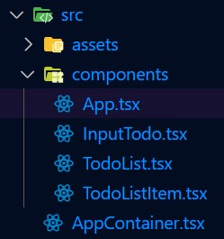
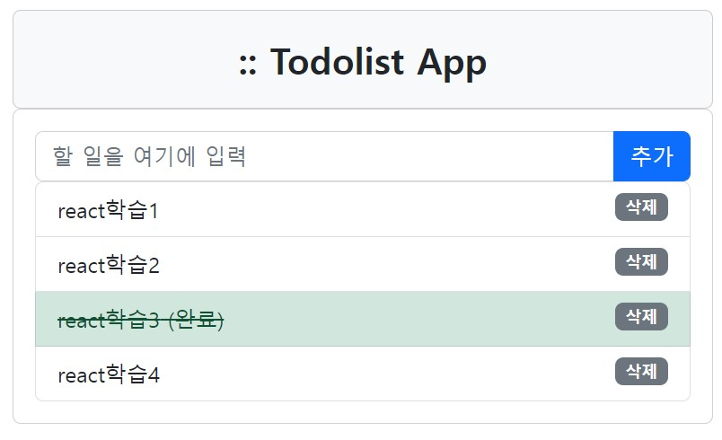
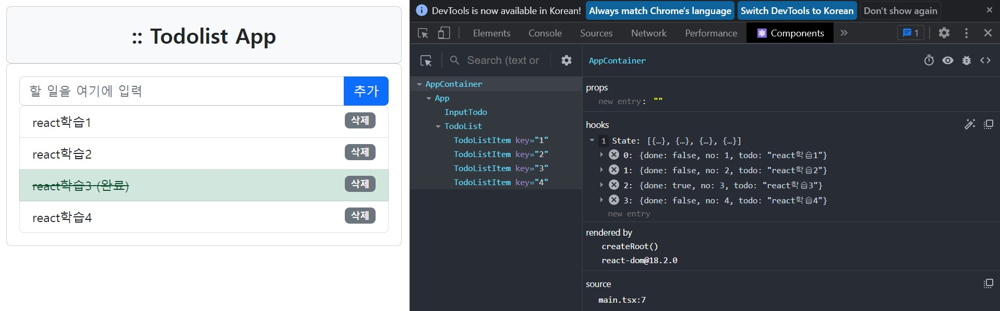
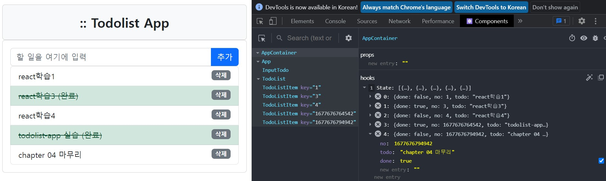

# **chapter 04**  

## 💡 `React` 

--- 
#### [리액트 컴포넌트]
- ### 컨테이너 컴포넌트와 표현 컴포넌트 <br>
- 컨테이너 컴포넌트(container component) <br>
`컨테이너 컴포넌트`는 상태와 상태 변경, 비즈니스 로직을 처리하는 연산 기능이 있으며 <br>
UI와 스타일 정보는 포함하지 않고 단순히 '자식 컴포넌트를 조합'하도록 작성. <br>
- 표현 컴포넌트(presentational component) <br>
`표현 컴포넌트`는 부모 컴포넌트로부터 속성(props)을 전달 받아 UI를 렌더링하는 기능을 수행.<br>
연산과 로직으로부터 UI를 분리해서 작성하므로 재사용성이 높다.<br>
  - 표현 컴포넌트는 자신의 상태를 가지지 않지만 '수명 주기 관리가 필요하지 않은 상태'라면 표현 컴포넌트 내부에 상태를 가질 수도 있다.

> `컨테이너 컴포넌트`에서의 상태 변경만을 추적하면 그 하위 컴포넌트의 UI가 어떻게 바뀔지를 <u>예측</u>할 수 있다. → 상태 변경 추적이 용이해지고 그에 따라 디버깅도 좀 더 쉽게 할 수 있다. <br>

> 상태를 변경하는 함수와 메서드는 상태를 보유한 컴포넌트에서 작성되어야 한다. <br>

> '자식 컴포넌트'에 상태와 함께 상태를 변경하는 함수도 속성으로 전달해야 한다. <br>
> '자식 컴포넌트'에서 이벤트가 발생하면 속성을 통해 전달받은 함수를 호출하여 컨테이너 컴포넌트의 상태를 변경 <br>
> ▷ 이러한 함수와 메서드를 콜백 함수(메서드)라고 한다. <br>

⊙ 부모-자식 컴포넌트 사이의 정보 전달 방법 <br>
- 부모에서 자식으로의 정보 전달 방법 <br>
  - 속성(props)을 이용해 정보를 전달 <br>
- 자식에서 부모로의 정보 전달 방법 <br>
  - 속성을 이용해 부모 컴포넌트의 함수(메서드)를 자식 컴포넌트로 전달하고, 자식 컴포넌트에서 이벤트가 발생하면 해당 함수를 호출 <br>

⊙ 컴포넌트 분할 <br>
- 컴포넌트의 재사용성 고려 <br>
  - 컴포넌트의 입자가 크면(한 컴포넌트가 많은 기능을 처리하면) 재사용성이 떨어질 수 있다. <br>
  - 반대로 컴포넌트를 너무 잘게 분할하면 컴포넌트 사이의 정보 전달 구조가 복잡해지고 컴포넌트의 개수가 많아져서 관리가 힘들어진다. <br>
- 컴포넌트 내부의 기능이 너무 복잡하지 않도록 분할 <br>
  - 컴포넌트의 입자가 크면 컴포넌트 단위로 디버깅하거나 테스트하기 어려워진다. <br>
  (하나의 컴포넌트가 3 ~ 4개 이상의 기능을 처리하지 않도록 분할) <br>
- 컴포넌트 렌더링 최적화를 고려 <br>
  - **컴포넌트 단위로 렌더링 여부를 결정한다.** <br>
    - 렌더링 최적화를 위해 상태를 변경하는 단위로 컴포넌트를 분할 <br>

<br>
&lt;애플리케이션 실습&gt; <br>
▷ CRUD(create-read-update-delete) <br>

<br>

★ 상태 데이터 <br>
```javascript
// TodoList App의 데이터
// → 할일 목록 데이터: todoList
  {}
[
  { no: 1, todo: "React학습1", done: false },
  { no: 2, todo: "React학습2", done: false },
  { no: 3, todo: "React학습3", done: true },
  { no: 4, todo: "React학습4", done: false }
]
```


★ 액션 도출 <br><br>
▣ addTodo(todo: string) => void <br>
- 할 일 아이템을 추가하는 기능. addTodo(todo) 형태로 todo 한 건을 인자로 전달받으면 todoList 상태에 추가. <br>

▣ deleteTodo(no: number) => void <br>
- no 값을 이용해 할 일 아이템을 찾아서 삭제 <br>

▣ toggleDone(no: number) => void <br>
- no 값을 이용해 할 일 아이템을 찾아서 done 값을 토글한다. <br>

<br>

★ 컴포넌트 목록 작성 <br>
 
▣ AppContainer 컴포넌트 <br>
- 상태: todoList <br>
- 메서드: addTodo, deleteTodo, toggleDone <br>

▣ App 컴포넌트 <br>
 - 속성: todoList, addTodo, deleteTodo, toggleDone <br>
 - 기능: InputTodo 컴포넌트와 TodoList 컴포넌트로 속성을 전달 <br>

▣ InputTodo 컴포넌트 <br>
- 속성: addTodo <br>
- 상태: todo(사용자의 입력값을 받아내기 위한 상태) <br>
- 기능: 사용자가 입력한 값을 todo 상태에 반영하고, 사용자가 추가 버튼을 클릭하면 속성으로 전달받은 addTodo 함수를 호출 <br>

▣ TodoList 컴포넌트 <br>
- 속성: todoList, deleteTodo, toggleDone <br>
- 기능: 전달받은 todoList 속성을 이용해 TodoListItem 컴포넌트를 반복적으로 렌더링하면서 속성으로 todoList의 각 항목(todoItem)과 deleteTodo, toggleDone 메서드를 전달 <br>

▣ TodoListItem 컴포넌트 <br>
- 속성: todoItem, deleteTodo, toggleDone <br>
- 기능: todoItem 속성으로 전달받은 할 일 한 건을 이용해 렌더링, 삭제 버튼을 클릭했을 때 deleteTodo 속성으로 전달받은 함수를 호출, 할 일 항목을 클릭하면 속성으로 전달받은 toggleDone함수를 호출<br>

<br> ♧ 새로운 프로젝트 생성 <br>
```javascript
cd ..
npm init vite todolist-app -- --template react-ts
cd todolist-app
npm install
// npm install immer bootstrap@5.x.x → 특정 버전 선택해서 설치
npm install immer bootstrap → 이렇게만 해서 설치해도 된다.(최신 버전)
```
＃  src/App.tsx와 src/App.css 파일 삭제 <br>
＃＃  src/AppContainer.tsx 생성 <br>
＃＃  src 폴더 하위로 components 디렉터리 생성 <br>
＃＃＃  src/components/App.tsx 생성 <br>
＃＃＃  src/components/InputTodo.tsx 생성 <br>
＃＃＃  src/components/TodoList.tsx 생성 <br>
＃＃＃  src/components/TodoListItem.tsx 생성 <br>

 <br>

◾ 04-27 : src/AppContainer.tsx → 상태 정의, 메서드(상태 변경 메서드) 정의, 상태를 변경할 때 immer를 통한 불변성 사용 <br>

```javascript
import produce from 'immer'
import { useState } from 'react'
import App from './components/App'

export type TodoListItemType = {
    no: number;
    todo: string;
    done: boolean;
};

const AppContainer = () => {
    const [todoList, setTodoList] = useState<Array<TodoListItemType>>([
        { no: 1, todo: "react학습1", done: false },
        { no: 2, todo: "react학습2", done: false },
        { no: 3, todo: "react학습3", done: true },
        { no: 4, todo: "react학습4", done: false }
    ]);

    const addTodo = (todo: string) => {
        let newTodoList = produce(todoList, (draft) => {
            draft.push({ no: new Date().getTime(), todo: todo, done: false });
        });
        setTodoList(newTodoList);
    };

    const deleteTodo = (no: number) => {
        let index = todoList.findIndex((todo) => todo.no === no);
        let newTodoList = produce(todoList, (draft) => {
            draft.splice(index, 1);
        });
        setTodoList(newTodoList);
    };

    const toggleDone = (no: number) => {
        let index = todoList.findIndex((todo) => todo.no === no);
        let newTodoList = produce(todoList, (draft) => {
            draft[index].done = !draft[index].done;
        });
        setTodoList(newTodoList);
    };

    return <App todoList={todoList}
                addTodo={addTodo}
                deleteTodo={deleteTodo}
                toggleDone={toggleDone} />
};

export default AppContainer;
```

◾ 04-28 : src/components/App.tsx → AppContainer의 Type import 및 속성 타입 정의, InputTodo, TodoList 컴포넌트 정보를 속성으로 전달 <br>
(error: InputTodo, TodoList 컴포넌트를 작성하지 않으면서 에러 발생 → 추후 작성 예정으로 무시할 것) <br>
```javascript
import React from 'react'
import { TodoListItemType } from '../AppContainer'
import InputTodo from './InputTodo'
import TodoList from './TodoList'

type AppProps = {
    todoList: Array<TodoListItemType>;
    addTodo: (todo: string) => void;
    toggleDone: (no: number) => void;
    deleteTodo: (no: number) => void;
};

const App = (props: AppProps) => {
    return (
        <div className="container">
            <div className="card card-body bg-light">
                <div className="title">:: Todolist App</div>
            </div>
            <div className="card card-default card-borderless">
                <div className="card-body">
                    
                    {/* 속성을 이용해 함수(메서드)를 전달 */}
                    <InputTodo addTodo={props.addTodo} />
                    <TodoList todoList={props.todoList}
                            toggleDone={props.toggleDone}
                            deleteTodo={props.deleteTodo} />
                </div>
            </div>
        </div>
    );
};

export default App;
```

◾ 04-29 : src/components/InputTodo.tsx → 속성으로 addTodo 메서드 전달 받아 속성의 타입 정의, 사용자의 입력 값을 받아내기 위해 자체적인 todo 상태 보유(제어 컴포넌트 구조 구현) <br>
```javascript
import React, { useState } from 'react'

type InputTodoProps = {
    addTodo: (todo: string) => void;
};

const InputTodo = (props: InputTodoProps) => {
    const [todo, setTodo] = useState<string>("");

    const addHandler = () => {
        props.addTodo(todo);
        setTodo("");
    };

    const enterInput = (e: React.KeyboardEvent) => {
        if (e.key === "Enter") {
            addHandler();
        };
    };

    const changeTodo = (e: React.ChangeEvent<HTMLInputElement>) => {
        setTodo(e.target.value);
    };

    return (
        <div className="row">
            <div className="col">
                <div className="input-group">
                    <input id="msg" type="text" className="form-control" name="msg"
                        placeholder="할 일을 여기에 입력" value={todo}
                        onChange={changeTodo} onKeyUp={enterInput} />
                    <span className="btn btn-primary input-group-addon" onClick={addHandler}>추가</span>
                </div>
            </div>
        </div>
    );
};

export default InputTodo;
```

◾ 04-30 : src/components/TodoList.tsx → 속성으로 전달 받은 todoList 배열 데이터를 이용해 TodoListItem 컴포넌트를 반복 렌더링 <br>
속성으로 전달받은 deleteTodo, toggleDone 메서드를 다시 TodoListItem 컴포넌트로 전달 <br>
``` javascript
import React, { useState } from 'react'
import { TodoListItemType } from '../AppContainer'
import TodoListItem from './TodoListItem'

type TodoListProps = {
    todoList: Array<TodoListItemType>;
    toggleDone: (no: number) => void;
    deleteTodo: (no: number) => void;
};

const TodoList = (props: TodoListProps) => {
    let items = props.todoList.map((item) => {
        return <TodoListItem key={item.no} todoItem={item}
                deleteTodo={props.deleteTodo} toggleDone={props.toggleDone} />
    });

    return (
        <div className="row">
            {" "}
            <div className="col">
                <ul className="list-group">{items}</ul>
            </div>
        </div>
    );
};

export default TodoList;
```

◾ 04-31 : src/components/TodoListItem.tsx → todoList의 아이템 한 건(todoItem)을 속성으로 전달받아 렌더링. <br>
삭제 버튼, todo 항목 클릭 시 이벤트 발생하면 속성으로 전달 받은 deleteTodo, toggleDone 메서드 호출 <br>
``` javascript
import React from 'react'
import { TodoListItemType } from '../AppContainer'

type TodoListItemProps = {
    todoItem: TodoListItemType;
    toggleDone: (no: number) => void;
    deleteTodo: (no: number) => void;
};

const TodoListItem = (props: TodoListItemProps) => {
    let itemClassName = "list-group-item";
    if (props.todoItem.done) itemClassName += " list-group-item-success";

    return (
        <li className={itemClassName}>
            <span className={props.todoItem.done ? "todo-done pointer" : "pointer"}
                onClick={() => props.toggleDone(props.todoItem.no)}>
                {props.todoItem.todo}
                {props.todoItem.done ? " (완료)" : ""}
            </span>
            <span className="float-end badge bg-secondary pointer"
                onClick={() => props.deleteTodo(props.todoItem.no)}>삭제</span>
        </li>
    );
};

export default TodoListItem;
```

◾ 04-32 : src/index.css → 기본 스타일 지정 <br>
```css
body {
  margin: 0;
  padding: 0;
  font-family: sans-serif;
}

.container {
  padding: 10px;
}

.title {
  text-align: center;
  font-weight: bold;
  font-size: 20pt;
}

.todo-done {
  text-decoration: line-through;
}

.pointer {
  cursor: pointer;
}

.paner-borderless {
  border: 0;
  box-shadow: none;
}
```

◾ 04-33 : src/main.tsx → AppContainer Import <br>
```javascript
import React from 'react'
import ReactDOM from 'react-dom/client'
import AppContainer from './AppContainer'
import 'bootstrap/dist/css/bootstrap.css'
import './index.css'

ReactDOM.createRoot(document.getElementById('root') as HTMLElement).render(
  <React.StrictMode>
    <AppContainer />
  </React.StrictMode>,
);

```

 <br>
 <br>
 <br>