# **chapter 07**  

## 💡 `React` 

--- 
#### [고차 함수와 렌더링 최적화] 

<br>

- React.memo 고차 함수 <br>
    - React.memo는 리액트 라이브러리로 기본 제공되는 고차 함수이며, 컴포넌트가 동일한 상태나 속성을 가지고 있다면 '얕은 비교'를 수행하도록 하여 불필요한 렌더링을 방지한다. <br>
    - PureComponent와 유사하다고 할 수 있다. <br>
    - 반드시 기억할 것은 PureComponent와 마찬가지로 **`React.memo` 고차 함수도 불변성을 가진 상태의 변경이 필수적**이다. <br>

```javascript
const Child = (...) => {
    ·····
}
export default React.memo(Child);

// ────────── 또는 ──────────

const Child = React.memo( (...) => {
    ·····
})
export default Child;
```

- React.memo를 이용한 렌더링 성능 최적화 <br>
최적화 이전의 todolist-app <br>
    

<br> ♧ 새로운 프로젝트 생성 <br>
```
cd ..
npm init vite todolist-app2 -- --template react-ts
cd todolist-app2
npm install
```

♤ src/TodoList.tsx 추가 <br>
♤ src/TodoListItem.tsx 추가 <br>
♤ /App 컴포넌트 작성 - todoList와 todo 상태를 초기화 / 할 일을 추가하는 상태 변경 메서드(addTodo) 작성 / todoList 상태를 TodoList에서 TodoListItem 컴포넌트로 차례로 전달하여 출력 <br>


◾ 07-05 : src/App.tsx → todoList, todo, addTodo 작성과 props 전달 <br>

```javascript
import React, { useState } from 'react'
import TodoList from './TodoList'

export type TodoListItemType = {id: number; todo: string };

const App = () => {
  const [todoList, setTodoList] = useState<Array<TodoListItemType>>([]);
  const [todo, setTodo] = useState<string>("");

  const addTodo = (todo: string) => {
    let newTodoList = [...todoList, { id: new Date().getTime(), todo: todo }];
    setTodoList(newTodoList);
    setTodo("");
  };

  return (
    <div className="boxStyle">
      <input type="text" value={todo} onChange={(e) => setTodo(e.target.value)} />
      <button onClick={() => addTodo(todo)}>Add Todo</button>
      <br />
      <TodoList todoList={todoList} />
      <div>todo 개수 : {todoList.length}</div>
    </div>
  );
};

export default App;
```

◾ 07-06 : src/TodoList.tsx → 컴포넌트 렌더링 여부 체크 <br>

```javascript
import React from 'react'
import { TodoListItemType } from './App'
import TodoListItem from './TodoListItem'

type Props = {
    todoList: Array<TodoListItemType>;
};

const TodoList = (props: Props) => {
    console.log("## TodoList");

    return (
        <ul>
            {props.todoList.map((item) => (
                <TodoListItem key={item.id} todoListItem={item} />
            ))}
        </ul>
    );
};

export default TodoList;
```


◾ 07-07 : src/TodoListItem.tsx → 컴포넌트 렌더링 여부 체크 <br>

```javascript
import React from 'react'
import { TodoListItemType } from './App'

type Props = {
    todoListItem: TodoListItemType;
};

const TodoListItem = (props: Props) => {
    console.log("## TodoListItem");
    return <li>{props.todoListItem.todo}</li>
};

export default TodoListItem;
```

```javascript
// 콘솔에 로그가 두 번씩 출력되는 것을 막기 위해 src/main.tsx에서 <React.StrictMode></React.StrictMode>를 제거(주석)
import React from 'react'
import ReactDOM from 'react-dom/client'
import App from './App'
// import './index.css'

ReactDOM.createRoot(document.getElementById('root') as HTMLElement).render(
  // <React.StrictMode>
    <App />
  // </React.StrictMode>,
)
```

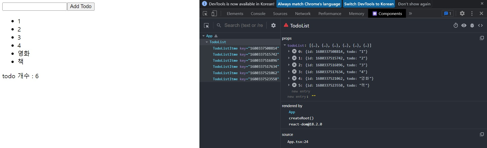 <br>
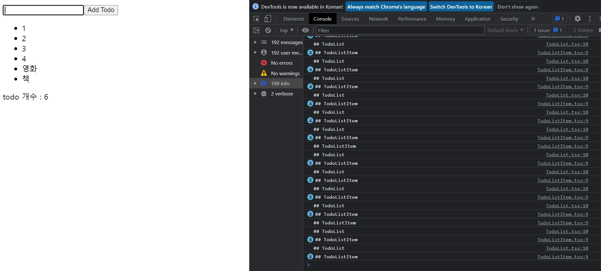 <br>
▶ 입력 필드에 입력할 때마다 그리고 todo 추가할 때마다 TodoList, TodoListItem(todoListItem 개수(todoList.length)만큼)이 재 렌더링 (콘솔 출력)되는 것을 확인 <br>
▶▶ todoList 상태에는 변화가 없음에도 App 컴포넌트의 todo 상태가 바뀌기 때문에 App 컴포넌트가 렌더링되면서 자식 컴포넌트인 TodoList, TodoListItem 컴포넌트 모두를 렌더링 하는 것이다. <br>

- React.memo를 이용한 렌더링 성능 최적화 <br>
React.memo 고차 함수 적용 <br>

두 컴포넌트의 마직 행을 다음과 같이 변경 <br>
```javascript
// TodoListItem 컴포넌트의 마지막 행을 다음과 같이 변경
export default React.memo(TodoListItem);

// TodoList 컴포넌트의 마지막 행을 다음과 같이 변경
export default React.memo(TodoList);
```

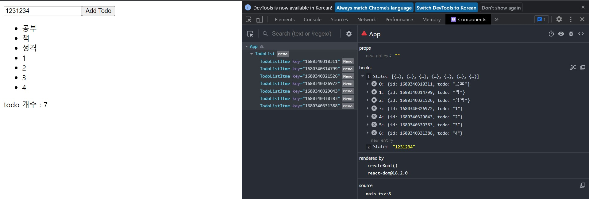 <br>
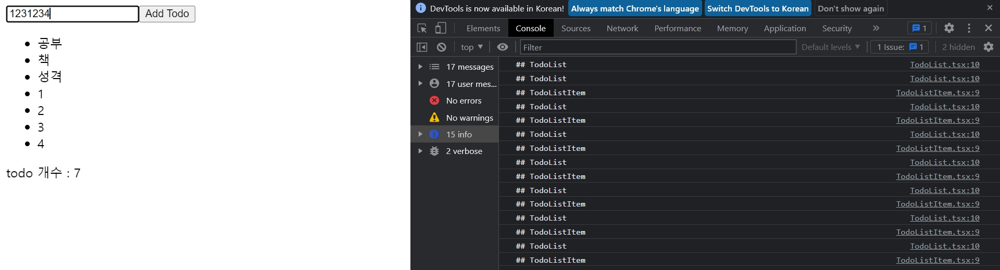 <br>
▶ 할 일 아이템을 타이핑하는 동안 컴포넌트 트리 전체가 다시 렌더링되지 않고, TodoListItem이 여러 개 있더라도 새롭게 추가한 아이템만 렌더링한다. <br>

- 속성으로 함수를 전달하는 경우 <br>
♤ src/App.tsx 컴포넌트에 deleteTodo 함수를 추가하고 TodoList 컴포넌트로 전달하도록 변경 <br>

◾ 07-08 : src/App.tsx 변경 → deleteTodo 함수 추가 및 TodoList 컴포넌트로 전달 <br>

```javascript
·····

const App = () => {
  
  ·····

  const deleteTodo = (id: number) => {
    let newTodoList = [...todoList];
    const index = todoList.findIndex((item) => item.id === id);
    newTodoList.splice(index, 1);
    setTodoList(newTodoList);
  };

  return (
    <div className="boxStyle">
      <input type="text" value={todo} onChange={(e) => setTodo(e.target.value)} />
      <button onClick={() => addTodo(todo)}>Add Todo</button>
      <br />
      <TodoList todoList={todoList} />
      <div>todo 개수 : {todoList.length}</div>
    </div>
  );
};

export default App;
```

◾ 07-09 : src/TodoList.tsx 변경 → deleteTodo 속성 타입 지정 및 TodoListItem 컴포넌트로 전달 <br>

```javascript
import React from 'react'
import { TodoListItemType } from './App'
import TodoListItem from './TodoListItem'

type Props = {
    todoList: Array<TodoListItemType>;
    deleteTodo: (id: number) => void; 
};

const TodoList = (props: Props) => {
    console.log("## TodoList");

    return (
        <ul>
            {props.todoList.map((item) => (
                <TodoListItem key={item.id} todoListItem={item} deleteTodo={props.deleteTodo} />
            ))}
        </ul>
    );
};

export default React.memo(TodoList);
```

◾ 07-10 : src/TodoListItem.tsx 변경 → 속성으로 전달받은 deleteTodo 호출 <br>

```javascript
import React from 'react'
import { TodoListItemType } from './App'

type Props = {
    todoListItem: TodoListItemType;
    deleteTodo: (id: number) => void;
};

const TodoListItem = (props: Props) => {
    console.log("## TodoListItem");
    return (
        <li>
            <span>{props.todoListItem.todo}</span>&nbsp;&nbsp;&nbsp;
            <span style={{ cursor: "pointer", color: "blue" }}
                onClick={() => props.deleteTodo(props.todoListItem.id)}>
                삭제
            </span>
        </li>
    );
};

export default React.memo(TodoListItem);
```

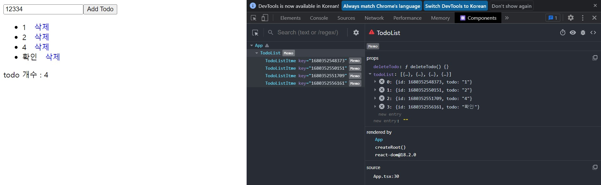 <br>
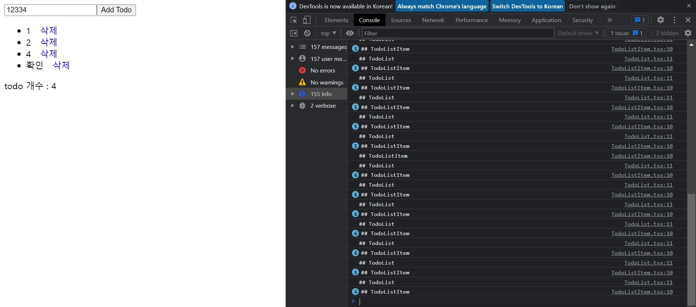 <br>
▶ React.memo 고차 함수를 적용했어도 props로 속성을 전달하면서 계속해서 렌더링 되는 것을 확인 <br>
```
1. 할 일 아이템을 입력 필드에 타이핑한다.
2. App 컴포넌트의 todo 상태가 변경된다.
3. App 컴포넌트가 렌더링되면서 deleteTodo 함수가 새롭게 생성된다.
4. 새롭게 생성된 deleteTodo 함수가 TodoList, TodoListItem 컴포넌트로 속성을 통해서 전달된다.
5. TodoList, TodoListItem 컴포넌트의 기존 deleteTodo 함수와 얕은 비교 결과가 false이므로 매번 렌더링한다.
```

```
⊙ 최적화 하는 방법

→ React.memo 고차 함수와 useCallback 훅을 함께 적용한다.
→ React.memo 고차 함수의 두 번째 인자를 사용한다.
```

1. useCallback 훅 적용 <br>
useCallback 훅을 적용하면 렌더링할 때마다 함수가 매번 생성되는 것을 막을 수 있다. 이때 주의할 점은 '의존 객체(배열)'를 정확하게 지정해야 한다. <br>

◾ 07-11 : src/App.tsx 변경 → addTodo, deleteTodo 함수에 useCallback 적용 <br>

```javascript
·····

const App = () => {
  ·····

  const addTodo = useCallback((todo: string) => {
    let newTodoList = [...todoList, { id: new Date().getTime(), todo: todo }];
    setTodoList(newTodoList);
    setTodo("");
  }, [ todoList ]);

  const deleteTodo = useCallback((id: number) => {
    let newTodoList = [...todoList];
    const index = todoList.findIndex((item) => item.id === id);
    newTodoList.splice(index, 1);
    setTodoList(newTodoList);
  }, [ todoList ]);

    ·····
};

export default App;
```

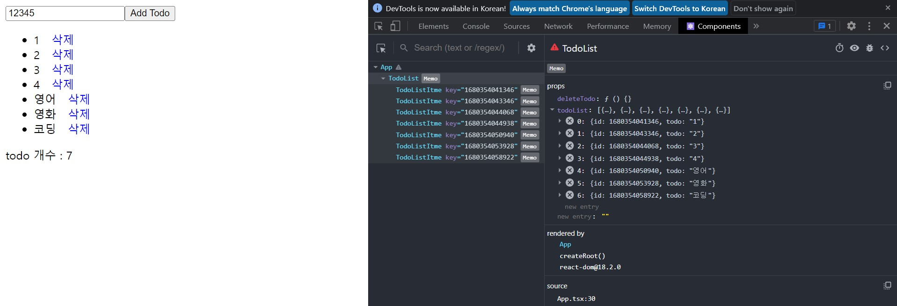 <br>
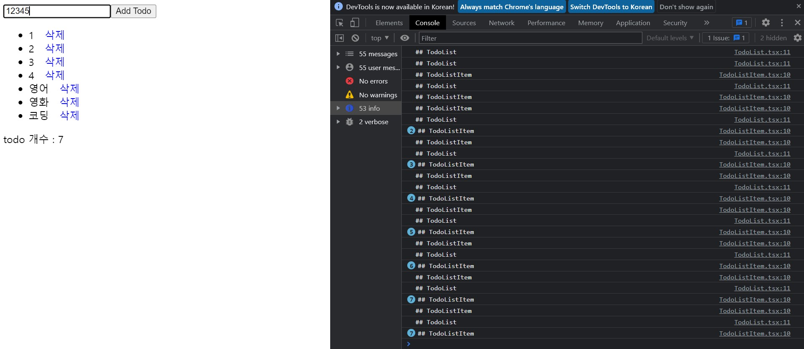 <br>
▶ 입력 필드에 타이핑하는 동안에 전체 컴포넌트 트리가 다시 렌더링 하지 않는다. 다만, 할 일을 추가할 때마다 모든 TodoListItem 컴포넌트들이 다시 렌더링된다. <br>
→ useCallback의 의존 객체(배열)는 todoList가 변경되면 deleteTodo 함수를 다시 만들기 때문에 렌더링이 일어나고, TodoList 컴포넌트와 TodoListItem 컴포넌트에서 속성으로 전달 받은 deleteTodo 함수를 이전 속성과 얕은 비교를 수행하면 false이므로 두 컴포넌트 모두 다시 렌더링된다. <br>

2. React.memo의 두 번째 인자 적용 <br>
React.memo의 두 번째 인자로 렌더링 여부를 지정하기 위한 함수를 전달할 수 있다. 이 함수는 클래스 컴포넌트 생명주기 메서드 중에서 shouldComponentUpdate()와 유사하다. <br>

```javascript
// 두 번째 인자로 전달한 함수의 리턴값이 true면 렌더링하지 않는다.
// prevProps : 이전의 속성
// nextProps : 새롭게 전달된 속성
React.memo(컴포넌트, (prevProps, nextProps) => {

})
```

◾ 07-12 : src/TodoListItem.tsx 변경 → React.memo의 두 번째 인자 함수를 TodoListItem 컴포넌트에 적용 <br>
→ 속성으로 전달된 todoListItem 속성이 동일하다면 true를 리턴하도록 얕은 비교를 수행 <br>

```javascript
·····

const TodoListItem = (props: Props) => {
    ·····

export default React.memo(TodoListItem, (prevProps, nextProps) => {
    return prevProps.todoListItem === nextProps.todoListItem;
});
```

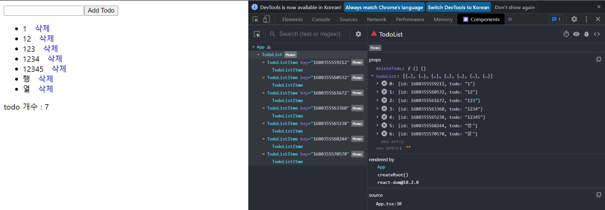 <br>
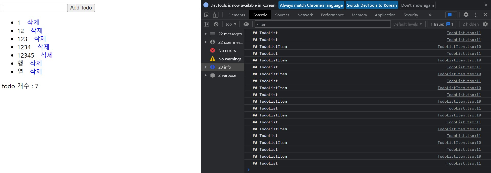 <br>
▶ 입력 필드에 타이핑을 해도 다시 렌더링하지 않고, 컴포넌트 트리 전체가 다시 렌더링되지 않으며 추가된 할 일 아이템만 렌더링된다. <br>

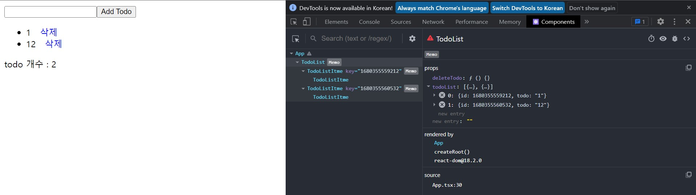 <br>
▶ 다만, 삭제를 하려는 경우, 삭제를 하려는 (ex: 123) 아이템을 포함하여 그 이후에 추가된 아이템 모두가 삭제되는 문제점이 발생 <br>
▶▶ 각각의 TodoListItem 컴포넌트에 전달된 deleteTodo 함수는 useCallback에 의해서 의존하는 todoList 객체를 참조하고 있는데, 이 deleteTodo 함수가 React.memo 고차 함수에 의해 메모이징되고 있기 때문이다. <br>
cf) 123의 삭제 참조 → 메모이징된 deleteTodo가 참조하는 todoList는 1, 12, 123이다. <br>
★ 따라서 React.memo 고차 함수의 두 번째 인자에 함수를 전달하는 것은 주의가 필요하다.(일반적인 경우라면 useCallback 훅을 적용한 것만으로도 충분하다.) <br>

- 추가적인 컴포넌트의 분할 <br>
위와 같은 문제를 해결하기 위해 컴포넌트를 적절히 분할하는 방법을 활용 <br>
    - 하나의 컴포넌트 영역을 분할 <br>
        - 자주 바뀌는 속성을 전달받은 영역 <br>
        - 그렇지 않은 영역 <br>

◾ 07-13 : src/TodoListItemBody.tsx → TodoListItem 컴포넌트 분리 ① <br>

```javascript
import React from 'react'
import { TodoListItemType } from './App'

type Props = {
    todoListItem: TodoListItemType;
};

const TodoListItemBody = (props: Props) => {
    console.log("## TodoListItemBody");
    return <span>{props.todoListItem.todo}</span>
};

export default React.memo(TodoListItemBody);
```

◾ 07-14 : src/TodoListItemDeleteButton.tsx → TodoListItem 컴포넌트 분리 ② <br>

```javascript
import React from 'react'

type Props = {
    id: number;
    deleteTodo: (id: number) => void;
};

const TodoListItemDeleteButton = (props: Props) => {
    console.log("## TodoListItemDeleteButton");
    return (
        <span style={{ cursor: "pointer", color: "blue" }}
            onClick={() => props.deleteTodo(props.id)}>
            삭제
        </span>
    );
};

export default React.memo(TodoListItemDeleteButton);
```

◾ 07-15 : src/TodoListItem.tsx 변경 → TodoListItemBody, TodoListItemDeleteButton 임포트 <br>

```javascript
import React from 'react'
import { TodoListItemType } from './App'
import TodoListItemBody from './TodoListItemBody'
import TodoListItemDeleteButton from './TodoListItemDeleteButton'

type Props = {
    todoListItem: TodoListItemType;
    deleteTodo: (id: number) => void;
};

const TodoListItem = (props: Props) => {
    console.log("## TodoListItem");
    return (
        <li>
            <TodoListItemBody todoListItem={props.todoListItem} />
            &nbsp;&nbsp;&nbsp;
            <TodoListItemDeleteButton deleteTodo={props.deleteTodo} id={props.todoListItem.id} />
        </li>
    );
};

export default React.memo(TodoListItem);
```

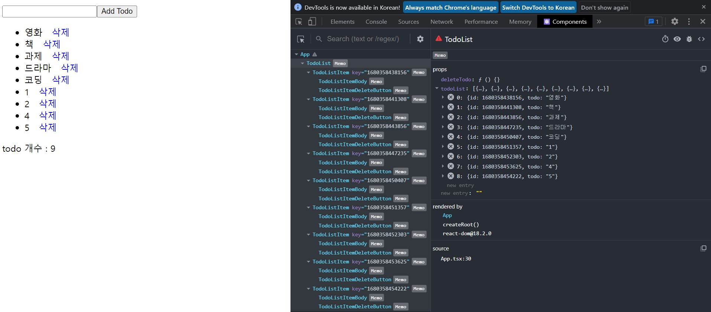 <br>
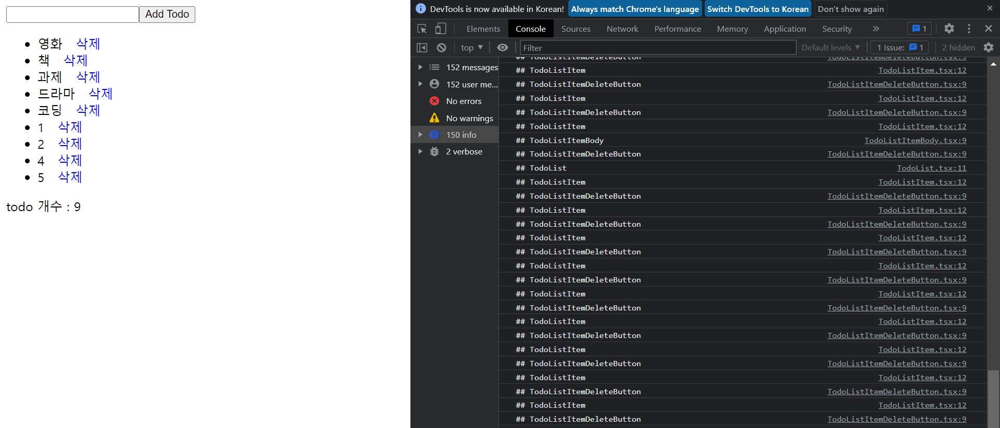 <br>
▶ TodoListItem의 영역 중 항상 바뀌는 함수를 속성으로 전달받아 사용하는 부분만 매번 다시 렌더링되고, 변경되지 않는 영역인 TodoListItemBody 컴포넌트는 다시 렌더링되지 않는 것을 확인 <br>
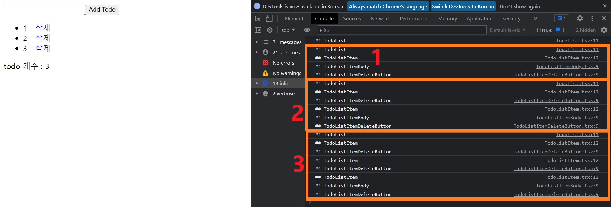 <br>

■ 할 일 아이템을 추가할 때 <br>
TodoListItem이 모두 다시 렌더링되지만 기존 할 일 아이템의 변경되지 않는 부분인 TodoListItemBody는 렌더링되지 않는다. TodoListItemDeleteButton만 다시 렌더링된다. <br>

■ 할 일 아이템을 삭제할 때 <br>
TodoListItemDeleteButton은 모두 다시 렌더링되지만 TodoListItemBody는 변경된 부분이 없으므로 다시 렌더링되지 않는다. <br>

```
리액트 애플리케이션에서 '고차 함수'는 기존 컴포넌트를 인자로 전달받아 기능을 추가하여 컴포넌트를 리턴한다. 여러 컴포넌트에서 필요로 하는 공통의 로직을 분리하여 재사용하기 좋은 구조를 만들 수 있다.

React.memo 고차 함수를 이용하면 렌더링 최적화가 가능하다. React.memo 고차 함수는 전달받은 속성에 대해 이전 속성과 얕은 비교를 통해 다시 렌더링할지를 결정함으로써 렌더링 최적화를 한다. 함수를 속성으로 전달하는 경우는 React.memo 고차 함수와 함께 useCallback 훅을 이용해 렌더링할 때마다 함수가 매번 생성되지 않도록 최적화할 수 있다.

하지만 이와 같은 성능 최적화를 모든 컴포넌트에 적용할 필요는 없다. 성능 최적화를 위한 작업은 메모리에 데이터를 캐싱하는 방법을 사용하므로 메모리 부하가 증가할 수 있다. 따라서 성능 최적화가 필요하다고 판단되는 컴포넌트에서만 이러한 방법을 사용해야 한다.
```